# 1. Kubernetes架构

## 1.1 架构

Kubernetes属于主从分布式架构，节点中角色分为Master和Node。系统架构图如下所示：

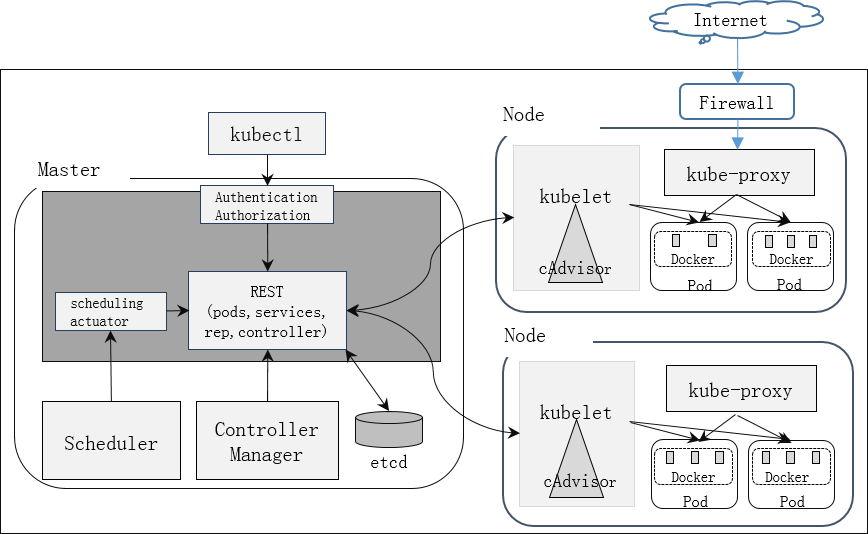

- Master节点上运行etcd，API Server，Controller Manager和Schedule四个组件，其中后三个组件构成Kubernetes的控制中心，负责对集群所有资源进行管理和调度。

- Node节点上运行Kubelet，Proxy和Docker Daemon三个组件，负责对本节点上的Pod生命周期进行管理，以及实现服务代理的功能。

- 所有节点上都可以运行Kubectl命令行工具，Kubectl提供集群管理工具集。


## 1.2 组件功能

- **etcd**  
  高可用的key/value存储系统，作为集群的配置存储中心，kbuernetes中重要的数据都时持久化在etcd中，这使得Kubernetes架构中的个组件属于无状态，更便于分布式集群部署。

- **API Server**
  封装了核心对象的增删改查操作，以及监听资源变化的接口，以REST API 接口方式提供给外部和内部组件调用。

  API Server内部有一套完备的安全机制，包括认证，授权，准入控制等相关模块，API Server收到REST请求后，会执行这些模块相关逻辑，过滤掉非法请求，然后将请求发送給API Server中的REST服务模块去执行资源的具体操作。

- **Controller Manager**
  集群内部的管理控制中心，负责执行各种控制器，集群故障检测和自动恢复，Node的发现，管理和状态监控等。主要包含以下控制器：
  - **Node Controller**
    管理维护Node，定期检查Node健康状况，标识出失效的Node。
  - **Replication Controller **
    管理维护RC，关联RC和Pod，保证RC定义的副本数量和实际运行Pod的数量一致。
  - **Namespace Controller**
    管理维护NS，定期清理无效的NS，包括NS下的API对象，如Pod，Service，Secret等。
  - **Service Controller**
    管理维护Service，为LoadBalancer类型的Service创建管理负载均衡器。
  - **Endpoints Controller**
    维护管理Endpoints，关联Service和Pod，创建Endpoints作为Service的后端，当Pod生变化时，实时刷新Endpoints。
  - **Service Account Controller**
    管理维护Service Account，为每个NS创建默认Service Account，同时为Service Account创建Service Account Secret
  - **Persistent Volume Controller **
    管理维护Persistent Volume和Persistent Volume Claim，为新的Persistent Volume Claim分配Persistent Volume进行绑定，为释放的Persistent Volume执行清理回收。
  - **Daemon Set Controller**
    维护管理Daemon Set，负责创建Daemon Pod，保证指定的Node上正常运行Daemon Pod。
  - **Deployment Controller**
    管理维护Deployment，关联Deployment和RC，保证运行指定数的Pod，当Deployment更新时，控制RC和Pod的更新
  - **Job Controller**
    管理维护Job，为Job创建一次性任务，保证完成Job指定完成的任务数目。
  - **Pod Autoscaler Controller **
    实现Pod的自动伸缩，定时获取监控数据，进行策略分配，当满足条件时执行Pod的自动伸缩。
- **Scheduler**
  集群资源的调度器，负责Pod在集群节点中的调度分配。
- **Kubelet**
  从API Server接收Pod的创建等请求。负责本节点上Pod的创建，修改，监控，删除等生命周期管理。同时定时向API Server上报本节点的状态信息。
  Kubelet服务中内嵌了一个cAdvisor服务，用于实时监控容器的性能指标。
- **Proxy**
  负责为Pod创建代理服务，从API Server获取所有Service，根据Service创建代理服务器，实现Service到Pod的路由和转发。


# 2. 基本概念

## 2.1 Node

Kubernetes属于主从分布式集群架构，Pod最终运行在Node上。Node中运行的服务包括kubelet，kube-proxy和docker daemon。

```
# kubectl get nodes
NAME        STATUS     AG
node1       Ready      1h
node2       Ready      1h
# kubectl describe nodes node1
```
- 节点隔离
  \# cat unnode.yaml

  ```yaml
  apiVersion: v1
  kind: Node
  metadata:
    name: node1
    labels: 
      kubernetes.io/hostname: node1
  spec:
    unschedulable: true/false
  ```

- 节点恢复

  ```
  # kubectl replace -f unnode.yaml
  # kubectl get nodes
  NAME        STATUS                     AGE
  node1       Ready,SchedulingDisabled   20h
  node2       Ready                      19h
  ```

## 2.2 Pod

Kubernetes 中创建，调度和管理的最小单位是Pod，Pod是若干相关容器的组合，这些容器使用相同的命名空间，IP地址和端口，相互间通过localhost来通讯，共享存储卷。相比原生的容器接口，Pod提供更高层次的抽象，但是Pod的设计不是为了运行同一个应用的多个实例，而是 运行一个应用多个紧密联系的程序，每个程序运行在单独的容器中，以pod的形式组合成一个应用。

### 2.2.1 Pod定义

```yaml
apiVersion: v1
kind: Pod
metadata:
  name: podexample
  labels:
    - app: podhttpd
spec:
  restartPolicy: Never
  containers:
    - name: podexample
      image: docker.io/httpd:latest
      imagePullPolicy: Never    //image获取策略
      ports:
        - name: webapp
          containerPort: 80     //容器需要监听的端口
          hostPort: 8001		//容器所在主机需要监听的端口，默认和containerPort相同
```
### 2.2.2 启动命令

```yaml
spec:
  restartPolicy: Never
    containers:
    - name: podexample
      image: "ubuntu:16.04"
      command: ["/bin/echo"]
      args: ["hello", "world"]
```
### 2.2.3 数据持久化和共享

```yaml
    containers:
    - name: write
      image: "ubuntu:16.04"
      command: ["bash", "-c", "echo \"Hello World\" >> /data/hello"]
      volumeMounts:
        - name: data
          mountPath:/data
    - name: read
      image: "ubuntu:16.04"
      command: ["bash", "-c", "sleep 10; cat /data/hello"]
      volumeMounts:
        - name: data
          mountPath:/data
    volumes:
      - name: data
        hostPath:
          path: /tmp
```

### 2.2.4 节点选择

- nodeSelector

  用于将Pod调度到指定的Node。

  1. 为Node设置label

     ```
     # kubectl label nodes node1 env=test
     ```

  2. 为Pod定义Node Selector

     ```yaml
     apiVersion: v1
     kind: Pod
     metadata:
       name: podexample
       labels:
         - evn: test
     spec:
         containers:
         - name: podexample
           nodeSelector:
             env: test
     ```

- Nodeffinity

  node亲和性调度，用于替换NodeSelector的下一代调度策略，包含两种：

  preferredDuringSchedulingIgnoredDuringExecution  : 软策略，尽量满足。

  requiredDuringSchedulingIgnoredDuringExecution  ： 硬策略，必须满足。

- nodeName

  通过主机名指定pod调度到节点

- podAffinity

  实际环境中，需要根据pod间的关系进行调度，如某些pod调度到同一节点：

  preferredDuringSchedulingIgnoredDuringExecution  : 软策略，尽量满足。

  requiredDuringSchedulingIgnoredDuringExecution  ： 硬策略，必须满足。

- Taints & tolerations

  在节点上设置“污点”，不希望pod被调度到该节点上

  ```shell
  # kubectl taint nodes xxxx system=service:NoSchedule
  ```

  给pod设置“污点容忍”后，pod仍有可能会被调度到污点的节点上：

  ```yaml
  tolerations:
  - key: "system"
  operator: "Equal"
  value: "service"
  effect: "NoScheduler"
  ```

  effect有三种设置，NoSchedule，PreferNoScheduler,NoExecute

Kubernetes通过一系列过滤函数，对Node进行筛选，支持的过滤函数如下：
  - NoDiskConflict： 检查数据卷是否冲突。
  - NoVolumeZoneConflict：评估Volume需求。
  - PodFitsResources: 检查可用资源是否满足
  - PodFitsPots：检查HostPorts是否冲突
  - PodFitsHost：根据Pod NodeName属性选择Node：不建议使用"nodeName：node"。
  - PodSelectorMatches：根据Pod NodeSelector选择
  - CheckNodeLabelIPresence：检查Node是否存在Scheduler配置的标签

如果存在多个符合条件的Node，则根据优先级函数筛选。常用优先级函数如下：
  - LeastRequestedPriority：选择最多可用资源的Node
  - CalculateNodeLabelPriority： 选择含有指定Label的Node
  - BalancedResourceAllocationL：选择资源均衡的Node


### 2.2.5 restartPolicy

  设置Pod内容器的重启策略，可选值为Always，OnFailure，Never。

### 2.2.6 hostPort

“containerPort: 80”表示容器需要监听的端口，“hostPort: 8001”表示容器所在主机需要监听的端口，默认和containerPort相同。相当于docker run -p 80:8001。

如果端口不相同则创建iptables规则进行端口映射如下：

   ```
-A POSTROUTING -s 172.17.0.2/32 -d 172.17.0.2/32 -p tcp -m tcp --dport 80 -j MASQUERADE
-A DOCKER ! -i docker0 -p tcp -m tcp --dport 8001 -j DNAT --to-destination 172.17.0.2:80
   ```
### 2.2.7 hostNetwork

设置Pod为Host网络模式，即直接使用Host的网络，不进行网络虚拟化隔离，Pod的PodIP就是其所在的Node的IP。相当于 docker run --net=host 

### 2.2.8 dnsPolicy

  设置Pod中容器的DNS策略，可选值为：

- Default：从运行的节点继承域名解析。

- ClusterFirst：

  DNS查询会被发送到kube-dns服务。对于含有集群域名后缀，将有kube-dns服务进行回应。所有其他的查询会被转发到继承自该节点的上游域名服务器。

- ClusterFirstWithHostNet，

- None

### 2.2.9 lifecycle

  提供回调函数，在容器的生命周期特定的阶段执行调用，目前提供如下回调：

  - PostStart：容器创建成功后调用。
  - PreStop：容器被终止前调用。

  钩子函数实现有以下两种：
  - Exec：在容器中执行指定命令
  - HTTP： 发起http调用请求
    ```yaml
    apiVersion: v1
    kind: Pod
    metadata:
      name: jjjj
    spec:
        containers:
        - name: podexample
          lifecycle：
            postStart:
              exec:
                command:
                  - "cp"
                  - "/sample.war"
                  - "/app"
            preStop:
              httpGet:
                command:
                  host: minitor.com
                  path: /warning
                  port: 8080
                  scheme: HTTP
    ```


### 2.2.10 Security Context

Security Context的目的是限制不可信容器的行为，保护系统和其他容器不受其影响。
Kubernetes提供了三种配置Security Context的方法：

- Container-level Security Context
  仅应用到指定的容器，并且不会影响Volume。比如设置容器运行在特权模式：
  ```yaml
  apiVersion: v1
  kind: Pod
  metadata:
    name: hello-world
  spec:
    containers:
      - name: hello-world-container
        # The container definition
        # ...
        securityContext:
          privileged: true
  ```

- Pod-level Security Context
  应用到Pod内所有容器，并且还会影响Volume（包括fsGroup和selinuxOptions）。
  ```yaml
  apiVersion: v1
  kind: Pod
  metadata:
    name: hello-world
  spec:
    containers:
    # specification of the pod's containers
    # ...
    securityContext:
      fsGroup: 1234
      supplementalGroups: [5678]
      seLinuxOptions:
        level: "s0:c123,c456"
  ```

- Pod Security Policies（PSP）：
  应用到集群内部所有Pod以及Volume。是集群级的Pod安全策略，自动为集群内的Pod和Volume设置Security Context。支持如下控制项：
  | 控制项                   | 说明                       |
  | ------------------------ | -------------------------- |
  | privileged               | 运行特权容器               |
  | defaultAddCapabilities   | 可添加到容器的Capabilities |
  | requiredDropCapabilities | 从容器中删除的Capabilities |
  | volumes                  | 控制容器可以使用哪些volume |
  | hostNetwork              | host网络                   |
  | hostPorts                | 允许的host端口列表         |
  | hostPID                  | 使用host PID namespace     |
  | hostIPC                  | 使用host IPC namespace     |
  | seLinux                  | SELinux Context            |
  | runAsUser                | user ID                    |
  | supplementalGroups       | 允许的补充用户组           |
  | fsGroup                  | volume FSGroup             |
  | readOnlyRootFilesystem   | 只读根文件系统             |
  例如，限制容器host端口范围为80000～8080

  ```yaml
  apiVersion: extensions/v1beta1
  kind: PodSecurityPolicy
  metadata:
    name: permissive
  spec:
    seLinux:
      rule: RunAsAny
    supplementalGroups:
      rule: RunAsAny
    runAsUser:
      rule: RunAsAny
    fsGroup:
      rule: RunAsAny
    hostPorts:
    - min: 8000
      max: 8080
    volumes:
    - '*'
  ```


### 2.2.11 livenessProbe

通过probe机制更加精确的判断Pod和容器是否准备就绪，从而让k8s判断是否分发请求给Pod。有以下两种类型的probe：

- Liveness Probe：用于容器自定义**健康检查**，如果检查失败则杀死容器，根据重启策略决定是否重启容器。
- Readiness Probe：用于容器自定义**准备状况检查**，如果检查失败则不会分发请求给该pod。

支持以下三种检查方法：

- ExecAction： 在容器中执行指定命令进行检查。

  ```yaml
  livenessProbe：
    exec:
      command:
      - cat
      - /tmp/helth
    initialDalaySeconds: 15
    timeoutSeconds: 1
  ```


- TCPSocketAction：对容器中指定的TCP端口进行检查，当端口被占用，检查成功。

  ```yaml
  readinessProbe：
    tcpSocket:
      port: 80
  ```

- HTTPGetAction：发送一个HTTP请求，当返回码介于200～400间，检查成功

  ```yaml
  livenessProbe：
    httpGet:
      path: /healthz
      port: 8080
  ```


### 2.2.12 Request & Limit

创建Pod时，可以指定每个容器的资源请求和资源限制。资源请求是容器所需的最小资源，资源限制是容器不能超过的资源上限：

```yaml
spec:
  containers:
  - name: db
    image: mysql
    resources：
      requests:
        memory: 256Mi
        cpu: 500m
      limits:
        memory: 512Mi
        cpu: 1000m
```

### 2.2.13 initContainers

在kubernetes1.3的POD中，有两类容器，一类是系统容器（POD Container），一类是用户容器（User Container），在用户容器中，现在又分成两类容器，一类是初始化容器（Init Container），一类是应用容器（App Container）.

初始化容器是kubernetes1.3的新特性，适用下面几个使用场景：

1. 如果容器中的应用使用到了一个外部服务，需要等这个外部服务可以访问之后才能启动容器中的应用。这种场景适合两个POD协同工作，第一个POD负责dnsservice，第二个POD负责访问第一个POD，这两个POD中的应用容器启动有先后顺序，第二个POD中的应用容器必须要等第一个POD中的应用容器启动后才能启动。
2. 做初始化配置

## 2.3 RC

用来控制管理Pod副本的数量，如果少于指定的副本，RC会启动新的Pod副本，反之会杀死多余的副本以保证数量不变。RC是弹性伸缩，滚动升级实现的核心。实际操作中，一般都是在RC中预先定义的Pod模板来创建Pod。使用PSP需要API Server开启extensions/v1beta1/podsecuritypolicy，并且配置PodSecurityPolicy admission控制器。

### 2.3.1 RC定义

```yaml
apiVersion: v1
kind: ReplicationController
metadata:
  name: httpd
  labels:
    - app: httpd
spec:
  replicas: 2
  selector:             //Label Selector,选择具有指定Label的Pod作为管理范围
    app: httpd
  template:             // 设置Pod模板，和Pod spec相同。
    metadata:
      labels:
        app: httpd
    spec:
      containers:
        - name: httpd
          image: docker.io/httpd:latest
          imagePullPolicy: Never
          ports:
            - containerPort: 80
```
### 2.3.2 Pod 模板

- 为了保证Pod名称唯一，Pod模板中不需要指定Pod的名称，Pod的名称为.metadata.generateName加上5为随机数。
- RC需要保证Pod持续运行，因此Pod模板中重启的策略必须是Always(Never/OnFailure/Always).
- Pod模板中Label不能为空，否则RC无法和模板创建出来的Pod关联。

### 2.3.3 弹性伸缩

`# kubectl scale replicationcontroller my-nginx --replicas=3`
`# kubectl get replicationcontroller --selector app=nginx`
`# kubectl get pod --selector app=nginx`

### 2.3.4 自动伸缩

通过Horizontal Pod Autoscaler，可以实现Pod的自动伸缩。Horizontal Pod Autoscaler和RC是一一对应的。HPA定时从平台监控系统中获取和RC关联Pod的整体资源使用情况，当策略匹配时，通过RC来调整Pod副本数量实现自动伸缩。
`# kubectl run nginx --image=nignx --labels app=nginx --requests cpu=200m`
`# kubectl expose rc nginx --port=80`

```yaml
apiVersion: autoscaling/v1
kind: HorizontalPodAutoscaler
metadata:
  name: nginx
  namespace: default
spec:
  scaleTargetRef:
    kind: ReplicationController
    name: nginx
  minReplicas: 3
  maxReplicas: 10
  targetCPUUtilizationPercentage: 80   # v1版本适用
#  metrics:                            # v2beta2版本适用
#  - type: Resource
#    resource:
#      name: cpu
#      targetAverageUtilization: 80
#  - type: Resource
#    resource:
#      name: memory
#      targetAverageValue: 200Mi
```

在HPA中通过.spec.scaleRef 指定对应的RC，minReplicas/maxReplicas 设定Pod副本的范围，cpuUnilization设定伸缩的策略。

也可以通过autoscal设定：

`# kubectl autoscale rc nginx --min=1 --max=10 --cpu-percent=50`

### 2.3.5 rolling-update

`# kubectl rolling-update webv1 -f vebv2 --update-period=10s`

## 2.4 Deployment

Deployment是k8s提供的一种更简单的更新RC和Pod的机制。

- deployment定义

  ```yaml
  apiVersion: extensions/v1beta1
  kind: Deployment
  metadata:
    name: web-deployment
  spec:
    replicas: 4
    template:
      metadata:
        labels:
          app: web
      spec:
        serviceAccountName: xxxx
        containers:
          - name: myweb
            image: myweb:v1
            ports:
              - containerPort: 80
  ```

  默认情况下，Deployment和rolling-update是一致的，采用滚动升级的方式，即逐步增加新的RC副本数，逐步减少旧的RC副本数。可以通过.spec.strategy.type指定升级类型，支持Recreate(直接升级)和RollingUpdate(滚动升级)。

## 2.5 Job

RC创建的Pod都是长期运行的，使用Job可以执行一次性的任务：

```yaml
apiVersion: extensions/v1beta1
kind: Job
metadata:
  name: pi
spec:
  completions: 4               //控制一次性任务pod的完成次数
  parallelism: 1              //控制并发执行数
  selector:
    matchLabels:
      app: pi
template:
    metadata:
      mane: pi
      labels:
        app: pi
    spec:
      containers:
        - name: pi
          image: perl
          command: ["perl", "-Mbignum=bpi", "-wle", "print bpi(2000)"]
      restartPolicy: Never
```

## 2.6 Service

Kubernetes中，虽然每个Pod都会根据Docker网桥的IP地址段被分配一个单独的IP，但这个IP地址会随着Pod的销毁而消失，service可以看作一组提供相同服务的Pod的对外访问接口，外部不需要了解后端Pod如何运作。Service和Pod是通过Label Selector来关联的。

### 2.6.1 Service定义

```yaml
apiVersion: v1
kind: Service
metadata:
  name: httpd
  labels:
    app: httpd
spec:
  selector:
    app: httpd
  type: ClusterIP
  clusterIP: xxxx   //当type为ClusterIP时，如果不指定则自动分配IP。
  ports:
    - name: http     //配置多端口时，端口名称为必选项
      port: 8000     //服务监听的端口号
      targetPort: 80 //需要转发到后端Pod的端口号
      protocol: TCP
```
spec.type用于配置service的类型，service有多种类型，默认为ClusterIP。最基本的`ClusterIP`类型解决了集群内部访问服务的需求，`NodePort`类型通过Node节点的端口暴露服务， 再配合上`LoadBalancer`类型所定义的负载均衡器，实现了流量经过前端负载均衡器分发到各个Node节点暴露出的端口， 再通过`iptables`进行一次负载均衡，最终分发到实际的Pod上这个过程。

- **ClusterIP**： 用于集群内部的Pod访问，在kube-proxy上设置iptable规则进行转发。
- **NodePort**:  暴露Host的端口，外部通过Node的IP和端口访问服务。
- **LoadBalancer**：使用外接的负载均衡器完成分发，需要在spec.status.loadBalancer字段指定外部负载均衡器的IP地址，同时定义nodePort，clusterIP。通常用于共有云上。
- **ExternalName**： 将服务映射到externalName（例如foo.bar.example.com）。需要kube-dns。


查询
```
# kubectl get service
NAME	CLUSTER_IP		EXTERNAL_IP	PORT(S)		SELECTOR	AGE
httpd	10.254.213.110	<none>		8000/TCP	app=httpd	7s
```
查看详细信息
```
# kubectl describe service httpd
Name:		httpd
Namespace:	default
Labels:		app=httpd
Selector:	app=httpd
Type:		ClusterIP
IP:			10.254.213.110
Port:		<unnamed> 8000/TCP
Endpoints:	172.17.0.2:80,172.17.0.3:80
Session Affinity: None
No events.
```
### 2.6.2 externalIPs

如果有外部IP可以路由到一个或多个集群节点，则Kubernetes的service可以通过externalIPs暴露在这些外部IP上。 通过externalIPs（作为目标IP）进入群集的流量将被路由到其中一个endpoint上。 外部IP由集群管理员管理而不是由Kubernetes。

externalIPs可以配合任意类型的ServiceTypes使用。

### 2.6.3 服务代理

上述Service的Endpoints属性包含2个IP，实际上就是Service关联的2个Pod的PodIP。Service的IP属性显示为10.254.213.110，这是Kubernetes分配给Service的虚拟IP，通过访问该IP，Kubernetes会将请求转发到后端Pod。虚拟IP属于Kubernetes内部的虚拟网络,外部寻址不到。在Kubernetes系统中，实际上是**由kube-proxy组件通过iptables实现虚拟IP路由和转发**。

Service不仅可以代理Pod，还可以代理运行在k8s外部的服务，如代理外部MySQL服务：

1. 创建Service，不设置selector
```yaml
apiVersion: v1
kind:  Service
metadata:
  name: mysql
spec:
  ports:
  - port: 3036
    targetPort: 3036
    protocol: TCP
```
2. 创建同名的Endpoints，设置外部服务ip地址：
```yaml
apiVersion: v1
kind:  Endpoints
metadata:
  name: mysql
subsets:
- addresses:
  - ip: 192.168.3.180
  ports:
  - port: 3060
    protocol: TCP
```

```yaml
# kubectl describe svc mysql
Name:              mysql
Namespace:         default
Labels:            <none>
Annotations:       <none>
Selector:          <none>
Type:              ClusterIP
IP:                20.1.92.89
Port:              <unset>  3036/TCP
TargetPort:        3036/TCP
Endpoints:         192.168.3.180:3060
Session Affinity:  None
Events:            <none>
```

当Service的Endpoints包含多个IP时，将进行请求的负载均衡，默认的策略是轮询或随机。Service通过设置".spec.sessionAffinity"为ClientIP支持基于源IP的会话保持功能，将同一个客户端的访问请求都转发到同一个后端。

### 2.6.4 服务发现

Pod访问其他Pod的Service时，可以通过以下两种服务发现方式：
- **环境变量**
  环境变量服务发现的方式时Kubernetes默认支持的。但使用环境变量方式必须保证Service在Pod之前被创建出来，然后系统才能在创建Pod时自动设置与Service相关的环境变量。另外，环境变量是租户隔离的，Pod只能获取相同namespace中的环境变量。
  - Service环境变量
    ```
    {SVCNAME}_SERVICE_HOST
    {SVCNAME}_SERVICE_PORT
    ```
  - Docker Link环境变量
    相当于通过Docker --link参数实现容器连接时设置的环境变量

- **DNS**
  Pod的定义中，通过sped.dnsPolicy设置Pod的DNS策略，默认是Clusterirst。
  - **Default**
    Linux系统中的DNS解析是通过/etc/resolv.conf进行配置的。dnsPolicy配置为Default时，Pod中的容器使用Host的DNS配置。

  - **ClusterFirst**
    如果Kubernetes部署并设置了Cluster DNS，则在创建Pod的时候，默认会将Cluster DNS的配置写入Pod中容器的DNS配置中。

    使用Cluster  DNS 功能，还需要修改 `kubelet`的启动配置项，告诉 kubelet，给每个启动的 pod 设置对应的 DNS 信息，一共有两个参数，分别是 DNS 在集群中的 vip 和域名后缀，要和 DNS rc 中保持一致.
    ```
    --cluster-dns=20.1.10.10
    --cluster-domain=cluster.local
    ```
    Cluster DNS会监控k8s API，为每个Service创建DNS记录用于域名解析，这样在Pod中就可以通过DNS域名获取Service的访问地址。对于每个Services，Cluster DNS会创建两条DNS记录：

    ```
    [service_name].[namespace_name].[cluster_domain]
    [service_name].[namespace_name].svc.[cluster_domain]
    ```
    在 pod 中可以通过 `service_name.namespace.svc.domain` 来访问任何服务，也可以使用缩写`service_name.namespace`，如果 pod 和 service 在同一个 namespace，甚至可以直接使用 `service_name`。


**kube-dns**

Kubernetes v1.4版本之前，DNS由“Etcd、Kube2sky、Skydns、Exechealthz”四个组件组成。
Kubernetes v1.4版本及之后，由“Kubedns、dnsmasq、exechealthz”三个组件组成


**Kubedns**
替代原来 kube2sky + etcd + skyDNS 三个容器的功能，监听 apiserver 并把所有 service 和 endpoints 的结果在内存中用合适的数据结构保存起来，并对外提供 DNS 查询服务。
  - 替换SkyDNS，为dnsmasq提供查询服务。
  - 替换etcd容器，使用树形结构在内存中保存DNS记录。
  - 通过K8S API监视Service资源变化并更新DNS记录。
  - 服务10053端口。

**Dnsmasq**
一个轻量级的 DNS 服务软件，可以提供 DNS 缓存功能。ClusterFirst模式下，dnsmasq 在内存中默认预留1G内存，保存当前最常用的 DNS 查询记录，提高查询性能。如果缓存中没有要查找的记录，会到 kubeDNS 中查询，并把结果缓存起来，以降低kubedns容器的压力、提高稳定性。
  - Dockerfile在GitHub上Kubernetes组织的contrib仓库中，位于dnsmasq目录下。
  - 在kube-dns插件的编排文件中可以看到，dnsmasq通过参数–server=127.0.0.1:10053指定upstream为kubedns。

**Exechealthz**
  - 在kube-dns插件中提供健康检查功能。
  - 源码同样在contrib仓库中，位于exec-healthz目录下。
  - 新版中会对两个容器都进行健康检查，更加完善。


**coredns**

Kubernetes包括用于服务发现的DNS服务器Kube-DNS。 该DNS服务器利用SkyDNS的库来为Kubernetes pod和服务提供DNS请求。SkyDNS2的作者，Miek Gieben，创建了一个新的DNS服务器，CoreDNS，它采用更模块化，可扩展的框架构建。 Infoblox已经与Miek合作，将此DNS服务器作为Kube-DNS的替代品。

###2.6.5 发布Service

Service在Cluster IP池中分配到的虚拟IP只能在内部访问，无法被外部网络寻址。但是如果Service作为前端服务，为集群外部客户端提供服务，就需要对外部发布Servece。Kubernetes支持以下几种对外提供服务的Service的类型定义:

#### 2.6.5.1 **NodePort**

Kubernetes除了分配一个内部的虚拟IP，另外会在集群中每个Node节点上打开一个主机上的端口，外部网络通过[NodeIP]:[NodePort]可以访问到内部的Servece。

```yaml
apiVersion: v1
kind: Service
metadata:
  name: httpd
spec:
  selector:
    app: httpd
  ports:
    - name: http
      port: 80
      nodePort: 32143
      protocol: TCP
  type: NodePort
```
#### 2.6.5.2 **LoadBalancer**

LoadBalancer需要指定Service的NodePort，ClusterIP和负载均衡器的IP地址。

```yaml
apiVersion: v1
kind: Service
metadata:
  name: lb
spec:
  selector:
    app: httpd
  type: LoadBalancer
  clusterIP: 10.0.171.239
  loadBalancerIP: 78.11.24.19
  ports:
  - name: http
      port: 8080
      targetPort: 80
      nodePort: 32000
      protocol: TCP
status:
  loadBalancer:
    - ingress:
        ip: 130.144.47.156
```

LoadBalancerh是建立在NodePort集群上的，Kubernetes请求底层云平台创建一个负载均衡器，作为访问Service的外部访问入口。

负载均衡器由底层云平台创建提供，会包含一个LoadalancerIP(如果没有指定loadBalancerIP，会分配一个临时的IP给负载均衡器)，可以认为是Service的外部IP(EXTERNAL_IP)。每个Node作为负载均衡器后端，当请求[EXTERNAL_IP]:[PORT]时，负载均衡器将请求转发到[NodeIP]:[NodePort]

```
# kubecel get svc httpd
NAME	CLUSTER_IP		EXTERNAL_IP		PORT(s)				SELECTOR	AGE
httpd	10.0.171.239	78.11.24.19	    8080:32000/TCP		app=httpd	5m	
```
ingress.ip为云平台提供的负载均衡器的IP地址.

#### 2.6.5.3 **Ingress**

通常情况下，service和pod的IP仅可在集群内部访问。集群外部的请求需要通过负载均衡转发到service在Node上暴露的NodePort上，然后再由kube-proxy将其转发给相关的Pod。而Ingress就是为进入集群的请求提供路由规则的集合，如下图所示:

```
    internet
        |
   [ Ingress ]
   --|-----|--
   [ Services ]
```

ingress是一种http方式的的路由转发机制，可以给service提供集群外部访问的URL、负载均衡、SSL终止、HTTP路由等。需要**Ingress Controller**和**http代理服务器**两个组件支持。http代理服务器将外部的http请求转发到**Service**，Ingress Controller需要监控Kubectl API，实时更新http代理服务器的转发规则。

```yaml
apiVersion: extensions/v1beta1
kind: Ingress
metadata:
  name: httpd
spec:
  rules:
    - host: my.example.com
      http:
        paths:
        - path: /app
          backend:
            serviceName: httpd
            servicePort: 80
```

spec.rules用于设置转发规则。其中配置了一条规则：当http请求的host为my.example.com时且path为/app时，转发到service httpd的80端口。

​

## 2.7 Label

Label以key/value形式附加到如Pod，Service，RC，Node等对象上，对对象进行管理和选择。为对象定义好Label后，其他对象可以使用Label Selector来定义其作用的对象。

一般会给Pod等对象定义多个Labels，以便于配置，部署，管理等。通过多个Labes的设置,可以多维度地对Pod等对象进行精细的管理。

## 2.8 Volume

Volume是Pod中能够被多个容器访问的共享目录，Volume的生命周期与Pod相同，当容器终止或重启时，Volume中的数据也不会丢失。

- 本地Volume： 
  - EmptyDir：实现pod间文件共享

    ```yaml
    spec: 
      containers:
        - name : xxx
          volumeMounts:
            - name: log-storeage
              mountPath: /var/log
      volumes:
        - name: log-storage
          emptyDir: {}
    ```

  - HostPath

    ```yaml
    spec: 
      containers:
        - name : xxx
          xxx
          volumeMounts:
            - name: log-storeage
              mountPath: /var/log
              readNoly: true
      volumes:
        - name: log-storage
          hostPath:
            path: /tmp
    ```

- 网络Volume： NFS，iscsi，GlusterFS，RBD.

  ```yaml
  spec: 
    containers:
      - name : xxx
        xxx
        volumeMounts:
          - name: nfs
            mountPath: "/usr/share/nginx/html"
    volumes:
      - name: nfs
        nfs:
          server: 192.168.56.1
          path: "/"
  ```

- Persistent Volume

  普通用户通过Persistent Volume和Persistent Volume Claim机制，可以不用关心各种存储的实现，实现安全可靠的数据存储。

  1. PV是由管理员创建的一个数据卷，创建是需要指定数据卷的容量，访问模式和回收策略。

  ```yaml
  apiVersion: v1
  kind: PersistentVolume
  metadata:
    name: nfspv
    labels:
      type: nfs
  spec:
    capacity:
      storage: 5Gi
    accessModes:
      - ReadWriteMany
    nfs:
      server: nfs-server
      path: "/"
  ```

  2. 创建PVC，指定所需的存储大小，然后k8s会选择满足条件的PV进行绑定：

  ```yaml
  apiVersion: v1
  kind: PersistentVolumeClaim
  metadata:
    name: testpvc
  spec:
    accessModes:
      - ReadWriteMany
    resources:
      requests:
        storage: 1Gi
  ```

  3. 普通用户通创建pod，过PVC请求并获得合适的PV，无需感知后端的存储。

  ```yaml
  apiVersion: v1
  kind: Pod
  metadata:
    name: busybox
    labels:
      app: busybox
  spec:
    containers:
      - name: busybox
        image: busybox
        command:
          - sleep
          - 3000
        volumeMounts:
          - mountPath: bs-data
            name: data
    volumes:
      - name: data
        persistentVolumeClaim:
          claimName: testpvc
  ```

- 信息Volume： Secret，Download API，Git Repo，

## 2.9 Namespace

- Namespace 定义
  ```yaml
  apiVersion: v1
  kind: Namespace
  metadata:
    name: development
    labels:
      name: development
  ```
  多租户在K8s中以Namespace来体现，默认情况下,用户创建的Pod,RC,Service等资源对象都被系统创建到名为default的Namespace中,该Namespace为Kubernetes集群启动时创建。

  通过上文创建NS后，在创建Pod等资源对象时,可以在定义文件中指定Pod等资源属于哪个Namespace：

  ```yaml
  apiVersion: v1
  kind: Pod
  metadata:
    name: podexample
    namespace: development
  ...
  ```


## 2.10 DaemonSet

DaemonSet保证在**每个Node上**都运行一个容器副本，常用来部署一些集群的日志、监控或者其他系统管理应用。典型的应用包括：
- 日志收集，比如fluentd，logstash等

- 系统监控，比如Prometheus Node Exporter，collectd，New Relic agent，Ganglia gmond等

- 系统程序，比如kube-proxy, kube-dns, glusterd, ceph等

  使用Fluentd收集日志的例子：

  ```yaml
  apiVersion: extensions/v1beta1
  kind: DaemonSet
  metadata:
    name: fluentd
  spec:
    template:
      metadata:
        labels:
          app: logging
          id: fluentd
        name: fluentd
      spec:
        serviceAccountName: xxxx  //关联SA
        containers:
        - name: fluentd-es
          image: gcr.io/google_containers/fluentd-elasticsearch:1.3
          env:
           - name: FLUENTD_ARGS
             value: -qq
          volumeMounts:
           - name: containers
             mountPath: /var/lib/docker/containers
           - name: varlog
             mountPath: /varlog
        volumes:
           - hostPath:
               path: /var/lib/docker/containers
             name: containers
           - hostPath:
               path: /var/log
             name: varlog
  ```

  除了DaemonSet，还可以使用**静态Pod**来在每台机器上运行指定的Pod，这需要kubelet在启动的时候指定manifest目录：
  ```
  kubelet --pod-manifest-path=/etc/kubernetes/manifests
  ```
  然后将所需要的Pod定义文件放到指定的manifest目录中。需要注意的是静态Pod不能通过API Server来删除，但可以通过删除manifest文件来自动删除对应的Pod。

## 2.11 PodPreset

  PodPreset用来给指定标签的Pod注入额外的信息，如环境变量、存储卷等。这样，Pod模板就不需要为每个Pod都显式设置重复的信息。开启PodPreset

  - 开启API settings.k8s.io/v1alpha1/podpreset
  - 开启准入控制 PodPreset


增加环境变量和存储卷的PodPreset示例：

```yaml
kind: PodPreset
apiVersion: settings.k8s.io/v1alpha1
metadata:
  name: allow-database
  namespace: myns
spec:
  selector:
    matchLabels:
      role: frontend
  env:
    - name: DB_PORT
      value: "6379"
  volumeMounts:
    - mountPath: /cache
      name: cache-volume
  volumes:
    - name: cache-volume
      emptyDir: {}
```

## 2.12 ResourceQuota

k8s是多租户架构，需要通过ResourceQuota来实现资源配额，ResourceQuota可以作用于cpu和内存，还可以限制Pods，Services，PVC等资源的数目。

```yaml
apiVersion: v1
kind: ResourceQuota
metadata:
  name: compute-resources
  namespace: development
spec:
  hard:
    pods: "10"
    requests.cpu: "1"
    requests.memory: 1Gi
    limits.cpu: "2"
    limits.memory: 512Mi
```

一旦NameSpace设置了资源配额，创建Pod时就必须指定资源请求

## 2.13 LimitRange

当在namespace下创建LimitRange后，就可以设置Pod/容器的资源请求和资源限制默认值，对pod/容器的资源规格配置进行约束。该功能需要开启准入控制 LimitRange。

```yaml
apiVersion: v1
kind: LimitRange
metadata:
  name: mylimits
  namespace： dev
spec:
  limits:
  - type: Pod
    max:
      cpu: "2"
      memory: 1Gi
    min:
      cpu: 200m
      memory: 6Mi
  - type: Container
    default:
      cpu: 300m
      memory: 200Mi
    defaultRequest:
      cpu: 200m
      memory: 100Mi
    max:
      cpu: "2"
      memory: 1Gi
    min:
      cpu: 100m
      memory: 3Mi
```


## 2.14 ConfigMap
kubernetes通过ConfigMap来实现对容器中应用的配置管理。
- 通过yaml文件来创建
```yaml
apiVersion: v1
kind: ConfigMap
metadata:
  name: test-cfg
  namespace: default
data:
  cache_host: memcached-gcxt
  cache_port: "11211"
  cache_prefix: gcxt
  my.cnf: |
    [mysqld]
    log-bin = mysql-bin
  app.properties: |
    property.1 = value-1
 property.2 = value-2
 property.3 = value-3
```

- 通过kubectl直接在命令行下创建
  - 直接将一个目录下的所有配置文件创建为一个ConfigMap：
  ```
  kubectl create configmap test-config --from-file=./configs
  ```
  - 直接将一个配置文件创建为一个ConfigMap：
  ```
  kubectl create configmap test-config2 --from-file=./configs/db.conf --  from-file=./configs/cache.conf
  ```
  - 通过在命令行直接传递键值对创建：
  ```
  kubectl create configmap test-config3 --from-literal=db.host=10.5.10.116 --from-listeral=db.port='3306'
  ```

## 2.15 Secret

Secret用于保存应用启动过程中需要的一些敏感信息，如用户密码等。Secret以密文方式存储数据，容器可以通过文件或者环境变量方式使用Secret中的敏感数据。

- 创建

  ```yaml
  apiVersion: v1
  kind: Secret
  metadata:
    name: test-secret
    namespace: default
  data:
    username: YWRtaW4=
    password: MTIzNDU2
  ```

  文件中的敏感数据必须通过base64编码后的结果

  ```shell
  # echo -n admin | base64
  YWRtaW4=
  # echo -n 123456 | base64
  MTIzNDU2
  # echo -n YWRtaW4= | base64 --decode
  admin
  ```

- 使用

  - Volume方式

    ```yaml
    containers:
    - name: mypod
      image: busybox
      args:
        - xxxxx
      volumeMounts:
      - name: foo
        mountPath: /etc/foo
        readOnly: true
    volemes：
    - name: foo
      secret:
        secretName: test-secret

    ```

  - 环境变量

    ```
    containers:
    - name: mypod
      image: busybox
      args:
        - xxxxx
      env:
        - name: SECRET_USERANAME
          valumeFrom:
            secretKeyRef:
              name: mysecret
              key: username
        - name: SECRET_PASSWORD
          valumeFrom:
            secretKeyRef:
              name: mysecret
              key: password
    ```

## 2.16 Service Account

Service Account并不是给kubernetes集群的用户使用的，而是给pod里面的进程使用的。运行在pod里的进程需要调用Kubernetes API以及非Kubernetes API的其它服务，通过Service Account为pod提供必要的身份认证。

如果kubernetes开启了ServiceAccount（–admission_control=…,ServiceAccount,… ）那么每个namespace下面都会创建一个default的sa。 

```shell
# kubectl get sa default -o yaml 
apiVersion: v1
kind: ServiceAccount
metadata:
  name: default
  namespace: default
secrets:
- name: default-token-5pqqp
```

其中最重要的就是secrets，包含两个数据token和ca.crt。其中，**token是由kube-controller-manager的`--service-account-private-key-file`指定的私钥生成**，**ca.crt是`--root-ca-file`指定的证书**。

```  shell
# kubectl get secrets default-token-5pqqp -o yaml
apiVersion: v1
data:
  ca.crt: xxxxxxxx
  namespace: ZGVmYXVsdA==
  token: xxxxxxxxx
kind: Secret
metadata:
  annotations:
    kubernetes.io/service-account.name: default
    kubernetes.io/service-account.uid: 0bae02b4-8c96-11e8-831d-080027e8a688
  name: default-token-5pqqp
  namespace: default
type: kubernetes.io/service-account-token
```

当用户在该namespace下创建pod的时候如果没有指定sa都会使用的默认sa，kubernetes会把默认的sa挂载到容器内(/var/run/secrets/kubernetes.io/serviceaccount)。

```
 volumes:
  - name: default-token-5pqqp
    secret:
      defaultMode: 420
      secretName: default-token-5pqqp
```

上面的内容是经过base64加密过后的，直接进入容器内：

```
# ls -l  /var/run/secrets/kubernetes.io/serviceaccount/
total 0
lrwxrwxrwx    1 root     root            13 May  4 23:57 ca.crt -> ..data/ca.crt
lrwxrwxrwx    1 root     root            16 May  4 23:57 namespace -> ..data/namespace
lrwxrwxrwx    1 root     root            12 May  4 23:57 token -> ..data/token
```

Pod中的应用通过token和ca.crt访问API Server。

## 2.17 PetSet

<待补充>

## 2.18 HPA

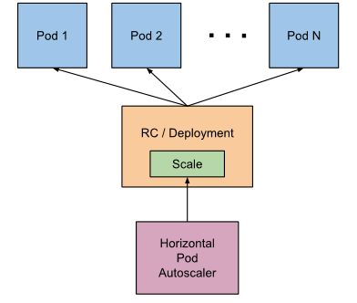

### 2.18.1 autoscaling版本

不同的autoscaling版本API中，HPA autoscale时可以根据以下指标来判断：
**autoscaling/v1**:

- CPU

  ```yaml
  apiVersion: autoscaling/v1
  kind: HorizontalPodAutoscaler
  metadata:
    name: nginxd
    namespace: default
  spec:
    scaleTargetRef:
      kind: ReplicationController
      name: nginxd
    minReplicas: 3
    maxReplicas: 5
    targetCPUUtilizationPercentage: 80
  ```

**autoscaling/v2beta2**，可以基于以下四种metrics实现自动伸缩

- Object
  k8s对象的某种指标，如ingress的hits-per-second。
- Pods
  pod的平均指标，如transactions-processed-per-second，描述每个pod的每秒事务数。
- Resource
  描述pod资源用量，譬如CPU或者内存
- External：第三方如Prometheus等获取的资源。

pod内存示例：
```yaml
apiVersion: autoscaling/v2beta2
...
  metrics:
  - type: Pods
    pods:
      metricName: memory_usage_bytes
      targetAverageValue: 100000
```

object示例：
```yaml
  - type: Object
    object:
      target:
        kind: Service
        name: sample-metrics-app
      metricName: http_requests
      targetValue: 100
```

Resource

```yaml
  metrics:
  - type: Resource
    resource:
      name: cpu
      targetAverageUtilization: 80
  - type: Resource
    resource:
      name: memory
      targetAverageValue: 200Mi
```

External:

```yaml
  metrics:
   - type: External
     external:
       metricName: queue_messages_ready
       metricSelector:
         matchLabels:
           queue: worker_tasks
       targetAverageValue: 30
```


### 2.18.2 metrics APIs

Kubernetes v1.1中首次引入了HPA特性。HPA第一个版本基于CPU利用率，后续版本支持基于内存实现自动伸缩。

Kubernetes 1.6版本后，使用autoscaling/v2beta1版本的HPA可以基于多个metrics实现自动伸缩。HPA控制器将评估每个metric，并根据该metric提出新的scales。支持metrics如下：

- metrics.k8s.io 

  通常由metrics-server提供。`--horizontal-pod-autoscaler-use-rest-clients=false`时将使用Heapster实现autoscaling，v1.11版本不推荐使用Heapster。

- custom.metrics.k8s.io

  由metrics决方案供应商提供的adapter API服务提供。如[Prometheus Adapter](https://github.com/directxman12/k8s-prometheus-adapter)，[Microsoft Azure Adapter](https://github.com/Azure/azure-k8s-metrics-adapter)，[Google Stackdriver](https://github.com/GoogleCloudPlatform/k8s-stackdriver)，[k8s-prom-hpa](https://github.com/stefanprodan/k8s-prom-hpa)。

- external.metrics.k8s.io

  由上面提供的自定义指标适配器提供

Kubernetes 1.7引入了聚合层，允许第三方应用程序通过注册为API附加组件来扩展Kubernetes API。自定义metrics API以及聚合层使得像Prometheus这样的监控系统可以向HPA控制器公开特定于应用程序的metrics。


# 3 Kubernetes API

k8s API Server有如下功能：
- 提供集群管理的API接口
- 集群内各个功能模块之间数据交互
- 集群安全机制

## 3.1 API对象与元数据

k8s中很多功能是通过API对象来实现的，如pod，RC等。定义API对象时需要声明apiVersion和Kind。
API对象的元数据用来定义API对象的基本信息，如pods对象元数据如下：
```json
    {
      "name": "pods",
      "singularName": "",
      "namespaced": true,
      "kind": "Pod",
      "verbs": [
        "create",
        "delete",
        "deletecollection",
        "get",
        "list",
        "patch",
        "update",
        "watch"
      ],
      "shortNames": [
        "po"
      ],
      "categories": [
        "all"
      ]
    },
```

## 3.2 访问k8s API
k8s API通过apiserver进程提供服务，默认情况下，该进程包含如下2个端口：
- 非安全端口
  该端口用于接受http请求，默认为127.0.0.1:8080，可以通过--insecure-bind-address/--insecure-port修改默认值
- 安全端口
  - 该端口用于接受https请求，默认为0.0.0.0:6443，可以通过--bind-address/--secure-port修改。
  - 用于基于Token文件/客户端证书/HTTP Base认证。
  - 用于基于策略的授权。
  - https需要x509证书，通过--tls-cert-file指定服务端证书。x509私钥通过"--tls-private-key-file"指定(同时需要通过--client-ca-file指定根证书)。

## 3.3 kubectl
使用kubectl首先需要配置kubeconfig文件，用于配置如果访问API，包括API的URL和认证信息等，并且可以设置不同的上下文环境，快速切换访问环境：
```yaml
apiVersion: v1
kind: Config
clusters:
- name: default-cluster
  cluster:
    certificate-authority: /etc/kubernetes/pki/ca.crt
    server: https://192.168.56.101:6443
users:
- name: default-admin
  user:
    client-certificate: /etc/kubernetes/pki/kubecfg.crt
    client-key: /etc/kubernetes/pki/kubecfg.key
contexts:
- name: default-system
  context:
    cluster: default-cluster
    user: default-admin
    namespace: default
current-context: default-system
preferences: {}
```

- clusters: 设置API Server访问URL和相关属性
- contexts：设置kubectl执行的上下文
- current-context：设置kubectl执行当前上下文
- preferences：其他属性
- users：设置访问API的认证信息。


## 3.4 aggregation layer

### 3.4.1 介绍

aggregation layer运行在kube-apiserver进程中(1.7版本)，用于扩展集群中的Kubernetes API。这些API可以是预构建的，基于现有的第三方解决方案，如 [service-catalog](https://github.com/kubernetes-incubator/service-catalog/blob/master/README.md)，也可以是用户创建的API，如 [apiserver-builder](https://github.com/kubernetes-incubator/apiserver-builder/blob/master/README.md)。在扩展资源被注册之前，aggregation layer不执行任何操作。

用户通过APIService对象向aggregation layer注册API，对象中声明URL路径，例如/apis/metrics.k8s.io/v1/...。发送到该API路径的任何内容都会被aggregation layer转发到已注册的APIService。

通常，APIService由群集中运行在pod中的*extension-apiserver*实现。如果需要对添加的资源进行主动管理，则*extension-apiserver*通常需要与一个或多个controllers配对。apiserver-builder为两者提供了框架。

### 3.4.2 配置

在kube-apiserver配置文件中加入如下参数

```
--requestheader-client-ca-file=<path to aggregator CA cert>
--requestheader-allowed-names=front-proxy-client
--requestheader-extra-headers-prefix=X-Remote-Extra-
--requestheader-group-headers=X-Remote-Group
--requestheader-username-headers=X-Remote-User
--proxy-client-cert-file=<path to aggregator proxy cert>
--proxy-client-key-file=<path to aggregator proxy key>
```

通常aggregation layer通过cluster IP访问extension-apiserver，如果在运行kube-api服务的主机没有运行kube-proxy，则必须配置以下参数，这样可以使用endpoints IP访问extension-apiserver：

```
--enable-aggregator-routing=true
```

### 3.4.3 设置扩展api-server

设置扩展api-server可以参考[sample-apiserver](https://github.com/kubernetes/sample-apiserver/blob/master/README.md)。或者使用第三方的解决方案，如apiserver-builder，生成框架并自动执行以下所有步骤

1. 确保APIService API已经打开(--runtime-config="api/all=true")
2. 制定RBAC规则，允许添加APIService对象
3. 创建运行 扩展api-service的命名空间。
4. 创建/获取用于签署扩展api-server用于HTTPS的服务器证书的CA证书。
5.  ​
6. 


## 3.5 metrics API

[metrics API](https://github.com/kubernetes/metrics)库包含Kubernetes使用metrics API的**类型定义**和**客户端代码**。 用户或HPA可以基于该库的客户端访问服务端的实现。metrics API分为以下两类：

- Resource Metrics API

  允许用户访问Pod和Node的资源metrics(CPU & memory)，基于该API的实现有[Heapster](https://github.com/kubernetes/heapster)和[metrics-server](https://github.com/kubernetes-incubator/metrics-server)

  ```go
  func (c *MetricsV1beta1Client) NodeMetricses() NodeMetricsInterface {
          return newNodeMetricses(c)           
  }

  func (c *MetricsV1beta1Client) PodMetricses(namespace string) PodMetricsInterface {
          return newPodMetricses(c, namespace)            
  }
  ```

- Custom Metrics API

  允许用户访问kubernetes中任意metrics。基于该API的实现有[Prometheus Adapter](https://github.com/directxman12/k8s-prometheus-adapter)，[Microsoft Azure Adapter](https://github.com/Azure/azure-k8s-metrics-adapter)，[Google Stackdriver](https://github.com/GoogleCloudPlatform/k8s-stackdriver)

  ​

# 4. kubelet组件

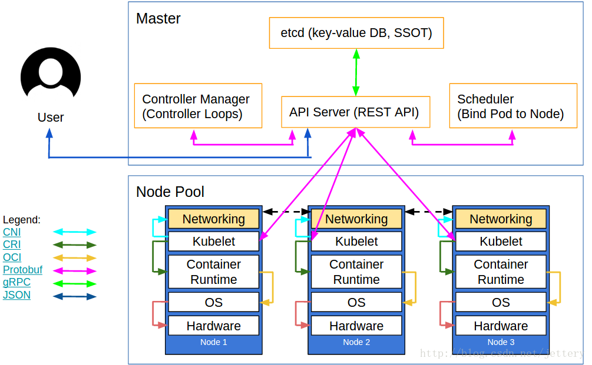

Kubelet组件运行在Node节点上，维持运行中的Pods以及提供kuberntes运行时环境，主要完成以下使命： 
１．监视分配给该Node节点的pods 
２．挂载pod所需要的volumes 
３．下载pod的secret 
４．通过docker/rkt来运行pod中的容器 
５．周期的执行pod中为容器定义的liveness探针 
６．上报pod的状态给系统的其他组件 
７．上报Node的状态 

整个kubelet可以按照下图所示的模块进行划分，模块之间相互配合完成Kubelet的所有功能．

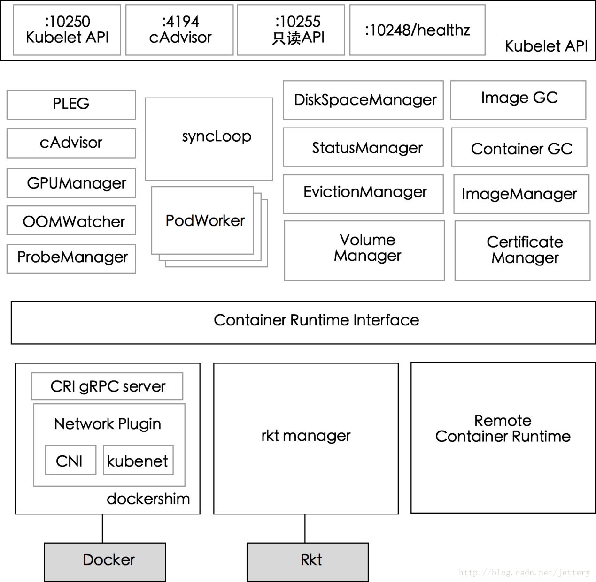


## 4.1 配置

### 4.1.1 kubelet API

Kubelet对外暴露的端口，通过该端口可以获取到kubelet的状态

```shell
# netstat -natp | grep kubelet
tcp    0  0 127.0.0.1:10255       0.0.0.0:*             LISTEN      18097/kubelet       
tcp    0  0 127.0.0.1:10248       0.0.0.0:*             LISTEN      18097/kubelet       
tcp    0  0 127.0.0.1:10250       0.0.0.0:*             LISTEN      18097/kubelet       
tcp    0  0 192.168.56.102:36398  192.168.56.101:8080   ESTABLISHED 18097/kubelet       
tcp    0  0 192.168.56.102:36392  192.168.56.101:8080   ESTABLISHED 18097/kubelet       
tcp    0  0 192.168.56.102:36394  192.168.56.101:8080   ESTABLISHED 18097/kubelet       
tcp    0  0 192.168.56.102:36396  192.168.56.101:8080   ESTABLISHED 18097/kubelet       
tcp6   0  0 :::4194               :::*                  LISTEN      18097/kubelet
```

- 10250 kubelet API　

  kublet暴露出来的端口，通过该端口可以访问获取node资源以及状态，另外可以配合kubelet的启动参数contention-profiling enable-debugging-handlers来提供了用于调试和profiling的api

- 4194 cAdvisor

  kublet通过该端口可以获取到本node节点的环境信息以及node上运行的容器的状态等内容

- 10255 readonly API

  kubelet暴露出来的只读端口，访问该端口不需要认证和鉴权，该http server提供查询资源以及状态的能力．注册的消息处理函数定义src/k8s.io/kubernetes/pkg/kubelet/server/server.go:149

- 10248 /healthz

  kubelet健康检查,通过访问该url可以判断Kubelet是否正常work, 通过kubelet的启动参数–healthz-port –healthz-bind-address来指定监听的地址和端口．默认值定义在pkg/kubelet/apis/kubeletconfig/v1alpha1/defaults.go 


### 4.1.2 config

k8s v1.10版本中，可以通过`--config=/etc/kubernetes/config.yaml`指定Kubelet配置参数的子集，这些子集已经不推荐直接通过Kubelet指定。[config.yaml](https://kubernetes.io/docs/tasks/administer-cluster/kubelet-config-file/)配置参考如下：

```yaml
kind: KubeletConfiguration
apiVersion: kubelet.config.k8s.io/v1beta1
evictionHard:
    memory.available:  "200Mi"
staticPodPath: "/etc/kubernetes/manifests"
clusterDomain: "cluster.local"
clusterDNS: ["21.1.0.3"]
```

### 4.1.3 Dynamic Kubelet Configuration

[动态Kubelet配置](https://kubernetes.io/docs/tasks/administer-cluster/reconfigure-kubelet/)(Dynamic Kubelet Configuration)允许集群中的节点通过ConfigMap实时更改集群中每个Kubelet的配置。

1. 获取节点配置

   ```shell
   # kubectl proxy --port=8001 &
   # export NODE_NAME=node1
   # curl -sSL "http://localhost:8001/api/v1/nodes/${NODE_NAME}/proxy/configz" | jq '.kubeletconfig|.kind="KubeletConfiguration"|.apiVersion="kubelet.config.k8s.io/v1beta1"' > kubelet_configz_${NODE_NAME}

   ```

2. 推送节点配置到控制平面

   ```shell
   # kubectl -n kube-system create configmap node1-config --from-file=kubelet=kubelet_configz_${NODE_NAME} --append-hash -o yaml
   ```

3. 设置节点使用新的配置

   ```shell
   # kubectl edit node ${NODE_NAME}
   ```

   在节点配置spec中新增以下：

   ```yaml
   configSource:
     configMap:
       name: CONFIG_MAP_NAME     # configmap名
       namespace: kube-system
       kubeletConfigKey: kubelet # ConfigMap中包含的kubelet名
   ```

4. 确认配置生效

   ```shell
   # kubectl get node ${NODE_NAME} -o yaml
   ```


## 4.2 kubelet核心功能模

### 4.2.1 PLEG 

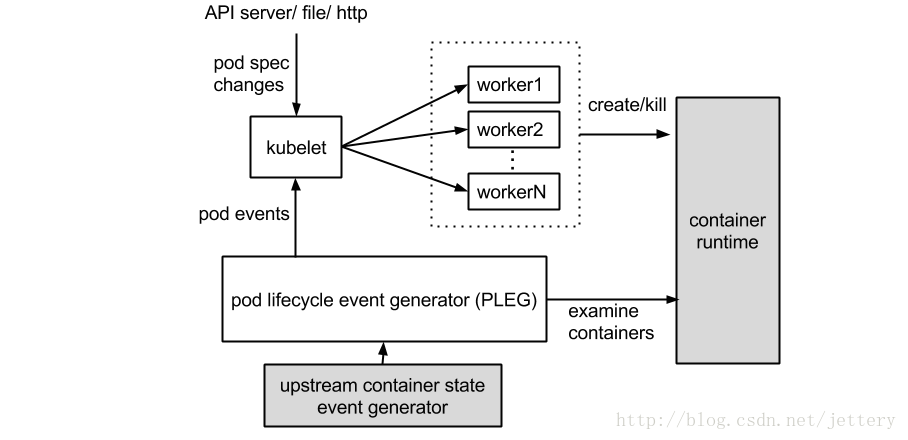
PLEG定期调用container runtime获取本节点的pods，之后比较本模块中之前缓存的pods信息，比较最新的pods中的容器的状态是否发生改变，当状态发生切换的时候，生成一个eventRecord事件，输出到eventChannel中．syncPod模块会接收到eventChannel中的event事件，来触发pod同步处理过程，调用contaiener runtime来重建pod，保证pod工作正常．

```go
type PodLifecycleEvent struct {
	ID types.UID
	Type PodLifeCycleEventType
	Data interface{}
}

type GenericPLEG struct {
	relistPeriod time.Duration
	runtime kubecontainer.Runtime
	eventChannel chan *PodLifecycleEvent
	podRecords podRecords
	relistTime atomic.Value
	cache kubecontainer.Cache
	clock clock.Clock
	podsToReinspect map[types.UID]*kubecontainer.Pod
}
```

接口定义如下：

```go
 48 type PodLifecycleEventGenerator interface {
 49         Start()
 50         Watch() chan *PodLifecycleEvent
 51         Healthy() (bool, error)
 52 }
```
### 4.2.2 containerManager 

负责node节点上运行的容器的cgroup配置信息，kubelet启动参数如果指定–cgroupPerQos的时候，kubelet会启动gorountie来周期性的更新pod的cgroup信息，维持其正确．实现了pod的Guaranteed/BestEffort/Burstable三种级别的Qos,通过配置kubelet可以有效的保证了当有大量pod在node上运行时，保证node节点的稳定性．该模块中涉及的struct主要包括 

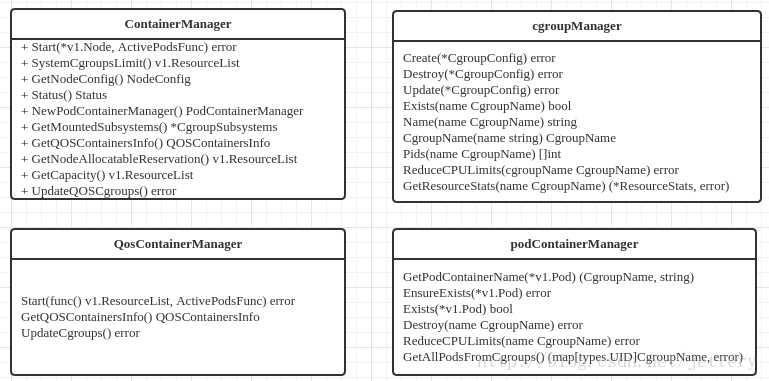

### 4.2.3 podManager 

podManager提供了接口来存储和访问pod的信息，维持static pod和mirror pods的关系，提供的接口如下所示

 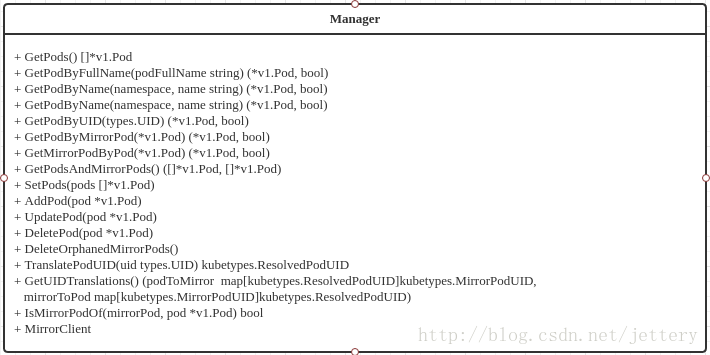

跟其他Manager之间的关系，podManager会被statusManager/volumeManager/runtimeManager所调用，并且podManager的接口处理流程里面同样会调用secretManager以及configMapManager. 

### 4.2.4 RuntimeManager 

containerRuntime负责kubelet与不同的runtime实现进行对接，实现对于底层container的操作，初始化之后得到的runtime实例将会被之前描述的组件所使用． 
当前可以通过kubelet的启动参数–container-runtime来定义是使用docker还是rkt.runtime需要实现的接口定义在src/k8s.io/kubernetes/pkg/kubelet/apis/cri/services.go文件里面

### 4.2.5 ImageManager 

调用kubecontainer.ImageService提供的PullImage/GetImageRef/ListImages/RemoveImage/ImageStates的方法来保证pod运行所需要的镜像，主要是为了kubelet支持cni．

### 4.2.6 VolumeManager 

负责node节点上pod所使用的ｖolume的管理．主要涉及如下功能 
Volume状态的同步，模块中会启动gorountine去获取当前node上volume的状态信息以及期望的volume的状态信息，会去周期性的sync　volume的状态，另外volume与pod的生命周期关联，pod的创建删除过程中volume的attach/detach流程．更重要的是kubernetes支持多种存储的插件，kubelet如何调用这些存储插件提供的interface.涉及的内容较多，更加详细的信息可以看kubernetes中volume相关的代码和文档．

### 4.2.7 cAdvisor 

cAdvisor集成在kubelet中，起到收集本Node的节点和启动的容器的监控的信息，启动一个Http Server服务器，对外接收rest api请求．cAvisor模块对外提供了interface接口，可以通过interface接口获取到node节点信息，本地文件系统的状态等信息，该接口被imageManager，OOMWatcher，containerManager等所使用 
cAdvisor相关的内容详细可参考github.com/google/cadvisor

### 4.2.8 GPUManager 

对于Node上可使用的GPU的管理，当前版本需要在kubelet启动参数中指定feature-gates中添加Accelerators=true，并且需要才用runtime=Docker的情况下才能支持使用GPU,并且当前只支持NvidiaGPU,GPUManager主要需要实现interface定义的Start()/Capacity()/AllocateGPU()三个函数

### 4.2.9 OOMWatcher 

系统OOM的监听器，将会与cadvisor模块之间建立SystemOOM,通过Watch方式从cadvisor那里收到的OOM信号，并发生相关事件

### 4.2.10 ProbeManager 

探针是由 kubelet 对容器执行的定期诊断。探针有三种实现方式 ：

- execprobe

  在容器内部执行一个命令，如果命令返回码为０，则表明容器健康。

- tcprobe

  通过容器的IP地址和端口号执行TCP检查，如果能够建立TCP连接，则表明容器健康。

- httprobe

  通过容器的IP地址，端口号以及路径调用http Get方法，如果响应status>=200 && status<=400的时候，则认为容器状态健康

ProbeManager依赖statusManager，livenessManager，containerRefManager实现Pod的健康检查的功能．当前支持两种类型的探针：LivenessProbe和ReadinessProbe, 

- LivenessProbe

  用于判断容器是否存活，如果探测到容器不健康，则kubelet将杀掉该容器，并根据容器的重启策略做相应的处理 

- ReadinessProbe: 用于判断容器是否启动完成 

### 4.2.11 StatusManager 

该模块负责pod里面的容器的状态，接受从其它模块发送过来的pod状态改变的事件，进行处理，并更新到kube-apiserver中．

### 4.2.12 stats

kubelet直接从cAdvisor暴露了许多metrics

```go
[kubelet/server/stats/handler.go]
"/stats"
handleStats
  -> h.provider.GetRawContainerInfo("/", query.cadvisorRequest(), false) 

"/stats/container"
handleSystemContainer
  -> provider.GetRawContainerInfo()

"stats/{podName}/{containerName}"
"stats/{namespace}/{podName}/{uid}/{containerName}"
handlePodContainer
  -> provider.GetPodByName()
  -> provider.GetContainerInfo()
```

kubelet还提供了**stats/summarm**，该接口不是直接通过cadvisor获取，cadvisor只提供了部分metrics源。**metrics-server**通过stats/summary接口获取Node和Pod的信息。

```go
"/stats/summary"
handleSummary
  -> summaryProvider.Get(forceStatsUpdate)
     -> provider.GetNode()
        provider.GetNodeConfig()
        provider.GetCgroupStats("/", updateStats)
        provider.RootFsStats()
        provider.ImageFsStats()
        provider.ListPodStats()
        provider.RlimitStats()
  -> summaryProvider.GetCPUAndMemoryStats()
```

stats/summary接口从StatsProvider结构中获取Node和Pod的信息:

```go
[kubelet/stats/stats_provider.go]

type StatsProvider struct {
        cadvisor     cadvisor.Interface
        podManager   kubepod.Manager   
        runtimeCache kubecontainer.RuntimeCache
        containerStatsProvider
}
```
根据k8s使用的runtime，StatsProvider需要从以下接口获取不同运行时的node和Pod信息：

- docker

  NewCadvisorStatsProvider
  返回从cAdvisor获取的node和Container的 stats。

- crio

  NewCRIStatsProvider
  返回从cAdvisor获取的node stats和从CRI获取的Container的stats。

上述runtime的StatsProvider需要实现以下接口：

```go
type containerStatsProvider interface {
        ListPodStats() ([]statsapi.PodStats, error)
        ListPodCPUAndMemoryStats() ([]statsapi.PodStats, error)
        ImageFsStats() (*statsapi.FsStats, error)
        ImageFsDevice() (string, error)
}
```

stats_provider.go包含如下方法：

```go
rootStats{CPU,Memory}   // 获取cpu，memory信息
networkStats            // 获取network信息
  -> GetCgroupStats
    -> info, err := getCgroupInfo(p.cadvisor, cgroupName, updateStats)
       -> cadvisor.ContainerInfoV2()
    -> cadvisorInfoToContainerStats(cgroupName, info, nil, nil)
    -> cadvisorInfoToNetworkStats(cgroupName, info)
rootFsStats             // 获取FS 信息，包括已用/可用Bytes，inode信息
  -> RootFsStats
     -> cadvisor.RootFsInfo()

imageFsStats           // 获取runtime中FS信息，该信息可能从cadvisor或crio中获取
  -> ImageFsStats()
     -> cadvisor.ImagesFsInfo()
        imageService.ImageStats()   //从cAdvisor获取信息
     -> imageService.ImageFsInfo()

rlimit       -> RlimitStats()       //直接从系统获取。

SystemContainers -> GetSystemContainersStats()
-----------------------------------------------
GetContainerInfo                   // 用于获取pod中container信息
  -> pod := kubecontainer.Pods(pods).FindPod(podFullName, podUID)
  -> container := pod.FindContainerByName(containerName)
  -> cadvisor.DockerContainer()
GetRawContainerInfo               //root container
```

kubelet中cadvisor提供了如下接口：

```go
v1
ContainerInfo     -> GetContainerInfo
VersionInfo       -> GetVersionInfo
SubcontainerInfo  -> SubcontainersInfo
                     cadvisorapi.ContainerInfo
MachineInfo       -> GetMachineInfo
WatchEvents

v2 
ContainerInfoV2  -> GetContainerInfoV2
ImagesFsInfo     -> getFsInfo
RootFsInfo       -> GetDirFsInfo
getFsInfo        -> GetFsInfo
```


### 4.2.13 Container/RefManager 

容器引用的管理，相对简单的Manager，通过定义map来实现了containerID与v1.ObjectReferece容器引用的映射．

### 4.2.14 EvictionManager 

evictManager当node的节点资源不足的时候，达到了配置的evict的策略，将会从node上驱赶pod，来保证node节点的稳定性．可以通过kubelet启动参数来决定evict的策略．另外当node的内存以及disk资源达到evict的策略的时候会生成对应的node状态记录．

### 4.2.15 ImageGC

imageGC负责Node节点的镜像回收，当本地的存放镜像的本地磁盘空间达到某阈值的时候，会触发镜像的回收，删除掉不被pod所使用的镜像．回收镜像的阈值可以通过kubelet的启动参数来设置．

### 4.2.16 ContainerGC 

containerGC负责NOde节点上的dead状态的container,自动清理掉node上残留的容器．具体的GC操作由runtime来实现．

**Kubernetes回收策略**

当kubernetes集群中某个节点上可用资源比较小时，kubernetes提供了资源回收策略来保证节点上POD正常运行。因为如果节点上的内存或者CPU资源耗尽时，这个节点上运行的POD就会变成不稳定。

Kubernetes通过kubelet来进行回收策略控制，保证节点上POD在节点资源比较小时可以稳定运行。

Kubelet提供QoS服务质量管理，支持系统级别的OOM控制。

在Kubernetes中，POD的QoS服务质量一共有三个级别，如下图所示：


这三个QoS级别介绍，可以看下面表格：

| QoS级别    | QoS介绍                                                      |
| ---------- | ------------------------------------------------------------ |
| BestEffort | POD中的所有容器都没有指定CPU和内存的requests和limits，那么这个POD的QoS就是BestEffort级别 |
| Burstable  | POD中只要有一个容器，这个容器requests和limits的设置同其他容器设置的不一致，那么这个POD的QoS就是Burstable级别 |
| Guaranteed | POD中所有容器都必须统一设置了limits，并且设置参数都一致，如果有一个容器要设置requests，那么所有容器都要设置，并设置参数同limits一致，那么这个POD的QoS就是Guaranteed级别 |

对于kubernetes来说，通过cgroup就可以给POD设置QoS级别，当资源不够使用时，先kill优先级低的POD，在实际使用时，是通过OOM（Out of Memory）分数值来实现的，OOM分数值从0到1000。OOM分数值是根据OOM_Ajd参数计算出来的，对于Guaranteed级别的POD，OOM_ADJ参数设置成了-998，对于BestEffort级别的POD，OOM_ADJ参数设置成了1000，对于Burstable级别的POD，OOM_ADJ参数取值从2到999，对于kube保留的资源，比如kubelet，OOM_ADJ参数设置成了-999。OOM_ADJ参数设置的越大，通过OOM_ADJ参数计算出来的OOM分数越高，OOM分数越高，这个POD的优先级就越低，在出现资源竞争的时候，就越早被kill掉，对于OOM_ADJ参数是-999的代表kubernetes永远不会因为OOM而被kill掉。如下图所示：

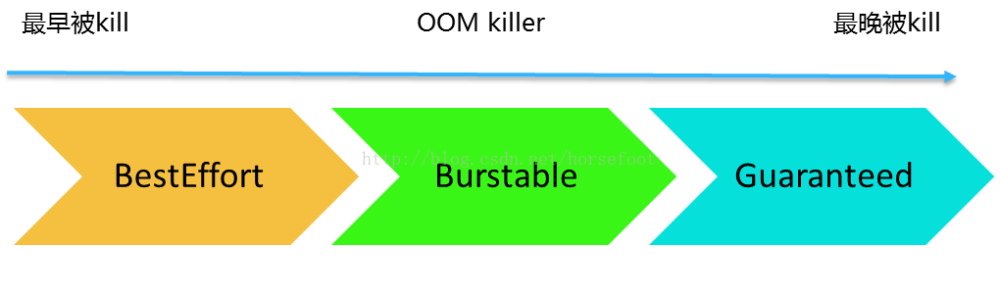

kubelet可以提前监控到节点上资源减少，并且及时做出控制操作，可以停止某些POD，然后让调度来在其他节点上启动这些POD，这样就可以保证节点上资源足够POD使用。

### 4.2.17 PodConfig

PodConfig将多个Pod配置源(file,url...)合并成一个一致的结构，然后按顺序向listeners提供增量更改通知。
PodConfig通过NewPodConfig()初始化，包含2个重要的结构：podStorage和config.Mux

```go
[kubelet/config/config.go]
type PodConfig struct {
        pods *podStorage
        mux  *config.Mux
        updates chan kubetypes.PodUpdate
        sourcesLock       sync.Mutex   
        sources           sets.String  
        checkpointManager checkpointmanager.CheckpointManager
}
```
Updates方法在kubelet.Run(podCfg.Updates())时被调用，返回的Updates Channel被传递给kubelet.syncLoop。调用Merger方法时会向Updates Channel写入pod更新消息。

```go
Channel
  -> c.mux.Channel(source)
  -> go wait.Until(func() { m.listen(source, newChannel) }, 0, wait.NeverStop)
     -> m.merger.Merge(source, update)
  -> return newChannel

Updates -> return c.updates  //返回updates channel

SeenAllSources
Sync
Restore
```
- config.Mux

  ```go
  [pkg/util/config/config.go]
  type Merger interface {
  	Merge(source string, update interface{}) error  //当source发生变化时调用
  }

  type Mux struct {
          merger Merger                       //source中有更新时调用Merger
          sourceLock sync.RWMutex        
          sources map[string]chan interface{} //保存source名称到channel的映射
  }
  ```
  Mux结构维护了多个sources和对应channel的映射关系，Mux通过NewMux初始化：
  ```go
  func NewMux(merger Merger) *Mux {      
          mux := &Mux{
                  sources: make(map[string]chan interface{}),
                  merger:  merger,       
          }
          return mux        
  }
  ```
  Mux包含一个Channel()方法，该方法通过map保存source(file,url...)和channel的映射，同时返回source对应的channel。当channel接收到消息时通过listen调用Merger方法。
  需要监控某个source时调用Channel方法。目前kubelet中监控了以下source：
  ```go
  config.NewSourceFile(kubeCfg.StaticPodPath, ..., \
                       			cfg.Channel(kubetypes.FileSource))
  config.NewSourceURL(kubeCfg.StaticPodURL, ..., \
                     			 	cfg.Channel(kubetypes.HTTPSource))
  cfg.Restore(bootstrapCheckpointPath, \
              					cfg.Channel(kubetypes.ApiserverSource))
  config.NewSourceApiserver(kubeDeps.KubeClient, nodeName, \
                            		cfg.Channel(kubetypes.ApiserverSource))
  ```

- podStorage

  ```go
  [kubelet/config/config.go]
  type podStorage struct {
          podLock sync.RWMutex
          pods map[string]map[types.UID]*v1.Pod
          mode PodConfigNotificationMode
          updateLock sync.Mutex
          updates    chan<- kubetypes.PodUpdate
          sourcesSeenLock sync.RWMutex
          sourcesSeen     sets.String
          recorder record.EventRecorder
  }

  newPodStorage

  Merge
  MergedState
  Sync
  ```

Merge方法中过滤掉冗余的更新，根据source的change中的消息类型向Updates Channel中写入Pod的更新消息，这些消息会传递给syncLoop。

## 4.3 kubelet流程

### 4.3.1 kubelet概要流程：
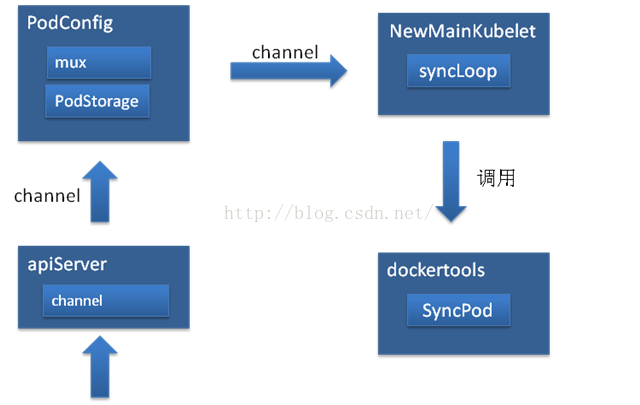
- API Server负责接收server发过来的Pod管理信息，通过channel推送到PodConfig。
- PodConfig的mux使用Storage的Merge方法，Merge方法又会通过Updates 这个channel将Pod数据推给Kubelet，真正的Pod处理在Kubelet包中。
- Kubelet通过syncLoop监听channel，收到数据后就执行关于Pod和容器的处理，
- 真正操作容器的方法调用kuberuntime包中的SyncPod方法。


channel消息流如下：

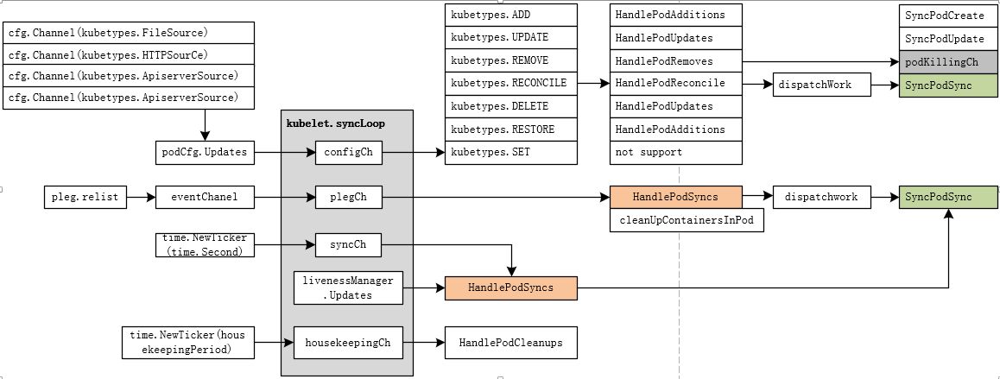

### 4.3.2 kubelet详细流程
kubelet通过goroutine启动各个组件，最后syncLoop循环处理所有 pod 更新，获取 pod 的新建、修改和删除等变化，然后调用对应的处理函数保证节点上的容器符合 pod 的配置。
```
main()
└─> app.NewKubeletCommand()
   └─> Run(kubeletServer, kubeletDeps)
      └─> run(s, kubeDeps)
         └─> RunKubelet()
             ├─> CreateAndInitKubelet()
             |   ├─> kubelet.NewMainKubelet()
             |   ├─> k.BirthCry()
             |   ├─> k.StartGarbageCollection()
             └─> startKubelet()
                 ├─> k.Run()                       // start the kubelet
                 └─> k.ListenAndServe()
                     k.ListenAndServeReadOnly()    // 启动kubelet API 服务，监听端口
```

#### 4.3.2.1 NewMainKubelet
实例化一个kubelet对象，并对kubelet内部各个component进行初始化：
```go
NewMainKubelet
  -> makePodSourceConfig()             //pod元数据的来源(FILE, URL,checkpoint，api)
  
  -> serviceIndexer := cache.NewIndexer()
     serviceLW := cache.NewListWatchFromClient()
     r := cache.NewReflector()
     go r.Run(wait.NeverStop)
     serviceLister := corelisters.NewServiceLister(serviceIndexer)
  -> nodeIndexer := cache.NewIndexer()
     nodeLW := cache.NewListWatchFromClient()
     r := cache.NewReflector()
     go r.Run(wait.NeverStop)
     nodeInfo := &predicates.CachedNodeInfo{
                           NodeLister: corelisters.NewNodeLister(nodeIndexer)}
  
  -> containerRefManager := kubecontainer.NewRefManager()
  -> oomWatcher := NewOOMWatcher()
  
  -> secretManager := secret.NewCachingSecretManager()
  -> configMapManager := configmap.NewCachingConfigMapManager()
  -> livenessManager = proberesults.NewManager()
  -> podCache = kubecontainer.NewCache()
  -> checkpointManager = checkpointmanager.NewCheckpointManager()
  
  -> podManager = kubepod.NewBasicPodManager       //初始化PodManager用于保存Pod状态

  -> resourceAnalyzer = serverstats.NewResourceAnalyzer()
  
  -> dockershim.NewDockerService       // 如果runtime是docker，则启动dockershim 
  
  -> getRuntimeAndImageServices        // 返回Runtime/Imagea Service服务的客户端API
  -> kuberuntime.NewKubeGenericRuntimeManager() //管理CRI接口
  
  -> StatsProvider = stats.NewCadvisorStatsProvider()/NewCRIStatsProvider()
  
  -> pleg = pleg.NewGenericPLEG()        //创建PLEG对象，并通过runtimeState检查PLEG健康状态      

  -> kubecontainer.NewContainerGC
  ->  newPodContainerDeletor             // 设置 containerGC
  -> images.NewImageGCManager            // 设置 imageGC
  
  -> prober.NewManager                     
  -> volumemanager.NewVolumeManager
  -> kubecontainer.NewRuntimeCache
  -> newPodWorkers
```

##### 4.3.2.1.1 makePodSourceConfig

支持FILE，URL，checkpoint，api-server四种方式获取pod源，前面几种都是让kubelet处于standalone模式，脱离管理api单独运行。
```go
makePodSourceConfig
  -> cfg := config.NewPodConfig()
  -> config.NewSourceFile(kubeCfg.StaticPodPath, \             // 1.file
                          nodeName, \
                          kubeCfg.FileCheckFrequency.Duration, \
                          cfg.Channel(kubetypes.FileSource))
  -> config.NewSourceURL(kubeCfg.StaticPodURL, \              // 2.url
                         manifestURLHeader, \
                         nodeName, \
                         kubeCfg.HTTPCheckFrequency.Duration, \
                         cfg.Channel(kubetypes.HTTPSource))
  -> updatechannel = cfg.Channel(kubetypes.ApiserverSource)
     cfg.Restore(bootstrapCheckpointPath, updatechannel)     // 3.checkpoint
  
  -> updatechannel = cfg.Channel(kubetypes.ApiserverSource)  // 4.api-server
     config.NewSourceApiserver(kubeDeps.KubeClient, nodeName, updatechannel)
```

**1. file 方式**

```go
NewSourceFile
  -> config := newSourceFile(path, nodeName, period, updates)
     -> store := cache.NewUndeltaStore(send, cache.MetaNamespaceKeyFunc)
     -> return &sourceFile{}
  -> config.run()
```

在 run函数中，定期调用s.listConfig()解析pod，通过s.store.Replace将pod更新到cache中。同时还通过watchEvents Channel监控文件的变化，Pod 增加/修改，删除时调用s.store.Add(pod)和s.store.Delete(pod)

**4. api Server**

最主要途径还是通过API Server的方式获取容器信息。并在此处watch apiserver，监听api关于本主机上面容器的变化：

- **NewSourceApiserver** 中通过NewListWatchFromClient创建了一个listwatch，监听在本主机上面所有命名空间中pods的更新，并把更新写入updatechannel中。
```go
func NewSourceApiserver(c clientset.Interface, nodeName types.NodeName, updates chan<- interface{}) {
lw := cache.NewListWatchFromClient(c.CoreV1().RESTClient(), "pods", metav1.NamespaceAll, fields.OneTermEqualSelector(api.PodHostField, string(nodeName)))
newSourceApiserverFromLW(lw, updates)
}
```

- **NewFilteredListWatchFromClient**中定义了listFunc和watchFunc
```go
func NewFilteredListWatchFromClient(c Getter, resource string, namespace string, optionsModifier func(options *metav1.ListOptions)) *ListWatch {
	listFunc := func(options metav1.ListOptions) (runtime.Object, error) {
		optionsModifier(&options)
		return c.Get().
			Namespace(namespace).
			Resource(resource).
			VersionedParams(&options, metav1.ParameterCodec).
			Do().
			Get()
	}
	watchFunc := func(options metav1.ListOptions) (watch.Interface, error) {
		options.Watch = true
		optionsModifier(&options)
		return c.Get().
			Namespace(namespace).
			Resource(resource).
			VersionedParams(&options, metav1.ParameterCodec).
			Watch()
	}
	return &ListWatch{ListFunc: listFunc, WatchFunc: watchFunc}
}
```

- **newSourceApiserverFromLW**
定义了send方法，用于将pods更新写入  upodatechannel。但send方法不会被立刻执行，而是在创建NewReflector时传递给NewUndeltaStore。
reflector结构中的store用于存储pod的信息的。send方法就是store里面的pushFunc，pushFunc会在store数据发生变化的时候被调用，从而达到监控的目的。

```go
func newSourceApiserverFromLW(lw cache.ListerWatcher, updates chan<- interface{}) {
	send := func(objs []interface{}) {
		var pods []*v1.Pod
		for _, o := range objs {
			pods = append(pods, o.(*v1.Pod))
		}
		updates <- kubetypes.PodUpdate{Pods: pods, Op: kubetypes.SET, Source: kubetypes.ApiserverSource}
	}
	r := cache.NewReflector(lw, &v1.Pod{}, cache.NewUndeltaStore(send, cache.MetaNamespaceKeyFunc), 0)
	go r.Run(wait.NeverStop)
}
```

- 创建完reflector后，调用Run运行。Run里面周期的调用ListAndWatch方法，接收并处理channel消息。：

```go
func (r *Reflector) Run(stopCh <-chan struct{}) {
	glog.V(3).Infof("Starting reflector %v (%s) from %s", r.expectedType, r.resyncPeriod, r.name)
	wait.Until(func() {
		if err := r.ListAndWatch(stopCh); err != nil {
			utilruntime.HandleError(err)
		}
	}, r.period, stopCh)
}
```

消息的处理在reflector.go:watchHandler()中。


##### 4.3.2.1.2 NewKubeGenericRuntimeManager

用于管理CRI接口，包括RuntimeManager和ImageManager。kubelet调用CRI接口都是通过该接口中的方法实现。接口定义如下：
```go
[kubelet/kuberuntime/kuberuntime_manager.go]
type KubeGenericRuntime interface {
	kubecontainer.Runtime
	kubecontainer.IndirectStreamingRuntime
	kubecontainer.ContainerCommandRunner
}
```

包含如下方法，以下方法最终都会调用remote中的API：
```go
[kubelet/kuberuntime/kuberuntime_manager.go]
type kubeGenericRuntimeManager struct {
	runtimeName         string
	recorder            record.EventRecorder
	osInterface         kubecontainer.OSInterface
	containerRefManager *kubecontainer.RefManager
	machineInfo         *cadvisorapi.MachineInfo
	containerGC         *containerGC
	keyring             credentialprovider.DockerKeyring
	runner              kubecontainer.HandlerRunner
	runtimeHelper       kubecontainer.RuntimeHelper
	livenessManager     proberesults.Manager
	cpuCFSQuota         bool
	imagePuller         images.ImageManager
	runtimeService      internalapi.RuntimeService
	imageService        internalapi.ImageManagerService
	versionCache        *cache.ObjectCache
	seccompProfileRoot  string
	internalLifecycle   cm.InternalContainerLifecycle
	legacyLogProvider   LegacyLogProvider
}
--------------------------------------------------------------
Version     -> m.runtimeService.Version(kubeRuntimeAPIVersion)
APIVersion  -> m.versionCache.Get(m.machineInfo.MachineID)
Status      -> m.runtimeService.Status()
SyncPod     -> m.computePodActions(pod, podStatus)
            -> m.createPodSandbox(pod, podContainerChanges.Attempt)//创建sandbox
            -> m.runtimeService.PodSandboxStatus(podSandboxID) 
            -> m.determinePodSandboxIP(pod.Namespace, pod.Name, podSandboxStatus)
            -> m.generatePodSandboxConfig(pod, podContainerChanges.Attempt)
            -> m.startContainer()   //启动container

GetPods     -> m.getKubeletSandboxes(all)
            -> m.sandboxToKubeContainer(s)
            -> m.getKubeletContainers(all)
            -> getContainerInfoFromLabels(c.Labels)

KillPod     -> m.runtimeService.StopPodSandbox()

GetPodStatus  -> m.getSandboxIDByPodUID
              -> m.runtimeService.PodSandboxStatus
              -> m.determinePodSandboxIP()
              -> m.getPodContainerStatuses()

GetPodContainerID -> pod.Sandboxes[0].ID
UpdatePodCIDR     -> m.runtimeService.UpdateRuntimeConfig

GarbageCollect    -> m.containerGC.GarbageCollect()
------------------------------------------------------------------------
[kubelet/kuberuntime/kuberuntime_sandbox.go]
createPodSandbox
                       -> m.generatePodSandboxConfig
                       -> m.runtimeService.RunPodSandbox
getKubeletSandboxes    -> m.runtimeService.ListPodSandbox
determinePodSandboxIP
getSandboxIDByPodUID   -> m.runtimeService.ListPodSandbox
GetPortForward         -> m.runtimeService.PortForward  //设置端口转发

------------------------------------------------------------------------
[kubelet/kuberuntime/kuberuntime_container.go]
GetContainerLogs  -> m.runtimeService.ContainerStatus
GetExec           -> m.runtimeService.Exec
GetAttach         -> m.runtimeService.Attach
RunInContainer    -> m.runtimeService.ExecSync
DeleteContainer   -> m.runtimeService.RemoveContainer
startContainer    -> m.generateContainerConfig
				  -> m.runtimeService.CreateContainer
                  -> m.runtimeService.StartContainer
getKubeletContainers -> m.runtimeService.ListContainers
getPodContainerStatuses -> m.runtimeService.ListContainers
                        -> m.runtimeService.ContainerStatus
GetContainerLogs        -> m.runtimeService.ContainerStatus
------------------------------------------------------------------------
[kubelet/kuberuntime/kuberuntime_image.go]
PullImage   -> m.imageService.PullImage
GetImageRef -> m.imageService.ImageStatus
ListImages  -> m.imageService.ListImages
RemoveImage -> m.imageService.RemoveImage
ImageStats  -> m.imageService.ListImages
```
##### 4.3.2.1.3 getRuntimeAndImageServices
根据kubelet启动参数remoteRuntimeEndpoint通过**NewRemoteImageService()**函数初始化CIR客户端的**RuntimeServiceClient**接口。CRI客户端接口定义在lubelet/apis/cri/runtime/v1alpha2/api.pb.go文件中。
```go
<kubelet/remote/remote_image.go>
[functions]
NewRemoteImageService()

[struct]
type RemoteImageService struct {
        timeout     time.Duration
        imageClient runtimeapi.ImageServiceClient
}

[methods]
ListImages  -> r.imageClient.ListImages
ImageStatus -> r.imageClient.ImageStatus
PullImage   -> r.imageClient.PullImage
RemoveImage -> r.imageClient.RemoveImage
ImageFsInfo -> r.imageClient.ImageFsInfo
```
同样，根据kubelet启动参数remoteImageEndpoint通过**NewRemoteRuntimeService()**函数初始化CIR客户端的**ImageServiceClient**接口。
```go
<kubelet/remote/remote_runtime.go>
[functions]
NewRemoteRuntimeService()

[struct]
type RemoteRuntimeService struct {
        timeout       time.Duration
        runtimeClient runtimeapi.RuntimeServiceClient
}

[methods]
Version           -> r.runtimeClient.Version

RunPodSandbox     -> r.runtimeClient.RunPodSandbox
StopPodSandbox    -> r.runtimeClient.StopPodSandbox
RemovePodSandbox  -> r.runtimeClient.RemovePodSandbox
PodSandboxStatus  -> r.runtimeClient.PodSandboxStatus
ListPodSandbox    -> r.runtimeClient.ListPodSandbox

CreateContainer   -> r.runtimeClient.CreateContainer
StartContainer    -> r.runtimeClient.StartContainer
StopContainer     -> r.runtimeClient.StopContainer
RemoveContainer   -> r.runtimeClient.RemoveContainer
ListContainers    -> r.runtimeClient.ListContainers
ContainerStatus   -> r.runtimeClient.ContainerStatus
ContainerStats      -> r.runtimeClient.ContainerStats
ListContainerStats  -> r.runtimeClient.ListContainerStats
UpdateContainerResources -> r.runtimeClient.UpdateContainerResources

ExecSync          -> r.runtimeClient.ExecSync
Exec              -> r.runtimeClient.Exec
Attach            -> r.runtimeClient.Attach
PortForward       -> r.runtimeClient.PortForward
UpdateRuntimeConfig -> r.runtimeClient.UpdateRuntimeConfig
Status              -> r.runtimeClient.Status
ReopenContainerLog  -> r.runtimeClient.ReopenContainerLog
```

kuberuntime_manager中的接口不会直接调用上述方法，而是使用以下两个接口对这些方法再做一次封装，用于记录操作的潜伏期和返回的错误：
```go
[pkg/kubelet/apis/cri/services.go]
type RuntimeService interface {
	RuntimeVersioner
	ContainerManager
	PodSandboxManager
	ContainerStatsManager

	// UpdateRuntimeConfig updates runtime configuration if specified
	UpdateRuntimeConfig(runtimeConfig *runtimeapi.RuntimeConfig) error
	// Status returns the status of the runtime.
	Status() (*runtimeapi.RuntimeStatus, error)
}
type ImageManagerService interface {
	// ListImages lists the existing images.
	ListImages(filter *runtimeapi.ImageFilter) ([]*runtimeapi.Image, error)
	// ImageStatus returns the status of the image.
	ImageStatus(image *runtimeapi.ImageSpec) (*runtimeapi.Image, error)
	// PullImage pulls an image with the authentication config.
	PullImage(image *runtimeapi.ImageSpec, auth *runtimeapi.AuthConfig) (string, error)
	// RemoveImage removes the image.
	RemoveImage(image *runtimeapi.ImageSpec) error
	// ImageFsInfo returns information of the filesystem that is used to store images.
	ImageFsInfo() ([]*runtimeapi.FilesystemUsage, error)
}
```

instrumented_services.go中提供**newInstrumentedRuntimeService()**和**newInstrumentedImageManagerService()**两个函数，初始化kubeGenericRuntimeManager结构中的runtimeService和imageService成员。

##### 4.3.2.1.4 newPodWorker

```go
[kubelet/pod_works.go]
type podWorkers struct {
	podLock        sync.Mutex
	podUpdates     map[types.UID]chan UpdatePodOptions //跟踪所有正在运行的
                                                       //pod goroutines
	isWorking      map[types.UID]bool
	lastUndeliveredWorkUpdate map[types.UID]UpdatePodOptions
	workQueue      queue.WorkQueue
	syncPodFn      syncPodFnType       //pod状态同步函数syncPod.
	recorder       record.EventRecorder
	backOffPeriod  time.Duration
	resyncInterval time.Duration
	podCache       kubecontainer.Cache
}

type PodWorkers interface {
	UpdatePod(options *UpdatePodOptions)
	ForgetNonExistingPodWorkers(desiredPods map[types.UID]empty)
	ForgetWorker(uid types.UID)
}

klet.podWorkers = newPodWorkers()
--------------------------------------------------------
UpdatePod
  -> p.managePodLoop(podUpdates)
    -> p.syncPodFn()
      -> kubelet.syncPod()    //同步pod状态，创建/更新/删除pod时调用
        -> kl.containerRuntime.SyncPod()
          -> kuberuntime.SyncPod()
  -> podUpdates <- *options

ForgetWorker
  -> p.removeWorker(uid)
    -> delete(p.podUpdates, uid)        //关闭管道

ForgetNonExistingPodWorkers
  -> p.removeWorker(key)
    -> delete(p.podUpdates, uid)        //关闭管道
```
##### 4.3.2.1.5 PodManager

kubelet可以从file，http和API发现POD的更新，非API的POD被称为静态Pod(static pods)，API Server无法感知到静态Pod的存在，为了监控静态POD，kubelet会通过API Server为每个静态pod创建一个镜像pod(mirror pod)。镜像pod和对应的静态对名称和namespace相同，镜像pod始终反映静态pod的实际状态，kubelet利用镜像pod来报告静态pod的状态，当静态pod被删除时，对应的镜像pod也会被删除。

```go
type MirrorClient interface {
	CreateMirrorPod(pod *v1.Pod) error
	DeleteMirrorPod(podFullName string) error
}

NewBasicMirrorClient

CreateMirrorPod 
  -> mc.apiserverClient.CoreV1().Pods(copyPod.Namespace).Create(&copyPod)
DeleteMirrorPod
  -> mc.apiserverClient.CoreV1().Pods(namespace).Delete
```

Kubelet依靠podManager获取Pod的状态，Pod Add/Update/Del等时都要通过podManager更新Pod状态， 如果podManager中不存在pod，则表示该Pod已在apiserver中删除。podManager除了用于管理Pod状态，还用于管理mirror pod，secret，configMap和checkpoint。

```go
type Manager interface {
	GetPods() []*v1.Pod
	GetPodByFullName(podFullName string) (*v1.Pod, bool)
	GetPodByName(namespace, name string) (*v1.Pod, bool)
	GetPodByUID(types.UID) (*v1.Pod, bool)
	GetPodByMirrorPod(*v1.Pod) (*v1.Pod, bool)
	GetMirrorPodByPod(*v1.Pod) (*v1.Pod, bool)
	GetPodsAndMirrorPods() ([]*v1.Pod, []*v1.Pod)
	SetPods(pods []*v1.Pod)
	AddPod(pod *v1.Pod)
	UpdatePod(pod *v1.Pod)
	DeletePod(pod *v1.Pod)
	DeleteOrphanedMirrorPods()
	TranslatePodUID(uid types.UID) kubetypes.ResolvedPodUID
	GetUIDTranslations() (podToMirror map[kubetypes.ResolvedPodUID]kubetypes.MirrorPodUID, mirrorToPod map[kubetypes.MirrorPodUID]kubetypes.ResolvedPodUID)
	IsMirrorPodOf(mirrorPod, pod *v1.Pod) bool
	MirrorClient
}

type basicManager struct {
	lock sync.RWMutex
	podByUID map[kubetypes.ResolvedPodUID]*v1.Pod
	mirrorPodByUID map[kubetypes.MirrorPodUID]*v1.Pod
	podByFullName       map[string]*v1.Pod
	mirrorPodByFullName map[string]*v1.Pod
	translationByUID map[kubetypes.MirrorPodUID]kubetypes.ResolvedPodUID
	secretManager     secret.Manager
	configMapManager  configmap.Manager
	checkpointManager checkpointmanager.CheckpointManager
	MirrorClient
}
```


#### 4.3.2.2 startKubelet.Run


kubelet.go中涉及以下两个接口：Bootstrap主要负责kubelet服务启动，SyncHandler根据channel消息，调用对应的handler更新pod状态：

```go
type Bootstrap interface {
	GetConfiguration() kubeletconfiginternal.KubeletConfiguration
	BirthCry()
	StartGarbageCollection()
	ListenAndServe(address net.IP, port uint, tlsOptions *server.TLSOptions, \
                   auth server.AuthInterface, enableDebuggingHandlers, \
                   enableContentionProfiling bool)
	ListenAndServeReadOnly(address net.IP, port uint)
	Run(<-chan kubetypes.PodUpdate)
	RunOnce(<-chan kubetypes.PodUpdate) ([]RunPodResult, error)
}

type SyncHandler interface {
	HandlePodAdditions(pods []*v1.Pod)
	HandlePodUpdates(pods []*v1.Pod)
	HandlePodRemoves(pods []*v1.Pod)
	HandlePodReconcile(pods []*v1.Pod)
	HandlePodSyncs(pods []*v1.Pod)
	HandlePodCleanups() error
}
```

Bootstrap接口涉及kubelet启动相关的函数，最主要的Run函数流程如下：
```go
[pkg/kubelet/kubelet.go]
Run()
  -> kl.initializeModules()   // 初始化内部模块，不需要runtime up。
  -> kl.volumeManager.Run()   // 启动VolumeManager
  -> kl.syncNodeStatus        // 同步node状态
  -> kl.updateRuntimeUp  // 初始化runtime依赖模块(第一次运行时),更新kubelet runtimeState。
  -> kl.syncNetworkUtil       // 同步iptables规则
  -> kl.podKiller             // 启动goroutine主管kill pods
  -> kl.dnsConfigurer.CheckLimitsForResolvConf() //启动goroutine负责检查resolv.conf中的限制
  
  -> kl.statusManager.Start()
     kl.probeManager.Start()    // 启动组件同步循环

  -> kl.pleg.Start()            //启动PLEG，周期调用relist
  -> kl.syncLoop(updates, kl)   // 启动pod生命周期事件生成器。
       -> syncLoopIteration     //根据channel的数据，调度对应的handler处理pod
          1. <-configCh         //config 事件
            kubetypes.ADD:       --> andler.HandlePodAdditions(u.Pods)
            kubetypes.UPDATE:    --> handler.HandlePodUpdates(u.Pods)
            kubetypes.REMOVE:    --> handler.HandlePodRemoves(u.Pods)
            kubetypes.RECONCILE: --> handler.HandlePodReconcile(u.Pods)
            kubetypes.DELETE:    --> handler.HandlePodUpdates(u.Pods)
            kubetypes.RESTORE:   --> handler.HandlePodAdditions(u.Pods)

          2. <-plegCh             //PLEG更新
            isSyncPodWorthy(e)   --> handler.HandlePodSyncs([]*v1.Pod{pod})
            pleg.ContainerDied   --> kl.cleanUpContainersInPod(e.ID, containerID)

          3. <-syncCh             //周期性的更新事件
            handler.HandlePodSyncs(podsToSync)

          4. <-kl.livenessManager.Updates()
            handler.HandlePodSyncs([]*v1.Pod{pod})

          5. <-housekeepingCh    //housekeep事件
            handler.HandlePodCleanups()
```

**Handler**

```go
HandlePodAdditions  -> kl.podManager.AddPod(pod)
                       kl.dispatchWork(pod, kubetypes.SyncPodCreate, mirrorPod, start)
                         -> kl.podWorkers.UpdatePod()
                       kl.probeManager.AddPod(pod)
HandlePodUpdates    -> kl.podManager.UpdatePod(pod)
                       kl.dispatchWork(pod, kubetypes.SyncPodUpdate, mirrorPod, start)
                         -> kl.podWorkers.UpdatePod()
HandlePodRemoves    -> kl.podManager.DeletePod(pod)
                       kl.deletePod(pod)
                         -> kl.podWorkers.ForgetWorker(pod.UID)
                       kl.probeManager.RemovePod(pod)
HandlePodSyncs      -> kl.dispatchWork(pod, kubetypes.SyncPodSync,   mirrorPod, start)
                        -> kl.podWorkers.UpdatePod()
HandlePodReconcile  -> kl.podManager.UpdatePod(pod)
                       kl.containerDeletor.deleteContainersInPod()                 
HandlePodCleanups   -> kl.podWorkers.ForgetNonExistingPodWorkers(desiredPods)
                       kl.probeManager.CleanupPods(activePods)
                       kl.podKillingCh <-
```


## 4.4 CRI

### 4.4.1 CRI概念

早期，Kubernetes依赖于底层的容器运行时实现生命周期控制，例如Pull、创建、删除等操作。运行时实现为实际的容器，从操作系统层面管理命名空间隔离和资源分配，Docker和rkt是通过非公开的API紧密集成到Kubernetes源代码中的。要添加其它的运行时需要修补源代码，这是非常繁琐的，并且稳定性没有保证。为了使得kubernetes更好的扩展以及整合容器运行时（docker，rkt，containerd，cri-o），在Kubernetes 1.5版本之后引入容器运行时接口(CRI，Container Runtime Interface)概念。同时正在完成一个称为[CRI-O](https://github.com/kubernetes-incubator/cri-o)的实现，力图构建Kubernetes和OCI兼容运行时之间的桥梁。这为Kubernetes以标准方式使用任何OCI兼容容器运行时铺平了道路。

Kubelet与容器运行时通信（或者是CRI插件填充了容器运行时）时，Kubelet就是客户端，而CRI插件就是对应的服务器。它们之间可以通过Unix 套接字或者gRPC框架进行通信。


protocol buffers API包含了两个gRPC服务：**ImageService**和**RuntimeService**。ImageService提供了从镜像仓库拉取、查看、和移除镜像的RPC。RuntimeSerivce包含了Pods和容器生命周期管理的RPC，以及跟容器交互的调用(exec/attach/port-forward)。一个单块的容器运行时能够管理镜像和容器（例如：Docker和Rkt），并且通过同一个套接字同时提供这两种服务。这个套接字可以在Kubelet里通过标识–container-runtime-endpoint和–image-service-endpoint进行设置。

- ImageService

  对于image，CRI提供以下机制：

  ```go
  service ImageService {
      rpc ListImages(ListImagesRequest) returns (ListImagesResponse) {}
      rpc ImageStatus(ImageStatusRequest) returns (ImageStatusResponse) {}
      rpc PullImage(PullImageRequest) returns (PullImageResponse) {}
      rpc RemoveImage(RemoveImageRequest) returns (RemoveImageResponse) {}
      rpc ImageFsInfo(ImageFsInfoRequest) returns (ImageFsInfoResponse) {}
  }
  ```


- RuntimeService

对于[Pod](https://www.kubernetes.org.cn/tags/pod)和容器的生命周期管理，CRI提供了下面的机制：

```go
service RuntimeService {
    rpc Version(VersionRequest) returns (VersionResponse) {}
    
    rpc RunPodSandbox(RunPodSandboxRequest) returns (RunPodSandboxResponse) {}
    rpc StopPodSandbox(StopPodSandboxRequest) returns (StopPodSandboxResponse) {}
    rpc RemovePodSandbox(RemovePodSandboxRequest) returns (RemovePodSandboxResponse) {}
    rpc PodSandboxStatus(PodSandboxStatusRequest) returns (PodSandboxStatusResponse) {}
    rpc ListPodSandbox(ListPodSandboxRequest) returns (ListPodSandboxResponse) {}
    rpc PortForward(PortForwardRequest) returns (PortForwardResponse) {}
    
    rpc CreateContainer(CreateContainerRequest) returns (CreateContainerResponse) {}
    rpc StartContainer(StartContainerRequest) returns (StartContainerResponse) {}
    rpc StopContainer(StopContainerRequest) returns (StopContainerResponse) {}
    rpc RemoveContainer(RemoveContainerRequest) returns (RemoveContainerResponse) {}
    rpc ListContainers(ListContainersRequest) returns (ListContainersResponse) {}
    rpc ContainerStatus(ContainerStatusRequest) returns (ContainerStatusResponse) {} 
    rpc UpdateContainerResources(UpdateContainerResourcesRequest) returns                                                               (UpdateContainerResourcesResponse) {} 
    rpc ReopenContainerLog(ReopenContainerLogRequest) returns                                                                           (ReopenContainerLogResponse) {}
    rpc ExecSync(ExecSyncRequest) returns (ExecSyncResponse) {}
    rpc Exec(ExecRequest) returns (ExecResponse) {}
    rpc Attach(AttachRequest) returns (AttachResponse) {}

    rpc ContainerStats(ContainerStatsRequest) returns (ContainerStatsResponse) {}
    rpc ListContainerStats(ListContainerStatsRequest) returns                                                                          (ListContainerStatsResponse) {}
    
    rpc UpdateRuntimeConfig(UpdateRuntimeConfigRequest) returns                                                                        (UpdateRuntimeConfigResponse) {}
    rpc Status(StatusRequest) returns (StatusResponse) {}
}
```

在资源受限的隔离环境里的一组应用容器组成一个Pod。在CRI，这个环境被称为PodSandbox。对于基于hypervisor的运行时，PodSandbox可能代表的是虚拟机。对于其他的，比如Docker，它可能是Linux命名空间。PodSandbox一定遵循着Pod的资源定义。在v1alpha1版API里，kubelet将创建pod级的cgroup限制下的一组进程，并传递给容器运行时，由此实现。

在Pod启动前，kubelet调用RuntimeService.RunPodSandbox来创建环境，包括调用CNI接口**为Pod设置网络**（例如：分配IP）等。当PodSandbox启动后，就可以分别创建/启动/停止/移除独立的容器。为了删除Pod，kubelet会在停止和移除所有容器前先停止和移除PodSandbox。

Kubelet负责通过RPC来进行容器生命周期的管理，测试容器生命周期钩子和健康/可读性检查，同时为Pod提供重启策略。


### 4.4.2 CRI 运行时的实现

当前，Kubernetes的CRI具有如下实现：

- [CRI-O](https://github.com/kubernetes-incubator/cri-o)：符合OCI的轻量级运行时；
- [cri-containerd](https://github.com/kubernetes-incubator/cri-containerd)：通过containerd的cri插件，使用containerd作为容器运行时
- [Dockershim](https://github.com/kubernetes/kubernetes/tree/release-1.5/pkg/kubelet/dockershim)：支持Docker直接充当CRI适配器。
- [rktlet](https://github.com/kubernetes-incubator/rktlet)：rkt容器运行时；
- [Frakti](https://github.com/kubernetes/frakti)：一种基于Hypervisor的容器运行时；

#### 4.4.2.1 CRI-O

CRI-O项目是由[Project Atomic](https://www.projectatomic.io/blog/2017/02/crio-runtimes/)/[RedHat](https://www.redhat.com/en/about/blog/running-production-applications-containers-introducing-ocid)所启动，在CRI项目基础上，为 Kubernetes 提供轻量级的运行时。

CRI-O 可以从容器仓库中拉取镜像，并使用[CNI](https://github.com/containernetworking/cni)处理网络，任何兼容 CNI 的网络插件都可与该项目一起使用。

CRI-O 允许直接从 Kubernetes 运行符合 OCI 标准的容器，而不需要任何不必要的代码或工具。kubelet和 CRI-O 进行通信，CRI-O 守护程序与 runc（或另一个符合 OCI 标准的运行时）一起启动、停止容器。

- Storage
  [containers/storage](https://github.com/containers/storage)库用于管理layers和创建Pod中容器的根文件系统，支持`Overlayfs`, `devicemapper`, `AUFS` and `btrfs` ，默认为`Overlayfs`。网络文件系统 (NFS, Gluster, Cefs)正在开发中。

- images
   [containers/image](https://github.com/containers/image) 库用于从registries拉取image，目前支持Docker [schema 2/version 1](https://docs.docker.com/registry/spec/manifest-v2-1/) as well as [schema 2/version 2](https://docs.docker.com/registry/spec/manifest-v2-2/)。

- Networking
   [CNI](https://github.com/containernetworking/cni)通过插件为Pod设置网络，如Flannel，Weave， OpenShift-SDN等。

- Monitoring
  [conmon](https://github.com/kubernetes-incubator/cri-o/tree/master/conmon) 是CRI-O中的一个程序，用于监视容器，处理来自容器进程的日志记录，检测OOM。

#### 4.4.2.2 cri_containerd

通过containerd的cri插件，Kubernetes使用containerd作为容器运行时：


cri在containerd1.1版本中，作为一个本地的插件被内置到containerd中并默认启用。

==<待补充>==


#### 4.4.2.3 Dockershim

kubelet启动时，会判断当前使用的runtime，如果runtime是docker，则会启动一个dockershim作为的grpc server，在grpc server中创建docker client和docker daemon通讯。

kubernetes/pkg/kubelet/kubelet.go:NewMainKubelet()
```go
612    switch containerRuntime {
613    case kubetypes.DockerContainerRuntime:
614        // Create and start the CRI shim running as a grpc server.
615        streamingConfig := getStreamingConfig(kubeCfg, kubeDeps)
616        ds, err := dockershim.NewDockerService(kubeDeps.DockerClientConfig, 
                                                  crOptions.PodSandboxImage, 
                                                  streamingConfig,
                                                  &pluginSettings, 
                                                  runtimeCgroups, 
                                                  kubeCfg.CgroupDriver, 
                                                  crOptions.DockershimRootDirectory,
                                                  crOptions.DockerDisableSharedPID)
        ...
 645    case kubetypes.RemoteContainerRuntime:
 646        // No-op.
 647        break
 648    default:
 649        return nil, fmt.Errorf("unsupported CRI runtime: %q", containerRuntime)
 650    }
```

dockershim启动流程如下：
```
kubelet.NewMainKubelet()
  -> dockershim.NewDockerService()
     -> NewDockerClientFromConfig()           // 创建docker client连接docker daemon
        -> libdocker.ConnectToDockerOrDie()
     -> cni.ProbeNetworkPlugins()
     -> kubenet.NewPlugin(pluginSettings.PluginBinDirs)
     -> network.InitNetworkPlugin
     -> network.NewPluginManager(plug)
  -> server := dockerremote.NewDockerServer()  // create dockershim grpc server
  -> server.Start()
```

##### 4.4.2.3.1 libdocker

dockershim/libdocker: Interface接口抽象了Docker客户端的接口，用于和docker daemon通讯，如创建，启动，停止，删除Container，Pull，Remove  Image等。定义如下：

```go
type Interface interface {
	ListContainers(options dockertypes.ContainerListOptions) ([]dockertypes.Container, error)
	InspectContainer(id string) (*dockertypes.ContainerJSON, error)
	InspectContainerWithSize(id string) (*dockertypes.ContainerJSON, error)
	CreateContainer(dockertypes.ContainerCreateConfig) (*dockercontainer.ContainerCreateCreatedBody, error)
	StartContainer(id string) error
	StopContainer(id string, timeout time.Duration) error
	UpdateContainerResources(id string, updateConfig dockercontainer.UpdateConfig) error
	RemoveContainer(id string, opts dockertypes.ContainerRemoveOptions) error
	
    InspectImageByRef(imageRef string) (*dockertypes.ImageInspect, error)
	InspectImageByID(imageID string) (*dockertypes.ImageInspect, error)
	ListImages(opts dockertypes.ImageListOptions) ([]dockertypes.ImageSummary, error)
	PullImage(image string, auth dockertypes.AuthConfig, opts dockertypes.ImagePullOptions) error
	RemoveImage(image string, opts dockertypes.ImageRemoveOptions) ([]dockertypes.ImageDeleteResponseItem, error)
	ImageHistory(id string) ([]dockerimagetypes.HistoryResponseItem, error)
	
    Logs(string, dockertypes.ContainerLogsOptions, StreamOptions) error
	Version() (*dockertypes.Version, error)
	Info() (*dockertypes.Info, error)
	CreateExec(string, dockertypes.ExecConfig) (*dockertypes.IDResponse, error)
	StartExec(string, dockertypes.ExecStartCheck, StreamOptions) error
	InspectExec(id string) (*dockertypes.ContainerExecInspect, error)
	AttachToContainer(string, dockertypes.ContainerAttachOptions, StreamOptions) error
	ResizeContainerTTY(id string, height, width uint) error
	ResizeExecTTY(id string, height, width uint) error
	GetContainerStats(id string) (*dockertypes.StatsJSON, error)
}
```

##### 4.4.2.3.2 dockershim网络

Kubernetes使用支持CRI的runtime时，通过RuntimeService服务的RuntimeService()方法来完成Pod的网络设置，否则使用dockershim来设置网络。


使用使用dockershim时，kubelet以插件的形式完成pod的网络资源设置。内置的插件包括:cni,kubenet,~~hostport~~等，kubelet NetworkPlugin接口定义如下：

```go
type NetworkPlugin interface {
        Init(host Host, hairpinMode kubeletconfig.HairpinMode, 
                     nonMasqueradeCIDR string, mtu int) error
        Event(name string, details map[string]interface{})
        Name() string
        Capabilities() utilsets.Int
        SetUpPod(namespace string, name string, 
                     podSandboxID kubecontainer.ContainerID, 
                     annotations map[string]string) error
        TearDownPod(namespace string, name string, 
                      podSandboxID kubecontainer.ContainerID) error
        GetPodNetworkStatus(namespace string, name string, 
                      podSandboxID kubecontainer.ContainerID) (*PodNetworkStatus, error)
        Status() error
}
```

kubelet通过PluginManager对网络插件进行管理
```go
type PluginManager struct {
	plugin NetworkPlugin
	podsLock sync.Mutex
	pods     map[string]*podLock
}
```

网络插件加载流程如下：
```
kubelet/dockershim/docker_service.go:
NewDockerService() -> 
    1. cni.ProbeNetworkPlugins()       --加载CNI网络插件
    2. kubenet.NewPlugin()             --加载kubenet网络插件
    
    3. network.InitNetworkPlugin       -- 初始化网络插件
    4. network.NewPluginManager(plug)  -- 管理网络插件
```


- kubenet

每台机器上创建一个br0网桥，根据PodCIDR为每个pod设置ip连接到br0网桥上。此方式可结合一些网络路由工具完成一个小规模的集群网络pod互联。

```go
type kubenetNetworkPlugin struct {
        network.NoopNetworkPlugin

        host            network.Host
        netConfig       *libcni.NetworkConfig
        loConfig        *libcni.NetworkConfig
        cniConfig       libcni.CNI
        bandwidthShaper bandwidth.BandwidthShaper
        mu              sync.Mutex 
        podIPs          map[kubecontainer.ContainerID]string
        mtu             int
        execer          utilexec.Interface
        nsenterPath     string
        hairpinMode     kubeletconfig.HairpinMode

        hostportSyncer  hostport.HostportSyncer
        hostportManager hostport.HostPortManager
        iptables        utiliptables.Interface
        sysctl          utilsysctl.Interface
        ebtables        utilebtables.Interface

        binDirs           []string
        nonMasqueradeCIDR string
        podCidr           string
        gateway           net.IP
}
```


- **CNI**

kubelet以cni插件来支持cni规范，通过cni插件调用其他厂商开发的遵循cni规范的各种网络插件，如`Calico`,`Flannel`等。**k8s默认情况下cni模式不支持端口映射**等。k8s将容器网络设置none，完全交给插件去管理容器网络资源。

```go
type cniNetworkPlugin struct {
        network.NoopNetworkPlugin

        loNetwork *cniNetwork

        sync.RWMutex
        defaultNetwork *cniNetwork

        host        network.Host
        execer      utilexec.Interface
        nsenterPath string
        confDir     string
        binDirs     []string
}
```


-  **hostport**


## 4.6 CSI

- **[CSI](https://github.com/container-storage-interface/)（Container Storage Interface**）：容器存储接口，提供存储资源


参考：https://jimmysong.io/posts/kubernetes-open-interfaces-cri-cni-csi/


# 5. kube-proxy组件

## 5.1 启动流程：

```go
[cmd/kube-proxy/app/server.go]
Run()
  -> o.writeConfigFile()
  -> proxyServer, err := NewProxyServer(o)
  -> proxyServer.Run()
    -> s.HealthzServer.Run()
    
    -> serviceConfig := config.NewServiceConfig()
       serviceConfig.RegisterEventHandler()
       go serviceConfig.Run(wait.NeverStop)
         -> OnServiceSynced()   //**
           -> proxier.syncProxyRules()
    
    -> endpointsConfig := config.NewEndpointsConfig()
	   endpointsConfig.RegisterEventHandler()
	   go endpointsConfig.Run()
         -> OnEndpointsSynced()  // **
           -> proxier.syncProxyRules()

    -> s.birthCry()
    -> s.Proxier.SyncLoop()

[cmd/kube-proxy/app/server_others.go]
NewProxyServer()
  -> newProxyServer
    -> createClients()
    -> eventBroadcaster.NewRecorder()
    -> healthcheck.NewDefaultHealthzServer()
    
    -> proxyModeIPTables
       -> iptables.NewProxier()   //创建BoundedFrequencyRunner实例，定期更新iptable rules
    
    -> proxyModeIPVS
      -> ipvs.NewProxier()        //
    
    -> return &ProxyServer
      -> userspace.NewLoadBalancerRR()
      -> userspace.NewProxier()  //
      
    -> iptInterface.AddReloadFunc(proxier.Sync)
```

server处理：

```go
[pkg/proxy/config/config.go]
type ServiceHandler interface {
        OnServiceAdd(service *api.Service)
        OnServiceUpdate(oldService, service *api.Service)
        OnServiceDelete(service *api.Service)
        OnServiceSynced()
}

type ServiceConfig struct {
	lister        listers.ServiceLister
	listerSynced  cache.InformerSynced
	eventHandlers []ServiceHandler
}
[functions]
NewServiceConfig()

[methods]
handleAddService()    -> OnServiceAdd
handleUpdateService() -> OnServiceUpdate
handleDeleteService() -> OnServiceDelete
```

endpoint处理：

```go
[pkg/proxy/config/config.go]
type EndpointsHandler interface {.
        OnEndpointsAdd(endpoints *api.Endpoints)
        OnEndpointsUpdate(oldEndpoints, endpoints *api.Endpoints)
        OnEndpointsDelete(endpoints *api.Endpoints)che.
        OnEndpointsSynced()
}

type EndpointsConfig struct {
        lister        listers.EndpointsLister        
        listerSynced  cache.InformerSynced
        eventHandlers []EndpointsHandler
}

[functions]
NewEndpointsConfig

[methods]
handleAddEndpoints()    -> OnEndpointsAdd
handleUpdateEndpoints() -> OnEndpointsUpdate
handleDeleteEndpoints() -> OnEndpointsDelete
```


iptables:

```
OnServiceAdd    -> proxier.OnServiceUpdate(nil, service)
OnServiceDelete -> proxier.OnServiceUpdate(service, nil)
OnServiceUpdate -> proxier.syncRunner.Run()
                  -> syncProxyRules
```


## 5.2 代理模式

kube-proxy代理包含以下三种模式：

### 5.2.1 iptables

该模式下，kube-proxy监听master的server/endpoint添加/删除事件，通过iptables创建对应的规则，将clusterIP重定向到后端pod。默认情况下，后端的选择是随机的。

kube-proxy启动后默认会新建以下链，
- KUBE-SERVICES
  作为service的入口，绑定在NAT表的PREROUTING链和OUTPUT链上。PREROUTING用于处理外部接收到的报文。OUTPUT用于处理从本地进程发送的报文。
  ```
  -N KUBE-SERVICES
  -A PREROUTING -m comment --comment "kubernetes service portals" -j KUBE-SERVICES
  -A OUTPUT -m comment --comment "kubernetes service portals" -j KUBE-SERVICES
  ```

- KUBE-SVC-*

  代表一个Service，绑定在KUBE-SERVICES上。

- KUBE-SEP-*

  代表Endpoints的每一个后端。绑定在KUBE-SVC-*上。

- KUBE-POSTROUTING

  ```
  -N KUBE-POSTROUTING
  -A POSTROUTING -m comment --comment "kubernetes postrouting rules" -j KUBE-POSTROUTING
  -A KUBE-POSTROUTING -m comment --comment "kubernetes service traffic requiring SNAT" -m mark --mark 0x4000/0x4000 -j MASQUERADE
  ```

- KUBE-MARK-MASQ

  ```
  -N KUBE-MARK-MASQ
  -A KUBE-MARK-MASQ -j MARK --set-xmark 0x4000/0x4000
  ```

  上两条链用于将所有kubernetes集群内部产生的数据包流经KUBE-MARK-MASQ链，将数据包标记0x4000/0x4000，接着在KUBE-POSTROUTING链中根据上述标记匹配所有的kubernetes集群内部的数据包，对这些包做SNAT操作。


#### 5.2.1.1 ClusterIP:

```yaml
# kubectl describe svc my-nginx
Name:              my-nginx
Namespace:         default
Labels:            <none>
Annotations:       <none>
Selector:          app=nginx
Type:              ClusterIP
IP:                20.1.229.191
Port:              <unset>  8000/TCP
TargetPort:        80/TCP
Endpoints:         172.17.0.2:80,172.17.0.3:80
Session Affinity:  None
Events:            <none>
```

iptable规则实现：
```
-N KUBE-MARK-MASQ
-N KUBE-SEP-IC3T2J6HE6M2GFH3
-N KUBE-SEP-SZOOSRNNPSO4SQN6
-N KUBE-SVC-BEPXDJBUHFCSYIC3

-A KUBE-MARK-MASQ -j MARK --set-xmark 0x4000/0x4000

-A KUBE-POSTROUTING -m comment --comment "k8s service traffic requiring SNAT" \
                    -m mark --mark 0x4000/0x4000 \
                    -j MASQUERADE

-A KUBE-SEP-IC3T2J6HE6M2GFH3 -s 172.17.0.3/32 \
                             -m comment --comment "default/my-nginx:" \
                             -j KUBE-MARK-MASQ
-A KUBE-SEP-IC3T2J6HE6M2GFH3 -p tcp -m comment --comment "default/my-nginx:" \
                                    -m tcp \
                                    -j DNAT --to-destination 172.17.0.3:80
-A KUBE-SEP-SZOOSRNNPSO4SQN6 -s 172.17.0.2/32 
                             -m comment --comment "default/my-nginx:" \
                             -j KUBE-MARK-MASQ
-A KUBE-SEP-SZOOSRNNPSO4SQN6 -p tcp -m comment --comment "default/my-nginx:" \
                                    -m tcp \
                                    -j DNAT --to-destination 172.17.0.2:80

-A KUBE-SERVICES -d 20.1.229.191/32 -p tcp \
                                -m comment --comment "default/my-nginx:cluster IP" \                                 -m tcp --dport 8000 \
                                -j KUBE-SVC-BEPXDJBUHFCSYIC3

-A KUBE-SVC-BEPXDJBUHFCSYIC3 -m comment --comment "default/my-nginx:" \
                           -m statistic --mode random --probability 0.50000000000 \
                           -j KUBE-SEP-SZOOSRNNPSO4SQN6
-A KUBE-SVC-BEPXDJBUHFCSYIC3 -m comment --comment "default/my-nginx:" \
                             -j KUBE-SEP-IC3T2J6HE6M2GFH3
```

#### 5.2.1.2 NodePort

NodePort是svc级别,由kube-proxy操控,所有节点iptables规则统一,逻辑上是全局的。svc上的NodePort会监听在所有的节点上，,即使有1个pod，任意访问某台的nodeport都可以访问到这个服务

```shell
# kubectl describe svc httpd
Name:                     httpd
Namespace:                default
Labels:                   <none>
Annotations:              <none>
Selector:                 app=nginx
Type:                     NodePort
IP:                       20.1.27.225
Port:                     http  8000/TCP
TargetPort:               80/TCP
NodePort:                 http  32143/TCP
Endpoints:                172.17.0.2:80,172.17.0.3:80
Session Affinity:         None
External Traffic Policy:  Cluster
Events:                   <none>
```

iptable规则实现：

相对于ClusterIP，NodePort增加以下两条规则：

```shell
-A KUBE-NODEPORTS -p tcp -m comment --comment "default/httpd:http" \
                         -m tcp --dport 32143 \
                         -j KUBE-MARK-MASQ
-A KUBE-NODEPORTS -p tcp -m comment --comment "default/httpd:http" \
                         -m tcp --dport 32143 \
                         -j KUBE-SVC-XFKVMULVNTOVAXCH
-A KUBE-SERVICES -m comment --comment "kubernetes service nodeports; NOTE: this must be the last rule in this chain" \
                 -m addrtype --dst-type LOCAL \
                 -j KUBE-NODEPORTS
```

#### 5.2.1.3 LoadBalancer

NULL

#### 5.2.1.4 externalIPs

externalIPs 通过svc创建，在指定的node上监听端口
```shell
# kubectl describe svc extip
Name:              extip
Namespace:         default
Labels:            <none>
Annotations:       <none>
Selector:          app=nginx
Type:              ClusterIP
IP:                20.1.247.181
External IPs:      192.168.56.110
Port:              <unset>  8000/TCP
TargetPort:        80/TCP
Endpoints:         172.17.0.2:80,172.17.0.3:80
Session Affinity:  None
Events:            <none>
```

在外部添加路由，gw为 其中一个Node：
```shell
# route add -host 192.168.56.110 gw 192.168.56.102 dev vboxnet0
```

iptables规则如下。如果192.168.56.110为外部地址，则匹配第二条规则，如果192.168.56.110为节点地址则匹配第三条规则：

```shell
-A KUBE-SERVICES -d 192.168.56.110/32 -p tcp \
                 -m comment --comment "default/extip: external IP" \
                 -m tcp --dport 8000 \
                 -j KUBE-MARK-MASQ
-A KUBE-SERVICES -d 192.168.56.110/32 -p tcp 
                 -m comment --comment "default/extip: external IP" \
                 -m tcp --dport 8000 \
                 -m physdev ! --physdev-is-in \    非来自网桥(非来自container)
                 -m addrtype ! --src-type LOCAL \  非本地发出
                 -j KUBE-SVC-PLMJW3AS3OGULKQX
-A KUBE-SERVICES -d 192.168.56.110/32 -p tcp \
                 -m comment --comment "default/extip: external IP" \
                 -m tcp --dport 8000 \
                 -m addrtype --dst-type LOCAL \
                 -j KUBE-SVC-PLMJW3AS3OGULKQX
```


### 5.2.2 ipvs

该模式下，kube-proxy监听master的server/endpoint添加/删除事件，通过netlink接口创建ipvs规则，并定期与 Services和Endpoints同步ipvs规则，以确保ipvs状态与预期一致。当访问服务时，流量将被重定向到其中一个后端Pod。


#### 5.2.2.1 ClusterIP

```shell
# kubectl describe svc my-nginx
Name:              my-nginx
Namespace:         default
Labels:            <none>
Annotations:       <none>
Selector:          app=nginx
Type:              ClusterIP
IP:                20.1.194.89
Port:              <unset>  8000/TCP
TargetPort:        80/TCP
Endpoints:         172.17.0.2:80,172.17.0.3:80
Session Affinity:  None
Events:            <none>
```

ipvsadm:

```shell
Prot LocalAddress:Port Scheduler Flags
  -> RemoteAddress:Port           Forward Weight ActiveConn InActConn
TCP  20.1.0.1:443 rr persistent 10800
  -> 192.168.56.101:443           Masq    1      0          0         
TCP  20.1.194.89:8000 rr
  -> 172.17.0.2:80                Masq    1      0          0         
  -> 172.17.0.3:80                Masq    1      0          0   
```

ipset:

```shell
Name: KUBE-LOOP-BACK
Type: hash:ip,port,ip
Revision: 5
Header: family inet hashsize 1024 maxelem 65536 comment
Size in memory: 744
References: 1
Number of entries: 3
Members:
192.168.56.101,tcp:443,192.168.56.101 comment "Kubernetes endpoints dst ip:port, source ip for solving hairpin purpose"
172.17.0.3,tcp:80,172.17.0.3 comment "Kubernetes endpoints dst ip:port, source ip for solving hairpin purpose"
172.17.0.2,tcp:80,172.17.0.2 comment "Kubernetes endpoints dst ip:port, source ip for solving hairpin purpose"

Name: KUBE-CLUSTER-IP
Type: hash:ip,port
Revision: 5
Header: family inet hashsize 1024 maxelem 65536 comment
Size in memory: 432
References: 2
Number of entries: 2
Members:
20.1.194.89,tcp:8000 comment "Kubernetes service cluster ip + port for masquerade purpose"
20.1.0.1,tcp:443 comment "Kubernetes service cluster ip + port for masquerade purpose"
```

iptables:

```shell
-A KUBE-POSTROUTING -m comment --comment "Kubernetes endpoints dst ip:port, source ip for solving hairpin purpose" -m set --match-set KUBE-LOOP-BACK dst,dst,src -j MASQUERADE

-A KUBE-SERVICES -m comment --comment "Kubernetes service cluster ip + port for masquerade purpose" -m set --match-set KUBE-CLUSTER-IP src,dst -j KUBE-MARK-MASQ

-A KUBE-SERVICES -m set --match-set KUBE-CLUSTER-IP dst,dst -j ACCEPT
```

第一条规则用于hairpin，即从容器内部访问本容器的服务。
第一条规则用于匹配从本节点访问clusterIP的请求，从本节访问clusterIP时sip为clusterIP，必须做SNAT操作，否则请求发送到其他节点后， 由于sip为clusterIP，因此不会有应答报文。

#### 5.2.2.2 NodePort

```shell
# kubectl describe svc httpd
Name:                     httpd
Namespace:                default
Labels:                   <none>
Annotations:              <none>
Selector:                 app=nginx
Type:                     NodePort
IP:                       20.1.16.94
Port:                     http  8000/TCP
TargetPort:               80/TCP
NodePort:                 http  32143/TCP
Endpoints:                172.17.0.2:80,172.17.0.3:80
Session Affinity:         None
External Traffic Policy:  Cluster
Events:                   <none>
```

ipvsadm:

```shell
IP Virtual Server version 1.2.1 (size=4096)
Prot LocalAddress:Port Scheduler Flags
  -> RemoteAddress:Port           Forward Weight ActiveConn InActConn
TCP  192.168.56.102:32143 rr
  -> 172.17.0.2:80                Masq    1      0          0
  -> 172.17.0.3:80                Masq    1      0          0
TCP  10.0.2.15:32143 rr
  -> 172.17.0.2:80                Masq    1      0          0
  -> 172.17.0.3:80                Masq    1      0          0
TCP  20.1.0.1:443 rr persistent 10800
  -> 192.168.56.101:443           Masq    1      0          0
TCP  20.1.16.94:8000 rr
  -> 172.17.0.2:80                Masq    1      0          0
  -> 172.17.0.3:80                Masq    1      0          0
TCP  127.0.0.1:32143 rr
  -> 172.17.0.2:80                Masq    1      0          0
  -> 172.17.0.3:80                Masq    1      0          0
TCP  172.17.0.1:32143 rr
  -> 172.17.0.2:80                Masq    1      0          0
  -> 172.17.0.3:80                Masq    1      0          0
```

ipset增加以下集合：

```shell
Name: KUBE-NODE-PORT-TCP
Type: bitmap:port
Revision: 3
Header: range 0-65535 comment
Size in memory: 532624
References: 1
Number of entries: 1
Members:
32143 comment "Kubernetes nodeport TCP port for masquerade purpose"
```

iptables:

```shell
-A KUBE-SERVICES -m comment --comment "Kubernetes nodeport TCP port for masquerade purpose" -m set --match-set KUBE-NODE-PORT-TCP dst -j KUBE-NODE-PORT
```

#### 5.2.2.3 LoadBalancer

NULL

#### 5.2.2.4 externalIPs

```
TCP  192.168.56.110:80 rr
  -> 172.17.0.2:80                Masq    1      0          0         
  -> 172.17.0.3:80                Masq    1      0          0 
```

```
Name: KUBE-EXTERNAL-IP
Type: hash:ip,port
Revision: 5
Header: family inet hashsize 1024 maxelem 65536 comment
Size in memory: 272
References: 3
Number of entries: 1
Members:
192.168.56.110,tcp:80 comment "Kubernetes service external ip + port for masquerade and filter purpose"
```

```
-A KUBE-SERVICES -m comment --comment "Kubernetes service external ip + port for masquerade and filter purpose" -m set --match-set KUBE-EXTERNAL-IP dst,dst -j KUBE-MARK-MASQ
-A KUBE-SERVICES -m comment --comment "Kubernetes service external ip + port for masquerade and filter purpose" -m set --match-set KUBE-EXTERNAL-IP dst,dst -m physdev ! --physdev-is-in -m addrtype ! --src-type LOCAL -j ACCEPT
-A KUBE-SERVICES -m comment --comment "Kubernetes service external ip + port for masquerade and filter purpose" -m set --match-set KUBE-EXTERNAL-IP dst,dst -m addrtype --dst-type LOCAL -j ACCEPT
```


### 5.2.3 usersapce

在此模式下，kube-proxy监视master添加和删除Service和Endpoints事件。 对于每个服务，会在本地节点上打开一个端口（随机选择）。


# 6. Kubernetes 网络

## 6.1 Kubernetes网络模型

Kubernetes从Docker网络模型中独立出来形成一套新的网络模型，该模型中每个Pod都拥有一个扁平化的，共享网络命名空间的ip，称为PodIP。通过PodIP，Pod能够跨网络和其他物理机和Pod进行通信。

kubernetes首先以插件的形式完成(pod)容器的网络资源设置。内置的插件包括:cni,kubenet,hostport等。

### 6.1.1 容器间通信

在同一个 Pod 内部的容器共享同一个网络命名空间，共享一个 Linux 协议栈，可以用 localhost 地址访问彼此的端口。

在下图中的虚线部分就是 Node 上运行着的一个 Pod 实例。容器 1 和容器 2 共享了一个网络的命名空间，可以直接使用 Linux 的本地 IPC 进行通信（例如消息队列或者管道）。之间只需要使用 localhost:port就可以互相访问。例如，如果容器 2 运行的是 MySQL，那么容器 1 使用 localhost:3306 就能直接访问这个运行在容器 2 上的 MySQL服务。

### 6.1.2 Pod间通信

每一个Pod都有一个真实的全局IP地址，同一个Node内的不同Pod之间可以直接采用对方Pod的 IP 地址通信，而且不需要使用其他发现机制，如 DNS、Consul 或者 etcd。

Pod 容器即有可能在同一个Node上运行，也有可能在不同的Node上运行，所以通信也分为两类：同一个Node内的Pod之间的通信和不同Node上的Pod之间的通信。

- 同一个Node内的Pod之间的通信
  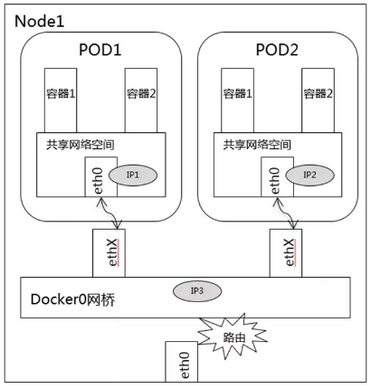
  上图Pod1和Pod2通过Veth连接在同一个docker0网桥上的，IP地址都是从docker0的网段上动态获取的，和网桥本身的IP地址属于同一个网段。另外，在Pod1、Pod2的默认路由都是docker0的地址，也就是说所有非local地址的网络数据，都会被默认发送到 docker0 网桥上，由 docker0 网桥直接中转。
  ```
  Kernel IP routing table
  Destination     Gateway         Genmask         Flags Metric Ref    Use Iface
  default         172.17.0.1      0.0.0.0         UG    0      0        0 eth0
  172.17.0.0      *               255.255.0.0     U     0      0        0 eth0
  ```
  综上，同一个Node内的Pod都关联在同一个docker0网桥上，地址段相同，所以它们之间可以直接通信。

- 不同Node上的Pod之间的通信

  - Pod的地址是与 docker0 在同一个网段内的，而docker0 网段与宿主机网卡是两个完全不同的 IP 网段，且不同Node之间的通信只能通过宿主机的物理网卡进行，因此要想实现位于不同 Node 上的 Pod 容器之间的通信，就必须通过宿主机的 IP 地址来进行寻址和通信。
  - 另一方面，Kubernetes 会记录所有正在运行Pod的IP分配信息，并将这些信息作为 Service 的 Endpoint保存在 etcd 中。因为网络模型要求 Pod 到 Pod 使用私有 IP 进行通信，因此这些私有 IP 信息对于 Pod 到 Pod 的通信也是十分重要的。
  - Kubernetes 的网络对 Pod 的地址是平面的和直达的，所以这些 Pod 的 IP 规划也很重要，不能有冲突。

  综上所述，不同 Node 上的 Pod 之间的通信需要满足两个条件：
  （1）在整个 Kubernetes 集群中对 Pod 的 IP 分配进行规划，不能有冲突；
  （2）找到一种办法，将 Pod 的 IP 和所在 Node 的 IP 关联起来，通过这个关联让 Pod 可以互相访问。

  根据条件 1 的要求，需要在部署 Kubernetes 时，对 docker0 的 IP 地址进行规划，保证每一个 Node 上的 docker0 地址没有冲突。可以在规划后手工配置到每个 Node 上，或者做一个分配规则，由安装的程序自己去分配占用。例如Flannel 就能够管理资源池的分配。

  根据条件 2 的要求，Pod 中的数据在发出时，需要有一个机制能够知道对方 Pod 的 IP 地址挂载哪个具体的 Node 上。也就是说先要找到 Node 对应宿主机的 IP 地址，将数据发送到这个宿主机的网卡上，然后在宿主机上将应用的数据转到具体的 docker0 上。一旦数据达到宿主机 Node，则Node 内部的 docker0 便知道如何将数据发送到 Pod。

  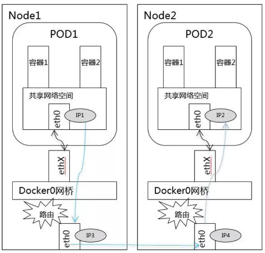

  在上图中，IP 1 对应的是 Pod 1、IP 2 对应的是 Pod 2。Pod 1 在访问 Pod 2 时，首先要将数据从源 Node 的 eth0 发送出去，找到并到达 Node 2 的 eth0。也就是说先要从 IP 3 到 IP 4，之后才是 IP 4 到 IP 2 的递送。

  在 Google 的 GEC 环境下，Pod 的 IP 管理（类似 docker0）、分配及它们之间的路由都是由 GCE 完成的。Kubernetes 作为主要在 GCE 上面运行的框架，它的设计是假设底层已经具备这些条件，所以它分配完地址并将地址记录下来就完成了它的工作。在实际的 GCE 环境宏，GCE 的网络组建会读取这些信息，实现具体的网络打通。

  而在实际的生产中，因为安全、费用、合规等种种原因，Kubernetes 的客户不可能全部使用 Google 的 GCE 环境，所以在实际的私有云环境中，除了部署 Kubernetes 和 Docker，还需要额外的网络配置，甚至通过一些软件来实现 Kubernetes 对网络的要求。做到这些后，Pod 和 Pod 之间才能无差别地透明通信。

### 6.1.3 Service到Pod间通信

详见kube-proxy
```
Pod1...Pod2                       Pod3...Pod4
     |                                 |
  docker0(172.17.0.1)                cni0(10.88.0.1)
     |                                 |
  Node1(192.168.56.102)             Node2(192.168.56.104)
     |                                 |
     -----------------------------------
                       |
                    Master(192.168.56.101)
```
node1
`# route add -net 10.88.0.0 netmask 255.255.255.0 gw 192.168.56.104`
node2
`route add -net 172.17.0.0 netmask 255.255.255.0 gw 192.168.56.102`

## 6.2 Network Policy
为了实现细粒度的容器间网络访问隔离策略，k8s 从v1.3版本开始，由SIG-Network小组主导研发了Network Policy机制，目前API版本为networking.k8s.io/v1。

Network Policy的主要功能是对Pod间的网络通信进行限制和准入控制，设置方式为将Pod的Label作为查询条件，设置允许访问或禁止访问的客户端Pod列表。目前查询条件可以作用于Pod和Namespace级别。

Network Policy由具体的cni插件实现，因此必须使用支持NetworkPolicy的网络解决方案，目前Calico, Romana, Weave, OpenShift, OpenContrail等开源项目均支持网络策略的实现。仅创建NetworkPolicy资源而没有策略控制器（policy controller），NetworkPolicy将不起作用。

Network Policy的工作原理如下图所示，policy controller需要实现一个API Listener，监听用户设置的NetworkPolicy定义，并将网络访问规则通过各Node的Agent进行实际设置，**Agent则需要CNI网络插件实现**。
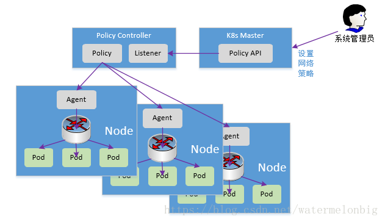

默认情况下，如果命名空间中不存在任何策略，则允许所有入口和出口流量进出该命名空间中的pod。 以下示例用于更改该命名空间中的默认行为。
- Default deny all ingress traffic
  ```yaml
  apiVersion: networking.k8s.io/v1
  kind: NetworkPolicy
  metadata:
    name: default-deny
  spec:
    podSelector: {}
    policyTypes:
    - Ingress
  ```

- Default allow all ingress traffic
  ```yaml
  apiVersion: networking.k8s.io/v1
  kind: NetworkPolicy
  metadata:
    name: allow-all
  spec:
    podSelector: {}
    policyTypes:
    - Ingress
    ingress:
    - {}
  ```

- Default deny all egress traffic
  ```yaml
  apiVersion: networking.k8s.io/v1
  kind: NetworkPolicy
  metadata:
    name: default-deny
  spec:
    podSelector: {}
    policyTypes:
    - Egress
  ```

- Default allow all egress traffic
  ```yaml
  apiVersion: networking.k8s.io/v1
  kind: NetworkPolicy
  metadata:
    name: allow-all
  spec:
    podSelector: {}
    policyTypes:
    - Egress
    egress:
    - {}
  ```

- Default deny all ingress and all egress traffic
  ```yaml
  apiVersion: networking.k8s.io/v1
  kind: NetworkPolicy
  metadata:
    name: default-deny
  spec:
    podSelector: {}
    policyTypes:
    - Ingress
    - Egress
  ```
  podSelector: 选择一组pod 应用网络策略。空的podSelector表示选择该 Namespace 中的所有 Pod。
  policyTypes： Ingress, Egress。如果在NetworkPolicy上未指定policyTypes，则默认情况下将始终设置Ingress，                  并且如果NetworkPolicy设置了任何出口规则，则将设置Egress。
  ingress： 包含了白名单ingress规则列表。每个规则允许匹配“from + port”的流量。from源可以选择ipBlock，namespaceSelector，podSelector。  
  egress：包含了白名单egress规则列表。允许匹配“to + ports”的流量。

完整示例如下：
```yaml
apiVersion: networking.k8s.io/v1
kind: NetworkPolicy
metadata:
  name: test-network-policy
  namespace: default
spec:
  podSelector:
    matchLabels:
      role: db
  policyTypes:
  - Ingress
  - Egress
  ingress:
  - from:
    - ipBlock:
        cidr: 172.17.0.0/16
        except:
        - 172.17.1.0/24
    - namespaceSelector:
        matchLabels:
          project: myproject
    - podSelector:
        matchLabels:
          role: frontend
    ports:
    - protocol: TCP
      port: 6379
  egress:
  - to:
    - ipBlock:
        cidr: 10.0.0.0/24
    ports:
    - protocol: TCP
      port: 5978
```


## 6.3 kube-router

kube-router是基于Kubernetes网络设计的一个集负载均衡器、网络策略和容器网络的综合方案。
- --run-service-proxy：基于IPVS的负载均衡
  kube-router采用Linux内核的IPVS模块为K8s提供Service的代理。

- --run-router： Container网络
  kube-router利用BGP协议和GoBGP库和为容器网络提供直连的方案。因为使用了原生的Kubernetes API去构建容器网络，意味着在使用kube-router时，不需要在你的集群里面引入其他依赖。

  同样的，kube-router在引入容器CNI时也没有其它的依赖，CNI标准的bridge插件就能满足kube-rouetr的需求。

- --run-firewall： 网络策略管理
  通过添加标签到kube-router的方式使用[网路策略](https://link.jianshu.com?t=https://kubernetes.io/docs/concepts/services-networking/network-policies/)功能。kube-router使用了ipset操作iptables，以保证防火墙的规则对系统性能有较低的影响。


> [kube-router](https://github.com/cloudnativelabs/kube-router)
> https://cloudnativelabs.github.io/


# 7. Kubernetes安全机制

认证和授权只作用于API Server的安全端口，认证解决用户是谁的问题，授权解决用户能做什么的问题。Kuberntes中API Server的访问控制过程图示如下：


## 7.1 Authentication

当前，k8s支持以下认证方式：

### 7.1.1 Basic Authentication

Basic Authentication指客户端在使用HTTP访问受限资源时，必须使用用户名/密码以获取认证。不推荐使用。

API Server使用Basic Authentication需要提供一个CSV格式的文件用于设置用户列表，每行表示一个用户，共三列：密码，用户名，用户ID：

```bash
# cat basic_auth.csv
admin_passwd,admin,1
test_passwd,test,2
```

然后设置API Server启动参数：

`--basic-auth-file=/etc/kubernetes/basic_auth.csv`

### 7.1.2 Token Authentication

Token是一个用户自定义的任意字符串，同Basic Authentication类似，使用Token替换用户名/密码。同样需要提供一个CSV格式的文件：

```bash
cat token_auth.csv
xxxxxxxxxxxxxx,admin,1
xxxxxxxxxxxxxx,test,2
```

### 7.1.3 Bootstrap Tokens Authentication

Kubernetes包括一个动态管理的Bearer token类型，称为Bootstrap Token。这些token作为Secret存储在kube-system namespace中，可以动态管理和创建。Controller Manager包含一个TokenCleaner Controller，如果到期时可以删除Bootstrap Tokens Controller。

### 7.1.4 Certificate Authentication

Certificate Authentication是一种用于证明用户身份的客户端数字证书。需要客户端提供信任的客户端CA证书：

`--client-ca-file=/etc/kubernetes/ca.crt`

#### 7.1.4.1 easyrsa

```shell
# curl -LO https://storage.googleapis.com/kubernetes-release/easy-rsa/easy-rsa.tar.gz
# ./easyrsa init-pki
# ./easyrsa --batch "--req-cn=192.168.56.101@`date +%s`" build-ca nopass
pki/ca.crt
pki/private/ca.key
```

kube-apiserver

```shell
# ./easyrsa --subject-alt-name="IP:192.168.56.101,IP:20.1.0.1,DNS:master,DNS:kubernetes,DNS:kubernetes.default" build-server-full server nopass --days=10000
pki/issued/server.crt
pki/private/server.key
```

kubectl

```shell
# ./easyrsa --dn-mode=org --req-cn=kubecfg --req-org=system:masters --req-c= --req-st= --req-city= --req-email= --req-ou= build-client-full kubecfg nopass
pki/issued/kubecfg.crt
pki/private/kubecfg.key
```

kubectl配置文件：

```shell
# cat .kube/config 
apiVersion: v1
clusters:
- cluster:
    certificate-authority: /etc/kubernetes/pki/ca.crt
    server: https://192.168.56.101:443
  name: default-cluster
contexts:
- context:
    cluster: default-cluster
    user: default-admin
  name: default-system
current-context: default-system
kind: Config
preferences: {}
users:
- name: default-admin
  user:
    client-certificate: /etc/kubernetes/pki/kubecfg.crt
    client-key: /etc/kubernetes/pki/kubecfg.key
```

kubelet

```shell
# ./easyrsa --dn-mode=org --req-cn="system:node:node1" --req-org=system:nodes --req-c= --req-st= --req-city= --req-email= --req-ou= build-client-full system:node:node1 nopass

#./easyrsa --dn-mode=org --req-cn="system:node:node2" --req-org=system:nodes --req-c= --req-st= --req-city= --req-email= --req-ou= build-client-full system:node:node2 nopass
```

kubelet配置文件：

```yaml
# cat /etc/kubernetes/kubelet.yaml 
apiVersion: v1
clusters:
- cluster:
    certificate-authority: /etc/kubernetes/pki/ca.crt
    server: https://192.168.56.101:443
  name: default-cluster
contexts:
- context:
    cluster: default-cluster
    user: default-admin
  name: default-system
current-context: default-system
kind: Config
preferences: {}
users:
- name: default-admin
  user:
    client-certificate: /etc/kubernetes/pki/node1.crt
    client-key: /etc/kubernetes/pki/node1.key
```

kube-proxy

```shell
# ./easyrsa --dn-mode=org --req-cn="system:kube-proxy" --req-org=system:node-proxier --req-c= --req-st= --req-city= --req-email= --req-ou= build-client-full system:kube-proxy nopass
```


#### 7.1.4.2 openssl


#### 7.1.4.3 cfssl

http://blog.51cto.com/ylw6006/2167592

##### 根证书

ca.pem 根证书公钥文件
ca-key.pem 根证书私钥文件
ca.csr 证书签名请求，用于交叉签名或重新签名
ca-config.json 使用cfssl工具生成其他类型证书需要引用的配置文件
ca.pem用于签发后续其他的证书文件，因此ca.pem文件需要分发到集群中的每台服务器上去。

##### container相关证书类型:

client certificate： 用于服务端认证客户端,例如etcdctl、etcd proxy、fleetctl、docker客户端
server certificate: 服务端使用，客户端以此验证服务端身份,例如docker服务端、kube-apiserver
peer certificate: 双向证书，用于etcd集群成员间通信

**创建证书**

```shell
# cat ca-config.json 
{
  "signing": {
    "default": {
      "expiry": "8760h"
    },
    "profiles": {
      "kubernetes": {
        "usages": [
          "signing",
          "key encipherment",
          "server auth",
          "client auth"
        ],
        "expiry": "8760h"
      }
    }
  }
}
# cat ca-csr.json 
{
    "CN": "kubernetes",
    "key": {
        "algo": "rsa",
        "size": 2048
    }
}
```
生成 CA 密钥
```shell
# cfssl gencert \
  -initca ca-csr.json | cfssljson -bare ca
```

```shell
# cat client-csr.json 
{
    "CN": "client",
    "key": {
        "algo": "rsa",
        "size": 2048
    }
}
```
生成 client 证书
```shell
# cfssl gencert \
  -ca=ca.pem -ca-key=ca-key.pem \
  -config=ca-config.json \
  -profile=kubernetes \
  client-csr.json | cfssljson -bare client
```


### 7.1.5 OpenID Authentication

OpenID是一套以用户为中心的分散式身份认证系统，用户只需要注册获取OpenID后，凭借OpenID账号可以在多个系统间自由登录，实现用户认证。API Server需要指定以下参数：

`--oidc-client-id=xxx --oidc-issuer-url=`xxx

### 7.1.6 Webhook Token Authentication

Webhook Token 认证方式可以让用户使用自己的认证方式。用户只需要按照约定的请求格式和应答格式提供 HTTPS 服务，当用户把 Bearer Token 放到请求的头部，kubernetes 会把 token 发送给事先配置的地址进行认证，如果认证结果成功，则认为请求用户合法。 这种方式下有两个参数可以配置：

`--authorization-webhook-config-file=""` ：kubeconfig 文件，说明如果访问认证服务器。

`--authentication-token-webhook-cache-ttl `：认证结果要缓存时长，默认是2m。

### 7.1.7 Keystone Authentication

支持对接OpenStack的Keystone ???：

`--experimental-keystone-url=<AuthURL>`

## 7.2 Authorization

Kubernetes API 认证后，通过授权控制用户的访问Kubernetes API的权限。通过检查请求包含的相关属性值，与相对应的访问策略相比较，API请求必须满足某些策略才能被处理。

### 7.2.1 授权模式

kube-apiserver可以设置以下授权模式：

- `--authorization-mode=ABAC`

   ABAC mode allows you to configure policies using local files.

- `--authorization-mode=RBAC` 

  RBAC mode allows you to create and store policies using the Kubernetes API.

- `--authorization-mode=Webhook` 

  WebHook is an HTTP callback mode that allows you to manage authorization using a remote REST endpoint.

- `--authorization-mode=Node` 

  Node authorization is a special-purpose authorization mode that specifically authorizes API requests made by kubelets.

- `--authorization-mode=AlwaysDeny` 

  This flag blocks all requests. Use this flag only for testing.

- `--authorization-mode=AlwaysAllow` 

  This flag allows all requests. Use this flag only if you do not require authorization for your API requests.


### 7.2.2 ABAC

之前，Kubernetes中的授权策略主要是ABAC(Attribute-Based Access Control)，基于属性的访问控制。对于ABAC，Kubernetes在实现上是比较难用的，而且需要Master 节点的SSH和根文件系统访问权限，授权策略发生变化后还需要重启API Server。

ABAC模式需要通过`--authorization-policy-file=xx`指定策略文件，策略文件为json格式，包含以下属性用于访问控制(未设置属性表示匹配任何值)：

- user： 用户名
- group：用户组
- readonly：只读标志，为true时，表示允许GET请求通过
- resource：资源
- namespace：命名空间，允许访问某个NS的资源

例如，允许kubelet读取pod资源：

```json
{"user":"kubelet","resource":"pods","readonly":"true"}
```

### 7.2.3 RBAC

Kubernetes 1.8版本中，RBAC已经稳定，并由RBAC.AudiiStudio.K8S.IO/V1 API支持。RBAC访问控制策略可以使用**kubectl** 或 **Kubernetes API**进行配置。使用RBAC可以直接授权给用户，让用户拥有授权管理的权限

#### 7.2.3.1 RBAC API的资源对象

RBAC API定义了四个资源对象用于描述RBAC中用户和资源之间的连接权限：

- Role
- ClusterRole
- RoleBinding
- ClusterRoleBinding

**Role和ClusterRole**

Role是一系列权限的集合。Role作用范围在Namespace中。ClusterRole与Role相似，只是ClusterRole是整个集群范围内使用的。

使用kubectl显示Kubernetes集群中的Role和ClusterRole

```bash
# kubectl get roles --all-namespaces
NAMESPACE     NAME                                             AGE
kube-public   system:controller:bootstrap-signer               2d
kube-system   extension-apiserver-authentication-reader        2d
kube-system   system::leader-locking-kube-controller-manager   2d
kube-system   system::leader-locking-kube-scheduler            2d
kube-system   system:controller:bootstrap-signer               2d
kube-system   system:controller:cloud-provider                 2d
kube-system   system:controller:token-cleaner                  2d
```

```bash
# kubectl get ClusterRoles
NAME                                                                   AGE
admin                                                                  2d
cluster-admin                                                          2d
edit                                                                   2d
system:aggregate-to-admin                                              2d
system:aggregate-to-edit                                               2d
system:aggregate-to-view                                               2d
system:auth-delegator                                                  2d
system:aws-cloud-provider                                              2d
system:basic-user                                                      2d
system:certificates.k8s.io:certificatesigningrequests:nodeclient       2d
system:certificates.k8s.io:certificatesigningrequests:selfnodeclient   2d
system:controller:attachdetach-controller                              2d
...
system:controller:ttl-controller                                       2d
system:discovery                                                       2d
system:heapster                                                        2d
system:kube-aggregator                                                 2d
system:kube-controller-manager                                         2d
system:kube-dns                                                        2d
system:kube-scheduler                                                  2d
system:kubelet-api-admin                                               2d
system:node                                                            2d
system:node-bootstrapper                                               2d
system:node-problem-detector                                           2d
system:node-proxier                                                    2d
system:persistent-volume-provisioner                                   2d
system:volume-scheduler                                                2d
view                                                                   2d

```

可以看到该Kubernetes集群中已经内置或创建很多的Role和ClusterRole


下面在default命名空间内创建一个名称为pod-reader的Role，role-pord-reader.yaml文件如下：

```yaml
kind: Role
apiVersion: rbac.authorization.k8s.io/v1
metadata:
  namespace: default
  name: pod-reader
rules:
- apiGroups: [""] # "" indicates the core API group
  resources: ["pods"]
  verbs: ["get", "watch", "list"]
```

```shell
# kubectl create -f role-pord-reader.yaml
role "pod-reader" created
# kubectl get roles
NAME AGE
pod-reader 1m
```

创建ClusterRole：

```yaml
kind: ClusterRole
apiVersion: rbac.authorization.k8s.io/v1beta1
metadata:
  # "namespace" omitted since ClusterRoles are not namespaced
  name: secret-reader
rules:
- apiGroups: [""]
  resources: ["secrets"]
  verbs: ["get", "watch", "list"]
```

**RoleBinding和ClusterRoleBinding**

RoleBinding是将**Role**和**Subjects**绑定，让Subjects继承Role所在namespace下的权限。ClusterRoleBinding是将把**ClusterRole**和**Subjects**绑定，让Subjects继承ClusterRole在整个集群中的权限。

**”Subjects“**包含**User**，**Group**，和**ServiceAccount**。

```bash
# kubectl get rolebinding --all-namespaces
NAMESPACE 	NAME 								AGE
kube-public	kubeadm:bootstrap-signer-clusterinfo	6d
kube-public	system:controller:bootstrap-signer		6d
kube-system	system:controller:bootstrap-signer		6d
```

```bash
# kubectl get clusterrolebinding
NAME 								AGE
cluster-admin						6d
flannel								6d
kubeadm:kubelet-bootstrap			6d
kubeadm:node-proxier 				6d
system:basic-user 					6d
system:controller:attachdetach-controller 6d
system:controller:certificate-controller 6d
......
system:controller:ttl-controller 6d
system:discovery 6d
system:kube-controller-manager 6d
system:kube-dns 6d
system:kube-scheduler 6d
system:node 6d
system:node-proxier 6d
```

实际上一个RoleBinding既可以引用相同namespace下的Role；又可以引用一个ClusterRole，RoleBinding引用ClusterRole时用户继承的权限会被限制在RoleBinding所在的namespace下。

```yaml
kind: RoleBinding
apiVersion: rbac.authorization.k8s.io/v1beta1
metadata:
  name: read-pods
  namespace: default
subjects:
- kind: User
  name: jane
  apiGroup: rbac.authorization.k8s.io
roleRef:
- kind: Role
  name: pod-reader
```

```yaml
kind: RoleBinding
apiVersion: rbac.authorization.k8s.io/v1beta1
metadata:
  name: read-secrets
  namespace: development # This only grants permissions within the "development" namespace.
subjects:
- kind: User
  name: dave
  apiGroup: rbac.authorization.k8s.io
roleRef:
  kind: ClusterRole
  name: secret-reader
  apiGroup: rbac.authorization.k8s.io
```
#### 7.2.3.2 k8s中默认的Role和RoleBinding

API Server已经创建一系列ClusterRole和ClusterRoleBinding。这些资源对象中名称以`system:`开头的，表示这个资源对象属于Kubernetes系统基础设施。也就说RBAC默认的集群角色已经完成足够的覆盖，让集群可以完全在 RBAC的管理下运行。修改这些资源对象可能会引起未知的后果，例如对于`system:node`这个ClusterRole定义了kubelet进程的权限，如果这个角色被修改，可能导致kubelet无法工作。

所有默认的ClusterRole和ClusterRoleBinding对象都会被标记为kubernetes.io/bootstrapping=rbac-defaults。可以使用`kubernetes.io/bootstrapping=rbac-defaults`这个label查看默认的ClusterRole和ClusterRoleBinding：

```bash
# kubectl get clusterrole -l kubernetes.io/bootstrapping=rbac-defaults
NAME AGE
admin 6d
cluster-admin 6d
edit 6d
system:auth-delegator 6d
system:basic-user 6d
system:controller:attachdetach-controller 6d
system:controller:certificate-controller 6d
......
system:node-problem-detector 6d
system:node-proxier 6d
system:persistent-volume-provisioner 6d
```

```bash
# kubectl get clusterrolebinding -l kubernetes.io/bootstrapping=rbac-defaults
NAME AGE
cluster-admin 6d
system:basic-user 6d
system:controller:attachdetach-controller 6d
system:controller:certificate-controller 6d
system:controller:cronjob-controller 6d
system:controller:daemon-set-controller 6d
system:controller:deployment-controller 6d
......
system:discovery 6d
system:kube-controller-manager 6d
system:kube-dns 6d
system:kube-scheduler 6d
system:node 6d
system:node-proxier 6d
```
当前k8s系统中内置以下Roles和rolebinding

##### 1. Auto-reconciliation

在每次启动时，api server会更新默认的ClusterRole/ClusterRoleBinging。 

k8s 1.6+版本中RBAC 激活时，Auto-reconciliation默认为enable，可以通过rbac.authorization.kubernetes.io/autoupdate为false禁用。

##### 2. Discovery Roles

| Default ClusterRole   | Default ClusterRoleBinding                                   | Description                                                  |
| :-------------------- | ------------------------------------------------------------ | :----------------------------------------------------------- |
| **system:basic-user** | **system:authenticated** and **system:unauthenticated**groups | Allows a user read-only access to basic information about themselves. |
| **system:discovery**  | **system:authenticated** and **system:unauthenticated**groups | Allows read-only access to API discovery endpoints needed to discover and negotiate an API level. |

##### 3. User-facing Roles

部分默认Role不是以system开头。

| Default ClusterRole | Default ClusterRoleBinding | Description                                                  |
| ------------------- | -------------------------- | ------------------------------------------------------------ |
| **cluster-admin**   | **system:masters** group   | Allows super-user access to perform any action on any resource. When used in a **ClusterRoleBinding**, it gives full control over every resource in the cluster and in all namespaces. When used in a **RoleBinding**, it gives full control over every resource in the rolebinding's namespace, including the namespace itself. |
| **admin**           | None                       | Allows admin access, intended to be granted within a namespace using a **RoleBinding**. If used in a **RoleBinding**, allows read/write access to most resources in a namespace, including the ability to create roles and rolebindings within the namespace. It does not allow write access to resource quota or to the namespace itself. |
| **edit**            | None                       | Allows read/write access to most objects in a namespace. It does not allow viewing or modifying roles or rolebindings. |
| **view**            | None                       | Allows read-only access to see most objects in a namespace. It does not allow viewing roles or rolebindings. It does not allow viewing secrets, since those are escalating. |

##### 4. Core Component Roles

| Default ClusterRole                | Default ClusterRoleBinding              | Description                                                  |
| ---------------------------------- | --------------------------------------- | ------------------------------------------------------------ |
| **system:kube-scheduler**          | **system:kube-scheduler** user          | Allows access to the resources required by the kube-scheduler component. |
| **system:kube-controller-manager** | **system:kube-controller-manager** user | Allows access to the resources required by the kube-controller-manager component. The permissions required by individual control loops are contained in the [controller roles](https://kubernetes.io/docs/admin/authorization/rbac/#controller-roles). |
| **system:node**                    | None in 1.8+                            | Allows access to resources required by the kubelet component, **including read access to all secrets, and write access to all pod status objects**. As of 1.7, use of the [Node authorizer](https://kubernetes.io/docs/admin/authorization/node/) and [NodeRestriction admission plugin](https://kubernetes.io/docs/admin/admission-controllers/#noderestriction) is recommended instead of this role, and allow granting API access to kubelets based on the pods scheduled to run on them. Prior to 1.7, this role was automatically bound to the `system:nodes` group. In 1.7, this role was automatically bound to the `system:nodes` group if the `Node` authorization mode is not enabled. In 1.8+, no binding is automatically created. |
| **system:node-proxier**            | **system:kube-proxy** user              | Allows access to the resources required by the kube-proxy component. |

##### 5. Other Component Roles

| Default ClusterRole                      | Default ClusterRoleBinding                                   | Description                                                  |
| ---------------------------------------- | ------------------------------------------------------------ | ------------------------------------------------------------ |
| **system:auth-delegator**                | None                                                         | Allows delegated authentication and authorization checks. This is commonly used by add-on API servers for unified authentication and authorization. |
| **system:heapster**                      | None                                                         | Role for the [Heapster](https://github.com/kubernetes/heapster) component. |
| **system:kube-aggregator**               | None                                                         | Role for the [kube-aggregator](https://github.com/kubernetes/kube-aggregator) component. |
| **system:kube-dns**                      | **kube-dns** service account in the **kube-system** namespace | Role for the [kube-dns](https://kubernetes.io/docs/concepts/services-networking/dns-pod-service/) component. |
| **system:node-bootstrapper**             | None                                                         | Allows access to the resources required to perform [Kubelet TLS bootstrapping](https://kubernetes.io/docs/admin/kubelet-tls-bootstrapping/). |
| **system:node-problem-detector**         | None                                                         | Role for the [node-problem-detector](https://github.com/kubernetes/node-problem-detector) component. |
| **system:persistent-volume-provisioner** | None                                                         | Allows access to the resources required by most [dynamic volume provisioners](https://kubernetes.io/docs/concepts/storage/persistent-volumes/#provisioner). |

##### 6. Controller Roles

- system:controller:attachdetach-controller
- system:controller:certificate-controller
- system:controller:cronjob-controller
- system:controller:daemon-set-controller
- system:controller:deployment-controller
- system:controller:disruption-controller
- system:controller:endpoint-controller
- system:controller:generic-garbage-collector
- system:controller:horizontal-pod-autoscaler
- system:controller:job-controller
- system:controller:namespace-controller
- system:controller:node-controller
- system:controller:persistent-volume-binder
- system:controller:pod-garbage-collector
- system:controller:pv-protection-controller
- system:controller:pvc-protection-controller
- system:controller:replicaset-controller
- system:controller:replication-controller
- system:controller:resourcequota-controller
- system:controller:route-controller
- system:controller:service-account-controller
- system:controller:service-controller
- system:controller:statefulset-controller
- system:controller:ttl-controller

关于这些角色详细的权限信息可以查看[Default Roles and Role Bindings](https://kubernetes.io/docs/admin/authorization/rbac/#default-roles-and-role-bindings)


### 7.2.4 Node

k8s 1.7+版本支持Node授权，Node授权是一种特殊用途的授权模式，它特定用于给kubelet发出的请求授权。

配合`NodeRestriction`准入控制来限制kubelet仅可访问node、endpoint、pod、service以及secret、configmap、PV和PVC等相关的资源，配置方法为:
```
--authorization-mode=Node,RBAC --admission-control=...,NodeRestriction,.`
```

Node授权者允许kubelet执行API操作，包括：
Read operations:
- services
- endpoints
- nodes
- pods
- secrets, configmaps, persistent volume claims and persistent volumes related to pods bound to the kubelet’s node

Write operations:
- nodes and node status
- pods and pod status

Auth-related operations:
- read/write access to the certificationsigningrequests API for TLS bootstrapping
- the ability to create tokenreviews and subjectaccessreviews for delegated authentication/authorization checks

注意，kubelet认证需要使用`system:nodes`组，并使用用户名`system:node:<nodeName>`。


## 6.3 Adminssion Control

在认证和授权后，通过Adminssion Control进一步对请求进行准入控制，API Server将按照顺序检查请求，如果任何一项没有通过，就就会拒绝请求

Adminssion Control作为Api Server一部分，以插件形式存在，通过以下参数启用指定的插件：

`--enable-admission-plugins="[NamespaceLifecycle,NamespaceExists,LimitRanger,AlwaysAdmit,PodSecurityPolicy,ResourceQuota,ServiceAccount,Priority,ValidatingAdmissionWebhook,MutatingAdmissionWebhook,NodeRestriction]"`

- AlwaysAdmit：允许所有的请求。

- AlwaysDeny：拒绝所以请求，仅用于测试

- AlwaysPullImages

  强制设置Pod拉取镜像策略为Always。这样能够保证私有镜像只能被有拉取权限的使用者使用。

- ServiceAccount：配合Service Account Controller使用，为设定了Service Account的Pod自动管理Secret，使得Pod能够使用相应的Secret下载Image和访问API Server。

- ResourceQuota：在Namespace中作资源配额限制

- LimitRanger

  实现配额控制，确保请求没有违反已经定义好的约束条件，这些条件定义在namespace中LimitRange对象中。如果在kubernetes中使用LimitRange对象，则必须使用这个插件。

- SecurityContextDeny

  禁止创建设置了 Security Context 的 pod。这个插件将会使 SecurityContext的pod中定义的选项全部失效。关于 SecurityContext的描述：SecurityContext 在container中定义了操作系统级别的安全设定（uid, gid, capabilities, SELinux等等）。

- <==待补充==>


# 8. Kuryr

## 8.1 Kuryr介绍

Kuryr项目在OpenStack bigtent下，用于将容器与SDN结合。Kuryr北向是容器网络接口，南向是OpenStack Neutron。

Kuryr开始创立时的目的是为了提供Docker与Neutron的连接，将Neutron的网络服务带给Docker。随着容器的发展，容器网络的发展也出现了分歧。主要分为两派，一个是Docker原生的CNM（Container NetworkModel），另一个是兼容性更好的CNI（Container NetworkInterface）。Kuryr相应的也出现了两个分支，一个是kuryr-libnetwork（CNM），另一个是kuryr-kubernetes（CNI）。

## 8.2 kuryr-libnetwork

### 8.2.1 介绍

kuryr-libnetwork是运行在Libnetwork框架下的一个plugin。Libnetwork是从DockerEngine和libcontainer中将网络逻辑模块化之后独立出来的的项目，并且替代了原有的DockerEngine网络子系统。Libnetwork定义了一个灵活的模型，使用local或者remote driver来向container提供网络服务。kuryr-libnetwork就是Libnetwork的一个remote driver实现，现在已经成为Docker官网推荐的一个remote driver。

Libnetwork的driver可以看作是Docker的一个plugin，与Docker的其他plugin共用一套plugin管理框架。也就是说，Libnetwork的remotedriver与Docker Engine中的其他plugin用一样的方式激活，并使用同样的协议。有关Libnetwork remotedriver需要实现的接口在Libnetwork的Git上都有详细的描述。

kuryr-libnetwork需要做的就是实现这些接口。可以从kuryr-libnetwork的代码中看出来。Libnetwork通过调用remotedriver的Plugin.Activate接口，来查看remotedriver实现了什么内容。从kuryr-libnetwork的代码中能看到，它实现了两个功能：NetworkDriver,IPAMDriver.

### 8.2.2 连接Libnetwork

Libnetwork依赖Docker的**plugin discovery**机制来发现remote driver。当用户或者容器需要使用Docker的plugin的时候，只需要指定plugin的名字，Docker会在相应的目录中查找与plugin名字相同的文件，文件中定义了如何连接该plugin。

### 8.2.3 连接Neutron

Kuryr使用用neutronclient与Neutron连接。工作方式如下:


<==待补充==>：https://www.aliyun.com/jiaocheng/518375.html


## 8.3 kuryr-kubernetes


# 9. 网络解决方案
由于k8s出自Google，而在GCE中已经提供了网络模型作为基础设施，所以k8s的网络模型就假定这个网络已经存在，其所有Pod都在一个可以直接连通的扁平的网络空间中。而在私有的平台设施里搭建k8s集群，就需要自己实现这个网络，将不同节点上的Docker容器之间的互相访问先打通，然后运行k8s。

目前已经有多个开源组件支持容器网络模型。

## 9.1 Flannel

### 9.1.1 flannel配置
```
/etc/sysconfig/flanneld
/run/flannel
/usr/bin/flanneld
/usr/lib/systemd/system/docker.service.d/flannel.conf
/usr/lib/systemd/system/flanneld.service
/usr/libexec/flannel/mk-docker-opts.sh
```

```shell
# cat /etc/sysconfig/flanneld 
FLANNEL_ETCD_ENDPOINTS="http://master:2379"
FLANNEL_ETCD_PREFIX="/flannel/network"
FLANNEL_OPTIONS="-iface enp0s8"
```

在etcd中添加一条网络配置记录，该记录用于flannel给每个docker分配虚拟IP地址段：

- UDP
  ```shell
  # etcdctl set /flannel/network/config '{"Network":"10.1.0.0/16"}'
  ```
- Vxlan  
  ```shell
  # etcdctl set /flannel/network/config '{"Network":"10.1.0.0/16","SubnetLen":24,"Backend":{"Type":"vxlan","VNI":0}}'
  ```
- hostgw
  ```shell
  # etcdctl set /flannel/network/config '{"Network": "10.2.0.0/16","SubnetLen":24,"Backend":{"Type":"host-gw"}}'
  ```
> 注：flannel仅支持etcd v2版 API ，因此上述命令需要使用v2版本的API，可通过环境变量来`export ETCDCTL_API=2`设置。

### 9.1.2  flannel启动过程
flannel服务需要先于docker启动。flannel服务启动时主要做了以下几步的工作：
- 从etcd中获取network的配置信息
- 划分subnet，并在etcd中进行注册，注册节点信息如下：
  ```shell
  # etcdctl ls /flannel/network/subnets
  /flannel/network/subnets/10.2.99.0-24
  /flannel/network/subnets/10.2.38.0-24

  # etcdctl get /flannel/network/subnets/10.2.38.0-24
  {"PublicIP":"192.168.56.105","BackendType":"host-gw"}
  # etcdctl get /flannel/network/subnets/10.2.99.0-24
  {"PublicIP":"192.168.56.104","BackendType":"host-gw"}
  ```

- 将子网信息记录到/run/flannel/subnet.env中
  ```shell
  # cat /run/flannel/subnet.env 
  FLANNEL_NETWORK=10.1.0.0/16
  FLANNEL_SUBNET=10.1.40.1/24
  FLANNEL_MTU=1472
  FLANNEL_IPMASQ=false
  ```

- 通过mk-docker-opts.sh脚本将subnet.env转换成docker的环境变量文件`/run/flannel/docker`

  ```shell
  # cat /run/flannel/docker 
  DOCKER_OPT_BIP="--bip=10.1.40.1/24"
  DOCKER_OPT_IPMASQ="--ip-masq=true"
  DOCKER_OPT_MTU="--mtu=1472"
  DOCKER_NETWORK_OPTIONS=" --bip=10.1.40.1/24 --ip-masq=true --mtu=1472"
  ```

- 安装flannel后为docker生成如下配置
  ```shell
  # cat /usr/lib/systemd/system/docker.service.d/flannel.conf
  [Service]
  EnvironmentFile=-/run/flannel/docker
  ```

  在docker的systemd文件中设置对应变量 DOCKER_NETWORK_OPTIONS，重启docker服务后，docker0网桥的地址将设置为FLANNEL_SUBNET的地址：
  `ExecStart=/usr/bin/dockerd $DOCKER_NETWORK_OPTIONS`


### 9.1.3 Flannel网络实现
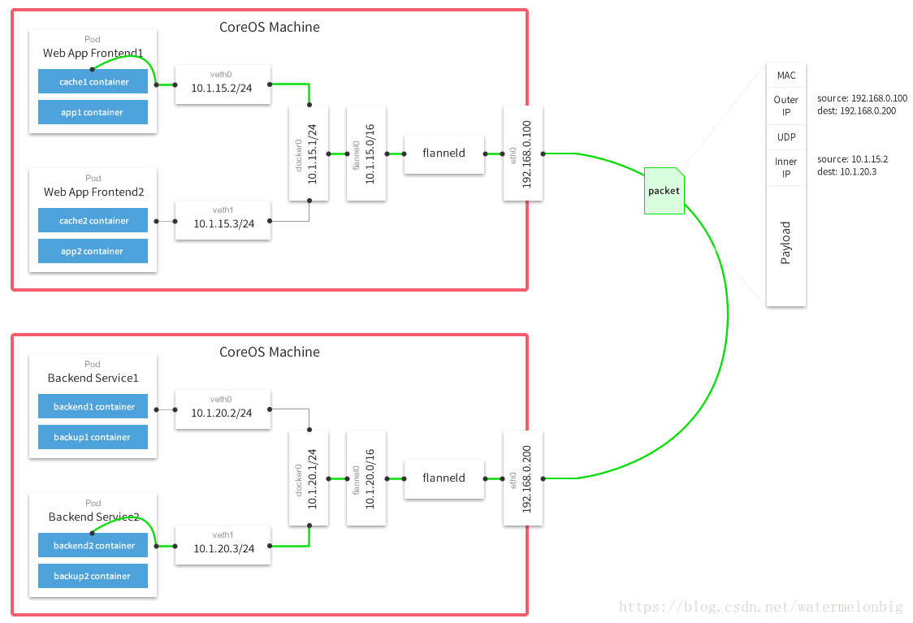

### 9.1.4 vxlan flannel
vxlan报文格式如下：


相对数据中心来说，flannel的vxlan比较简单，在Layer 3上只有1个Vxlan网络，只有1个vxlan接口(flannel.[VNI]，默认为flannel.1)。VTEP的MAC地址不是通过组播学习的，而是通过从apiserver的node接口watch到并静态下发的。

- 查找出接口
  LookupExtIface()用于查找出接口，所有vxlan报文都需要封装后走出接口，flannel通过如下方式选择出接口：
  - -iface指定具体接口
  - 根据正则表达式来匹配查找
  - 根据默认网关查找出接口

- subnet

  flannel网络是10.1.0.0/16，每个节点是一个subnet，通过SubnetManager管理。flannel的SubnetManager可以选择基于k8s的apiserver(kube.NewSubnetManager)或基于etcd(etcdv2.NewLocalManager)。其中，基于k8s主要时通过节点的annotations实现节点监控，节点annotations信息如下：
  ```
   annotations:
        flannel.alpha.coreos.com/backend-data: '{"VtepMAC":"8e:11:4d:6c:15:1c"}'
        flannel.alpha.coreos.com/backend-type: vxlan
        flannel.alpha.coreos.com/kube-subnet-manager: "true"
        flannel.alpha.coreos.com/public-ip: 10.39.0.46
  ```

  backend/vxlan_network.go在run时启动subnet/watch/WatchLeases() goroutine，批量读取events channel，根据事件中带的nodes信息，如IP，VtepMAC，下发到本机内核fdb table。

- backend
  根据backend类型创建backend，然后调用be.RegisterNetwork函数去初始化flannel接口
  ```
  RegisterNetwork
    -> newVXLANDevice
       -> netlink.LinkAdd(vxlan)             //创建接口
    -> be.subnetMgr.AcquireLease(ctx, subnetAttrs)  //请求分配子网段
    -> dev.Configure
       -> netlink.LinkSetUp(dev.link)        //设置ip
    -> return newNetwork()
  	
  handleSubnetEvents
    -> subnet.EventAdded
    -> subnet.EventRemoved
  ```

- fdb表
  flannel网络中的VTEP的MAC并不是通过组播学习的，而是通过apiserver/etcd同步。前面在创建flannel.1接口时各个节点会将自己的VTEP信息上报给apiserver/etcd，而apiserver/etcd会再同步给各节点上正在watch node api的listener(flanneld)，flanneld再通过netlink下发到内核，更新fdb表项，从而达到了整个集群的同步。


## 9.2 calico

### 9.2.1 calico介绍

Calico 是一个三层的数据中心网络方案。Calico 和其他虚拟网络最大的不同是没有采用 overlay 网络，而是提供了纯 3 层的网络模型。每个容器通过 IP 直接通信，中间通过路由转发，容器所在的节点提供了路由查找的功能。calico 采用BGP(Border Gateway Protocol)路由协议。可以用于 容器集群平台 kubernetes、共有云平台 AWS、GCE 等， 也可以集成到 openstack 等 Iaas 平台。

Calico在每个节点利用Linux Kernel实现了一个高效的vRouter来负责数据转发。每个vRouter通过BGP协议将本节点上运行的容器的路由信息广播到整个Calico网络，并自动设置到达其他节点的路由转发规则。Calico保证所有容器之间的数据流量都是通过IP路由的方式完成互联互通的。Calico节点组网可以直接利用数据中心的网络结构（L2或者L3），不需要额外的NAT、隧道或者Overlay Network，没有额外的封包解包，能够节约CPU运算，提高网络通信效率。

Calico在小规模集群中可以直接互联，在大规模集群中可以通过额外的BGP route reflector来完成。
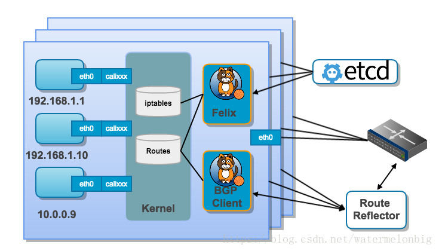

此外，Calico基于iptables还提供了丰富的网络策略，实现了k8s的Network Policy策略，提供容器间网络可达性限制的功能。

### 9.2.2 calico配置组件

calico配置包含以下组件：
-  **`calico/node`**
  基于[alpine linux](https://www.alpinelinux.org/)发行版定制生成的Container image，包含了startup，confid，felix，bird/bird6，calico-bgp-daemon，libnetwork(默认为“false”)配置文件及启动脚本。calico/node运行在所有集群节点上，Felix agent用于管理路由和网络策略规则，Linux Kernel 负责数据数据包路由，通过BPG agent来控制路由分发。
-  **`cni-plugin`**
  基于busybox作成的Container image，包含一个install-cni.sh脚本，用于将cni-plugin插件(calico，calico-ipam)安装到host机指定的目录(默认为/opt/cni/bin)，并生成calic插件的配置文件(默认存放在/etc/cni/net.d/)和Config。
-  **`kube-controllers`**
  基于[alpine linux](https://www.alpinelinux.org/)发行版的Container image，包含一个kube-controllers可执行程序。kube-controllers作为一个pod运行在其中一个节点上，同步kube-apiserver,etcd之间数据。如果k8s配置使用[Kubernetes datastore](https://docs.projectcalico.org/v2.0/getting-started/kubernetes/installation/hosted/k8s-backend/)存储数据时，不需要运行该组件，通常和flannel配合使用，用于支持网络隔离。

#### 9.2.2.1 Installing calico/node

calico node可以通过calicoctl运行：
```shell
# ETCD_ENDPOINTS=http://192.168.56.102:2379 calicoctl node run \
                          --node-image=192.168.56.1:5000/calico/node:v3.1.3
```
该命令通过docker启动node容器，日志如下：
```shell
Running command to load modules: modprobe -a xt_set ip6_tables
Enabling IPv4 forwarding
Enabling IPv6 forwarding
Increasing conntrack limit
Removing old calico-node container (if running).
Running the following command to start calico-node:

docker run --net=host --privileged --name=calico-node -d --restart=always \
                      -e NODENAME=node1 \
                      -e CALICO_NETWORKING_BACKEND=bird \
                      -e CALICO_LIBNETWORK_ENABLED=true \
                      -e FELIX_IPINIPENABLED=false \
                      -e ETCD_ENDPOINTS=http://192.168.56.102:2379 \
                      -v /var/log/calico:/var/log/calico \
                      -v /var/run/calico:/var/run/calico \
                      -v /var/lib/calico:/var/lib/calico \
                      -v /lib/modules:/lib/modules \
                      -v /run:/run \
                      -v /run/docker/plugins:/run/docker/plugins \
                      -v /var/run/docker.sock:/var/run/docker.sock \
                      192.168.56.1:5000/calico/node:v3.1.3

Image may take a short time to download if it is not available locally.
Container started, checking progress logs.

startup.go 251: Early log level set to info
startup.go 267: Using NODENAME environment for node name
startup.go 279: Determined node name: node1
startup.go 101: Skipping datastore connection test
startup.go 352: Building new node resource Name="node1"
startup.go 367: Initialize BGP data
startup.go 564: Using autodetected IPv4 address on interface enp0s8: 192.168.56.102/24
startup.go 432: Node IPv4 changed, will check for conflicts
startup.go 627: No AS number configured on node resource, using global value
startup.go 516: CALICO_IPV4POOL_NAT_OUTGOING is true (defaulted) through environment variable
startup.go 779: Ensure default IPv4 pool is created. IPIP mode: 
startup.go 789: Created default IPv4 pool (192.168.0.0/16) with NAT outgoing true. IPIP mode: 
startup.go 516: FELIX_IPV6SUPPORT is true (defaulted) through environment variable
startup.go 746: IPv6 supported on this platform: true
startup.go 516: CALICO_IPV6POOL_NAT_OUTGOING is false (defaulted) through environment variable
startup.go 779: Ensure default IPv6 pool is created. IPIP mode: Never
startup.go 789: Created default IPv6 pool (fd90:9eb6:73b3::/48) with NAT outgoing false. IPIP mode: Never
startup.go 176: Using node name: node1

Calico node started successfully
```
或者直接作为systemd服务启动：
```
[Unit]
Description=calico-node
After=docker.service
Requires=docker.service

[Service]
User=root
Environment=ETCD_ENDPOINTS=http://<ETCD_IP>:<ETCD_PORT>
PermissionsStartOnly=true
ExecStart=/usr/bin/docker run --net=host --privileged --name=calico-node \
  -e ETCD_ENDPOINTS=${ETCD_ENDPOINTS} \
  -e NODENAME=${HOSTNAME} \
  -e IP= \
  -e IP6= \
  -e AS= \
  -e NO_DEFAULT_POOLS= \
  -e CALICO_NETWORKING_BACKEND=bird \
  -e FELIX_DEFAULTENDPOINTTOHOSTACTION=ACCEPT \
  -v /lib/modules:/lib/modules \
  -v /run/docker/plugins:/run/docker/plugins \
  -v /var/run/docker.sock:/var/run/docker.sock \
  -v /var/run/calico:/var/run/calico \
  -v /var/lib/calico:/var/lib/calico \
  -v /var/log/calico:/var/log/calico \
  quay.io/calico/node:v3.1.3
ExecStop=/usr/bin/docker rm -f calico-node
Restart=always
RestartSec=10

[Install]
WantedBy=multi-user.target
```
#### 9.2.2.2 Installing Calico CNI plugins

Calico CNI plugins需要`calico`，`calico-ipam`和标准的CNI`loopback`三个插件及对应的配置文件，其中，calico插件的"policy"段仅在运行kube-controllers容器时才需要配置。
```shell
cat /etc/cni/net.d/10-calico.conf
{
    "name": "calico-k8s-network",
    "cniVersion": "0.6.0",
    "type": "calico",
    "etcd_endpoints": "http://<ETCD_IP>:<ETCD_PORT>",
    "log_level": "info",
    "ipam": {
        "type": "calico-ipam"
    },
    "policy": {
        "type": "k8s"
    },
    "kubernetes": {
        "kubeconfig": "</PATH/TO/KUBECONFIG>"
    }
}
```

#### 9.2.2.3 Installing the Calico kube-controllers

calico kube-controllers容器用于同步Calico datastore与Kubernetes之间的数据，作为Deployment运行在节群的其中一个节点上。即使不使用网络策略，也需要运行calico / kube-controllers容器。

http://127.0.0.1:4000/v3.1/getting-started/kubernetes/installation/calico-kube-controllers.yaml

kube-controllers也可以通过以下命令运行：

```shell
# ETCD_ENDPOINTS=http://192.168.56.102:4001 \
ENABLED_CONTROLLERS=policy,profile,workloadendpoint,node \
KUBECONFIG=/etc/cni/net.d/calico-kubeconfig \
LOG_LEVEL=debug \
./kube-controllers
```

### 9.2.3 calico运行组件
```
                                                       Pod
                                                        |
                   node/startup --------><-------- calico-plugin
                                         |
filter <------ calico-felix <-------->  etcd  --------> confd ------> bird/bitd6
                    |                    |                                 |
                    |    calicoctl ------><------ kube-controller          |
                    |                                      |               |
                    |                                 kube-apiserver       |
                    |                                                      |
                    |                                                      |
                    |---------------->  kernel route  -------------------->|          
```

Calico的主要组件如下：
- etcd
  Calico使用的存储后端。

- confd
  Confd是一个轻量级的配置管理工具。通过配置文件(xxx.toml)监控后端(如etcd等)中指定数据的变化，然后根据模板文件(xxx.tmpl)，为应用生成最新的配置(xxx.cfg)并自动reload。其常用架构如下：
  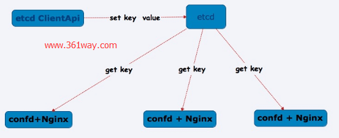

  Calico中的confd基于原confd进行了大量修改，适用于Calico，仅支持单个Calico datastore后端。 用于监视Calico BGP配置并根据模板从该配置自动生bird BGP配置。
  ```
  ListRoot="/calico/ipam/v2/host/node1"
  ListRoot="/calico/resources/v3/projectcalico.org/bgppeers"
  ListRoot="/calico/resources/v3/projectcalico.org/ippools"
  ListRoot="/calico/resources/v3/projectcalico.org/bgpconfigurations"
  ListRoot="/calico/resources/v3/projectcalico.org/nodes"
  ```

  Calico中confd配置目录如下，其中conf.d 目录中是toml配置文件，用于监控etcd中指定的数据，templates 目录中是tmpl模版文件，config目录是根据模板文件生成的bird配置文件：
  ```
  $ tree etc/calico/confd/
  etc/calico/confd/
  ├── conf.d
  │   ├── bird6_aggr.toml
  │   ├── bird6_ipam.toml
  │   ├── bird6.toml
  │   ├── bird_aggr.toml
  │   ├── bird_ipam.toml
  │   ├── bird.toml
  │   └── tunl-ip.toml
  ├── config
  │   ├── bird6_aggr.cfg
  │   ├── bird6.cfg
  │   ├── bird6_ipam.cfg
  │   ├── bird_aggr.cfg
  │   ├── bird.cfg
  │   └── bird_ipam.cfg
  └── templates
      ├── bird6_aggr.toml.template
      ├── bird6.cfg.template
      ├── bird6_ipam.cfg.template
      ├── bird_aggr.cfg.template
      ├── bird_aggr.toml.template
      ├── bird.cfg.template
      ├── bird_ipam.cfg.template
      ├── bird_ipam.toml.template
      ├── README.md
      └── tunl-ip.template
  ```

  以bird.toml为例：
  ```toml
  $ cat /etc/calico/confd/conf.d/bird.toml 
  [template]
  src = "bird.cfg.template"
  dest = "/etc/calico/confd/config/bird.cfg"
  prefix = "/calico/bgp/v1"
  keys = [
      "/host",
      "/global",
  ]
  check_cmd = "bird -p -c {{.src}}"
  reload_cmd = "pkill -HUP bird || true"
  ```
  - src： 指定模板文件
  - dest：指定用模版生成的配置文件
  - prefix： 指定监控的结点的前缀
  - keys：要监控的etcd中的key，必须是prefix下的结点。
  - reload_cmd 是生成confd生成新的配置以后的动作

- node/startup
  node container中初始化程序
  ```
  ETCD_ENDPOINTS=http://192.168.56.102:2379 HOSTNAME=node1 IP=autodetect CLUSTER_TYPE=k8s,bgp startup
  ```
  用于初始化节点的基本信息,包含信息如下：
  **Cluster信息**
  ```json
  /calico/resources/v3/projectcalico.org/clusterinformations/default
  {
  "kind":"ClusterInformation",
  "apiVersion":"projectcalico.org/v3",
  "metadata":{
  	"name":"default",
  	"uid":"e31ea10e-9918-11e8-bd47-0800277cfbe4",
  	"creationTimestamp":"2018-08-06T01:34:40Z"},
  	"spec":{"clusterGUID":"2db0dfbfae26454a9d6758695d6d02ee","clusterType":"k8s,bgp","calicoVersion":"v3.1.3","datastoreReady":true}}
  ```
  **node信息**
  ```json
  /calico/resources/v3/projectcalico.org/nodes/node1
  {
  "kind":"Node",
  "apiVersion":"projectcalico.org/v3",
  "metadata":{
  	"name":"node1",
  	"uid":"e31ec3df-9918-11e8-bd47-0800277cfbe4",
  	"creationTimestamp":"2018-08-06T01:34:40Z"},
  "spec":{"bgp":{"ipv4Address":"192.168.56.102/24"}}}
  ```
  **felix配置**
  ```json
  /calico/resources/v3/projectcalico.org/felixconfigurations/default
  {
  "kind":"FelixConfiguration",
  "apiVersion":"projectcalico.org/v3",
  "metadata":{
  	"name":"default",
  	"uid":"e32f0902-9918-11e8-bd47-0800277cfbe4",
  	"creationTimestamp":"2018-08-06T01:34:40Z"},
  "spec":{"logSeverityScreen":"Info","ipipEnabled":true,"reportingInterval":"0s"}}

  /calico/resources/v3/projectcalico.org/felixconfigurations/node.node1
  {
  "kind":"FelixConfiguration",
  "apiVersion":"projectcalico.org/v3",
  "metadata":{
  	"name":"node.node1",
  	"uid":"e32fe76f-9918-11e8-bd47-0800277cfbe4",
  	"creationTimestamp":"2018-08-06T01:34:40Z"},
  "spec":{"defaultEndpointToHostAction":"Return"}}
  ```
  **ippool**
  ```json
  /calico/resources/v3/projectcalico.org/ippools/default-ipv4-ippool
  {
  "kind":"IPPool",
  "apiVersion":"projectcalico.org/v3",
  "metadata":{
  	"name":"default-ipv4-ippool",
  	"uid":"e327fe76-9918-11e8-bd47-0800277cfbe4",
  	"creationTimestamp":"2018-08-06T01:34:40Z"},
  "spec":{"cidr":"192.168.0.0/16","ipipMode":"Never","natOutgoing":true}}

  /calico/resources/v3/projectcalico.org/ippools/default-ipv6-ippool
  {"kind":"IPPool",
  "apiVersion":"projectcalico.org/v3",
  "metadata":{
  	"name":"default-ipv6-ippool",
  	"uid":"e32919cb-9918-11e8-bd47-0800277cfbe4",
  	"creationTimestamp":"2018-08-06T01:34:40Z"},
  "spec":{"cidr":"fd71:a41b:b227::/48","ipipMode":"Never"}}
  ```

- calicoctl：Calico命令行管理工具。

- BGP Client(BIRD)：
  - BIRD是一款UNIX系统中的动态IP路由守护。支持BGPv4，OSPFv2, OSPFv3，RIPv2, RIPng等路由协议。
  - Bird实现了一个内部的路由表，该内部路由表可以连接到内核路由表，允许BIRD将网络路由从其内部路由表导出到内核路由表，并且还可以选择将内核路由表入其内部路由表。
  - 过滤器可用于控制将哪些网络路由导入内部路由表或导出到给定协议。可以使用过滤器接受，拒绝或修改网络路由。
  - BIRD还支持多个内部路由表，支持协议类型的多个实例。协议可以连接到不同的内部路由表，这些内部路由表可以交换关于它们包含的网络路由的信息（由过滤器控制），并且这些内部路由表中的每一个可以连接到不同的内核路由表，从而允许策略路由。

  calico中bird负责把Felix在各Node上设置的路由信息通过BGP协议广播到Calico网络。确保 workload 间的联通。calico 中的计算节点充当了路由器的角色，为运行在本机上的容器提供路由称为 `vRouter`。处于节点上的 Endpoint 只能同本节点 `vRouter` 通信， calico 中，数据包的第一条和最后一条都是通过 `vRouter` 中路由规则来实现。`vRouter` 间通过BGP协议来同步节点上的 Endpoint 信息。

- BGP Route Reflector(BIRD)：
  BGP Client要求每个BGP客户端连接到网状拓扑中的每个其他BGP客户端，大规模部署时维护复杂。BGP Route Reflector在大规模部署时使用，摒弃所有节点互联的 mesh 模式，通过一个或者多个 BGP Route Reflector 来完成分级路由分发。

- calico-bgp-daemon
  基于[GoBGP](https://osrg.github.io/gobgp)的Calico BGP守护进程。 作为BGP agent，用于替代calico/node容器images中的BIRD。目前该组件属于实验性的。

- Felix
  Calico Agent，运行在每台Node上，根据容器ip等信息设置路由、ACLs、iptables规则等，保证主机容器网络互通。

  - Interface Management
    Felix将接口相关的信息写到到内核中，以便内核能够正确处理该endpoint发出的流量。 确保host使用主机的MAC响应来自每个工作负载的ARP请求，并将为其管理的接口启用IP转发功能。

    Felix还监视接口的创建和销毁，以便确保在适当的时间对接口programming。

  - Route Programming
    Felix将host中endpoints的路由写入到Linux内核FIB中。 确保到达host的数据包转发到相应的endpoints。

  - ACL Programming
    Felix负责将ACL写入到Linux内核中。 这些ACL用于确保只能在endpoints之间发送有效流量，并确保endpoints无法绕过Calico的安全措施。

  - State Reporting
    Felix负责提供有关网络健康状况的数据，该数据被写入etcd，以使其对网络的其他组件和运营商可见。

  ```
  Apply -> syncRoutesForLink
  ```

  Felix包含大量的参数/环境变量，其中可以通过`FELIX_IPINIPENABLED=false`设置后端是否以ipip方式传输数据，ipip方式时会先创建一个tunnel设备，然后会通过tunnel传输数据：
  ```shell
  # ip tunnel show
  tunl0: ip/ip  remote any  local any  ttl inherit  nopmtudisc
  ```
  - 非IPIP
    ```shell
    # ip route
    192.169.104.0/26 via 192.168.56.103 dev enp0s8 proto bird 
    blackhole 192.169.166.128/26 proto bird
    ```
  - IPIP
    ```shell
    # ip route
    192.169.104.0/26 via 192.168.56.103 dev tunl0 proto bird onlink 
    blackhole 192.169.166.128/26 proto bird 
    192.169.166.137 dev calid6c9be2e04e scope link
    ```

- kube-controllers
  kube-controllers监控Kubernetes API的NetworkPolicy、POD和命名空间事件。默认情况下，kube-controllers包含以下4个控制器:
  **`policy controller`**：监控 network policies并执行Calico policies。
  ```yaml
  /calico/resources/v3/projectcalico.org/networkpolicies/default/knp.default.denyall-network-policy
  {
  "kind":"NetworkPolicy",
  "apiVersion":"projectcalico.org/v3",
  "metadata":{
  	"name":"knp.default.denyall-network-policy",
  	"namespace":"default",
  	"uid":"266a5bcc-9b9b-11e8-a371-0800277cfbe4",
  	"creationTimestamp":"2018-08-09T06:12:10Z"},
  "spec":{
  	"order":1000,
  	"selector":"projectcalico.org/orchestrator == 'k8s'",
  	"types":["Ingress","Egress"]}}
  ```
  **`profile controller`**：监控namespace并执行Calico profiles。
  ```yaml
  /calico/resources/v3/projectcalico.org/profiles/kns.default
  {
  "kind":"Profile",
  "apiVersion":"projectcalico.org/v3",
  "metadata":{
  	"name":"kns.default",
  	"uid":"f45be6e4-9a17-11e8-b3cc-0800277cfbe4",
  	"creationTimestamp":"2018-08-07T08:00:30Z"},
  "spec":{
  	"ingress":[{"action":"Allow","source":{},"destination":{}}],
  	"egress":[{"action":"Allow","source":{},"destination":{}}]}}
  ```
  **`workloadendpoint controller`**：监控pod label的更改并更新Calico workload endpoints。
  **`node controller`**：监控k8s节点的删除并从Calico中删除相应的数据。

- calico-plugin
  创建pod时调用，为pod创建网络，分配ip地址路由等，同时更新etcd中node，workloadendpoints等信息。
  ```yaml
  /calico/resources/v3/projectcalico.org/nodes/node1
  {
  "kind":"Node",
  "apiVersion":"projectcalico.org/v3",
  "metadata":{
  	"name":"node1",
  	"uid":"35a9df52-993a-11e8-9cb9-0800277cfbe4",
  	"creationTimestamp":"2018-08-06T05:33:12Z"},
  "spec":{
  	"bgp":{
  		"ipv4Address":"192.168.56.102/24",
  		"ipv4IPIPTunnelAddr":"192.169.166.128"},
  	"orchRefs":[{"nodeName":"node1","orchestrator":"k8s"}]}}
  	
  /calico/ipam/v2/handle/k8s-pod-network.d536ac8
  {"block":{"192.169.166.128/26":1}}
  	
  /calico/resources/v3/projectcalico.org/workloadendpoints/default/node1-k8s-counter1-eth0
  {
  "kind":"WorkloadEndpoint",
  "apiVersion":"projectcalico.org/v3",
  "metadata":{
  	"name":"node1-k8s-counter1-eth0",
  	"namespace":"default",
  	"uid":"e5448a9d-9a08-11e8-96ed-0800277cfbe4",
  	"creationTimestamp":"2018-08-07T06:12:43Z",
  	"labels":{
  		"app":"busybox1",
  		"projectcalico.org/namespace":"default",
  		"projectcalico.org/orchestrator":"k8s"}},
  "spec":{
  	"orchestrator":"k8s",
  	"node":"node1",
  "containerID":"d536ac8b28480568c36e760d60b487d1deefebf325339efb77f9379e83ea15f3",
  	"pod":"counter1",
  	"endpoint":"eth0",
  	"ipNetworks":["192.169.166.134/32"],
  	"profiles":["kns.default"],
  	"interfaceName":"calid6c9be2e04e",
  	"mac":"36:9c:84:c7:64:87"}}
  ```


> 参考
> https://github.com/projectcalico
> https://docs.projectcalico.org
> [数据中心架构ToR和EoR](https://www.cnblogs.com/Anker/p/8998904.html)
> [数据中心交换机布线方式](http://blog.51cto.com/dannyswallow/1731777)

## 9.3 Canal

Calico 在对CNM 和 libnetwork 提供更好的支持的同时，为了更亲和 Kubernetes ，和更好的对 CNI 的支持，Metaswitch 和 CoreOS 一起组建了 新的公司 TiGERA（https://www.tigera.io/），主推 Canal 将 Calico 的 policy 功能加入到 Flannel 的网络中，为和 k8s 的网络提供更好的 ACL 控制。

https://github.com/projectcalico/canal

## 9.4 contiv

Contiv Netplugin 是来自思科的解决方案。编程语言为 Go。它基于 OpenvSwitch，以插件化的形式支持容器访问网络，支持 VLAN，Vxlan，多租户，主机访问控制策略等。作为思科整体支持容器基础设施contiv项目的网络部分，最大的亮点在于容器被赋予了 SDN 能力，实现对容器更细粒度，更丰富的访问控制功能。另外，对 Docker CNM 网络模型的支持，并内置了 IPAM 接口，不仅仅提供了一容器一 IP，而且容器的网络信息被记录的容器配置中，伴随着容器的整个生命周期，减低因为状态不同步造成网络信息丢失的风险。有别于 CNI，这种内聚化的设计有利于减少对第三方模块的依赖。随着项目的发展，除了 Docker，还提供了对 Kubernetes 以及 Mesos 的支持，即 CNI 接口。


包含如下组件：

- Netmaster 后台进程负责记录所有节点状态，保存网络信息，分配 IP 地址
- Netplugin 后台进程作为每个宿主机上的 Agent 与 Docker 及 OVS 通信，处理来自 Docker 的请求，管理 OVS。Docker 方面接口为 remote driver，包括一系列 Docker 定义的 JSON-RPC(POST) 消息。OVS 方面接口为 remote ovsdb，也是 JSON-RPC 消息。以上消息都在 localhost 上处理。
- 集群管理依赖 etcd/serf


> 参考：
> http://contiv.github.io/
> https://github.com/contiv/netplugin

## 9.5 OpenVswitch

http://www.openvswitch.org/

## 9.6 其他

kube-route

Cilium
该项目利用Linux的BPF技术在应用层完成容器的网络策略。

Cilium的工作模式是生成内核级别的BPF程序与容器直接交互。 区别于为容器创建overlay网络，Cilium允许每个容器分配一个IPv6地址（或者IPv4地址），使用容器标签而不是网络路由规则去完成容器间的网络隔离。它还包含创建并实施Cilium规则的编排系统的整合。

使用BPF的两大理由是快速性和方便性。BPF被编译成内部机器代码，所以它能像其它内核代码一样快速运行。Cilium使用的BPF程序变化时不需要重启机器甚至容器也不需要重启。Cilium的创造者也指出BPF程序是基于单个容器进行优化，因此特定容器所不需要的特性不编译进去就行了。
>参考：
>https://cilium.io/
>https://github.com/cilium/cilium


Romana：https://github.com/romana

Weave

> 参考：https://www.juhe.cn/news/index/id/948


# 10 kube-scheduler组件

scheduler将待调度的Pod按照特定的算法和调度策略绑定到节群的某个节点上，并将绑定的信息写入etcd。涉及三个对象：待调度的Pod列表，可用的Node列表，调度算法和策略。即通过调度算法为Pod选择一个合适的Node。kubelet通过API Server监听到scheduler产生的Pod绑定事件后，获取对应的Pod，下载Image并启动容器。

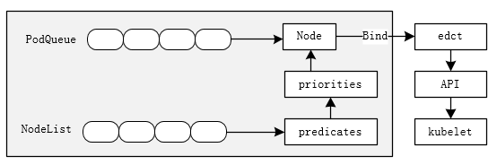

## 10.1 Pod调度队列

[scheduler/core/scheduling_queue.go]
```go
type SchedulingQueue interface {       
        Add(pod *v1.Pod) error
        AddIfNotPresent(pod *v1.Pod) error   //如果FIFO中不存在，则将一个pod添加到FIFO。
        AddUnschedulableIfNotPresent(pod *v1.Pod) error //将一个不可调度的pod添加回队列。
                                                        //在FIFO中，它被添加到队列的末尾。
        Pop() (*v1.Pod, error)                         //弹出FIFO Head
        Update(oldPod, newPod *v1.Pod) error           //更新FIFO中的pod
        Delete(pod *v1.Pod) error      
        
        MoveAllToActiveQueue()
        AssignedPodAdded(pod *v1.Pod)  
        AssignedPodUpdated(pod *v1.Pod)        //FIFO不需要实现这三接口，因为FIFO中的pod
                                               //总是在活动调度队列中。
        WaitingPodsForNode(nodeName string) []*v1.Pod
        WaitingPods() []*v1.Pod                //返回Queue中所有等待的Pod
}
```

SchedulingQueue包含了Queue的接口，用于存储等待调度的pod。有cache.FIFO和cache.Heap两种模式.如果在配置中指定`--feature-gates PodPriority=true`则使用cache.Heap模式,该模式下优先调度优先级高的Pod。
```go
type FIFO struct {
        *cache.FIFO
}

type PriorityQueue struct {
        lock sync.RWMutex
        cond sync.Cond
        activeQ *Heap  //scheduler主动查看以查找要调度的pod的堆结构。 堆头是最高优先级的pod
        unschedulableQ *UnschedulablePodsMap  //保存已经尝试并确定不可调度的pod

        nominatedPods map[string][]*v1.Pod  //在指定节点上运行的pod列表。pod可以在
                                            //activeQ或unchedulableQ中
        receivedMoveRequest bool    //将pod从unschedulableQ移动到activeQ的请求时，receivedMoveRequest设置为true，当从activeQ弹出pod时，receiveMoveRequest设置为false。
}
```

- Add/Update/Delete方法：
  这三该方法通过调用client-go(k8s.io/client-go/listers/core/v1)中的PodInformer接口实现：
  ```go
  // scheduled pod cache
  AddFunc:    c.addPodToCache,
    -> c.schedulerCache.AddPod(pod)
    -> c.podQueue.AssignedPodAdded(pod)

  UpdateFunc: c.updatePodInCache,
    -> c.schedulerCache.UpdatePod(oldPod, newPod)
    -> c.podQueue.AssignedPodUpdated(newPod)
    
  DeleteFunc: c.deletePodFromCache,
    -> c.schedulerCache.RemovePod(pod)
    -> c.podQueue.MoveAllToActiveQueue()
  ```

  ```go
  // unscheduled pod queue
  AddFunc:    c.addPodToSchedulingQueue,
    -> c.podQueue.Add(obj.(*v1.Pod))
    
  UpdateFunc: c.updatePodInSchedulingQueue,
    -> c.podQueue.Update(oldObj.(*v1.Pod), pod)
    
  DeleteFunc: c.deletePodFromSchedulingQueue,
    -> c.podQueue.Delete(pod)
    -> c.volumeBinder.DeletePodBindings(pod)
  ```

## 10.2 NodeTree
NodeTree是一种树状数据结构，用于保存节点的名称。zones中保存zone列表作为“NodeTree.tree”的key，“NodeTree.tree”的value是节点名称的数组。
```go
[scheduler/cache/node_tree.go]
type NodeTree struct {
        tree		map[string]*nodeArray
        zones		[]string
        zoneIndex	int
        exhaustedZones sets.String
        NumNodes       int
        mu             sync.RWMutex    
}

type nodeArray struct {
        nodes     []string
        lastIndex int
}
```
- AddNode/UpdateNode/DeleteNode接口实现如下：
  ```go
  AddFunc:    c.addNodeToCache,
    -> c.schedulerCache.AddNode(node)
       -> NewNodeInfo()
       -> cache.nodeTree.AddNode(node)
       -> cache.addNodeImageStates(node, n)
    -> c.podQueue.MoveAllToActiveQueue()

  UpdateFunc: c.updateNodeInCache,
    -> c.schedulerCache.UpdateNode(oldNode, newNode)
       -> cache.nodeTree.UpdateNode(oldNode, newNode)
       -> cache.addNodeImageStates(newNode, n)
    -> c.podQueue.MoveAllToActiveQueue()

  DeleteFunc: c.deleteNodeFromCache,
    -> c.schedulerCache.RemoveNode(node)
       -> cache.nodeTree.RemoveNode(node)
       -> cache.removeNodeImageStates(node)
    -> c.equivalencePodCache.InvalidateAllPredicatesOnNode(node.GetName())
  ```

- Next 
  Next方法在scheduler/core/generic_scheduler.go:Schedule中被调用。predicate筛选符合要求的候选节点。

## 10.3调度策略
Scheduler默认调度流程分为以下2步：
1. 预选调度： 即遍历所有目标Node，筛选符合要求的候选节点，scheduler内置多种预选策略(xxx predicates).
   - NoDiskConflict： 检查数据卷是否冲突。
   - PodFitsResources: 检查节点资源是否满足需求
   - PodFitsPots：检查HostPorts是否冲突
   - PodFitsHost：判断spec.NodeName属性和被选节点名称是否一致。
   - PodSelectorMatches：根据Pod NodeSelector选择节点。
   - NoVolumeZoneConflict：评估Volume需求。
   - CheckNodeLabelIPresence：检查Node是否存在Scheduler配置的标签
   - CheckServiceAffinity：判断备选节点是否包含策略指定的标签
2. 确定最优节点： 如果存在多个符合条件的Node，则在第一步基础上，采用优选策略(xxx priority)计算候选节点积分，积分最高胜出。
   - LeastRequestedPriority：选择最多可用资源的Node
   - CalculateNodeLabelPriority： 选择含有指定Label的Node
   - BalancedResourceAllocationL：选择资源均衡的Node

算法是通过包的引用来作为加载的入口的，定义在[cheduler/algorithmprovider/plugin.go]中：
```go
package algorithmprovider
import (
        "k8s.io/kubernetes/pkg/scheduler/algorithmprovider/defaults"
)
```

在import package时，会执行defaults中的init方法。
```go
func RegisterAlgorithmProvider(name string, predicateKeys, priorityKeys sets.String)
```
- name为使用的算法名称
- predicateKeys为算法用到的预选策略集合
- priorityKeys为算法用到的优选策略集合


## 10.4 详细流程
```go
Run
  -> algorithmprovider.ApplyFeatureGates()
     -> defaults.ApplyFeatureGates()
     

  -> schedulerConfig, err := NewSchedulerConfig(c)
  -> sched := scheduler.NewFromConfig(schedulerConfig)
  
  -> go c.PodInformer.Informer().Run(stopCh)
     c.InformerFactory.Start(stopCh)
     
  -> c.InformerFactory.WaitForCacheSync(stopCh)
     controller.WaitForCacheSync("scheduler", stopCh, c.PodInformer.Informer().HasSynced)
     
  -> sched.Run()
     -> sched.scheduleOne
        -> pod := sched.config.NextPod()   //从core/scheduling_queue.go的调度队列中
                                           //获取待调度的pod
           -> getNextPod()
              -> c.podQueue.Pop()
        
        -> suggestedHost, err := sched.schedule(pod)
           -> sched.config.Algorithm.Schedule(pod, sched.config.NodeLister)
              -> podPassesBasicChecks()
              -> nodes, err := nodeLister.List()
              -> g.cache.UpdateNodeNameToInfoMap()
              -> g.findNodesThatFit(pod, nodes)  //根据predicate函数过滤合适的节点
              
              -> PrioritizeNodes                 //确定最优节点
        
        -> assumedPod := pod.DeepCopy()
        -> sched.assumeVolumes(assumedPod, suggestedHost)
        -> sched.assume(assumedPod, suggestedHost)
        
        -> sched.bindVolumes(assumedPod)
        -> sched.bind()
           -> sched.config.SchedulerCache.FinishBinding(assumed)
```


# 11 kube-controller-manager

## 11.1 HPA

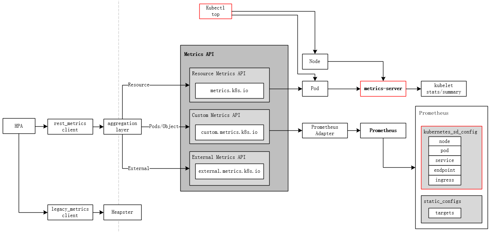

HPA可以基于如下4类接口实现自动伸缩：

- Resource - 基于Pod的资源(cpu,内存)使用情况

  ```go
  ResourceMetricSourceType
    computeStatusForResourceMetric
      Target.AverageValue       -> GetRawResourceReplicas
      Target.AverageUtilization -> GetResourceReplicas
                                   -> GetResourceMetric    
                                      -> PodMetricses
  ```

- Pods - pod的平均指标，pod的每秒事务数(ransactions-processed-per-second)

  ```go
  PodsMetricSourceType
    computeStatusForPodsMetric
      GetMetricReplicas
        GetRawMetric         -> NamespacedMetrics
  ```

- Object  - k8s对象的某种指标，如ingress的hits-per-second。

  ```go
  ObjectMetricSourceType:
    computeStatusForObjectMetric
      GetObjectMetricReplicas
        GetObjectMetric      -> RootScopedMetrics
  ```

- External - 第三方如Prometheus等获取的资源

```go
ExternalMetricSourceType:
  computeStatusForExternalMetric
    Target.AverageValue -> GetExternalMetricReplicas
    Target.Value        -> GetExternalPerPodMetricReplicas
                           -> GetExternalMetric    
                              -> NamespacedMetrics
```

上述接口通过metrics client从Metrics API获取信息：

```go
type MetricsClient interface {
        GetResourceMetric() (PodMetricsInfo, time.Time, error)
        GetRawMetric() (PodMetricsInfo, time.Time, error)
        GetObjectMetric() (int64, time.Time, error)
        GetExternalMetric() ([]int64, time.Time, error)
}
```
metrics client实现有legacy_metrics_client和rest_metrics_client两种，最新版本中"--horizontal-pod-autoscaler-use-rest-clients为"true"，默认使用rest_metrics_client，legacy_metrics_client用于Heapster,已经不推荐使用。

接口实现如下：
**Resource Metrics API**:
```go
resourceclient "k8s.io/metrics/pkg/client/clientset/versioned/typed/metrics/v1beta1"

type resourceMetricsClient struct {    
        client resourceclient.PodMetricsesGetter                                   
}

GetResourceMetric
-> metrics, err := c.client.PodMetricses(namespace).List()
```
**Custom Metrics API**:

```go
customclient "k8s.io/metrics/pkg/client/custom_metrics"

type customMetricsClient struct {
        client customclient.CustomMetricsClient
}

GetRawMetric
  -> metrics, err := c.client.NamespacedMetrics(namespace).GetForObjects()
GetObjectMetric
  -> c.client.RootScopedMetrics().GetForObject()
```
**External Metrics API**:

```go
externalclient "k8s.io/metrics/pkg/client/external_metrics"
type externalMetricsClient struct {
        client externalclient.ExternalMetricsClient
}

GetExternalMetric
  -> c.client.NamespacedMetrics(namespace).List()
```


# 12 client-go

- The `kubernetes` package contains the clientset to access Kubernetes API.
- The `discovery` package is used to discover APIs supported by a Kubernetes API server.
- The `dynamic` package contains a dynamic client that can perform generic operations on arbitrary Kubernetes API objects.
- The `transport` package is used to set up auth and start a connection.
- The `tools/cache` package is useful for writing controllers.
- informers
- listers


# 13 Kubernetes Autoscaler

## 13.1 Cluster Autoscaler

[CA](https://github.com/kubernetes/autoscaler/tree/master/cluster-autoscaler)是用来弹性伸缩kubernetes集群，可以根据部署的应用所请求的资源量来动态的伸缩集群节点数量，由以下几个模块组成：

- autoscaler：核心模块，负责整体扩缩容功能

- Estimator：负责评估计算扩容节点

- Simulator：负责模拟调度，计算缩容节点

- CA Cloud-Provider：与云交互进行节点的增删操作。社区目前支持AWS、Azure和GCP，其他云厂商需要自己实现CloudProvider和NodeGroup相关接口。 

  CA的架构如下图所示： 

  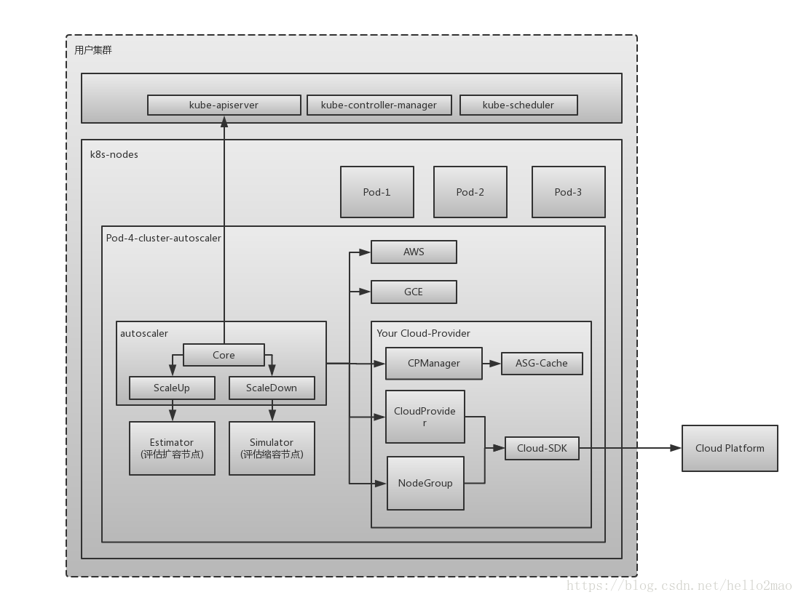当资源不足，pod一直处于Pending状态时，会导致pod调度失败，ca会扩容节点数量，当node的资源利用率较低时，且此node上存在的pod都能被重新调度到其他node上运行，ca会缩容。缩容时以下配置的node不会被删除

  - 节点上有pod被PodDisruptionBudget控制器限制。
  - 节点上有命名空间是kube-system的pods。
  - 节点上的pod不是被控制器创建，例如不是被deployment, replica set, job, stateful set创建。
  - 节点上有pod使用了本地存储
  - 节点上pod驱逐后无处可去，即没有其他node能调度这个pod
  - 节点有注解：”cluster-autoscaler.kubernetes.io/scale-down-disabled”: “true”

部署ca

```yaml
apiVersion: extensions/v1beta1
kind: Deployment
metadata:
  name: cluster-autoscaler
  labels:
    k8s-app: cluster-autoscaler
spec:
  replicas: 1
  selector:
    matchLabels:
      k8s-app: cluster-autoscaler
  template:
    metadata:
      labels:
        k8s-app: cluster-autoscaler
    spec:
      containers:
        - image: cluster-autoscaler:latest
          name: cluster-autoscaler
          command:
            - ./cluster-autoscaler
            - --nodes={{MIN}}:{{MAX}}:k8s-worker-asg-1
```


## 13.2 Vertical Pod Autoscaler

[VPA](https://github.com/kubernetes/autoscaler/tree/master/vertical-pod-autoscaler)为现有pod分配更多/更少的CPU或内存，主要是更新deployment或者replication controller specs中的resources定义。它可以适用于有状态和无状态的pod，但它主要是为有状态服务而构建的。但是如果希望实现最初为pod分配的资源的自动更正，则可以将其用于无状态容器。VPA还可以对OOM事件做出反应。VPA当前要求重新启动pod以更改已分配的CPU和内存。当VPA重新启动pod时，它会考虑pods分发预算（PDB）以确保始终具有所需的最小pod数。

配置示例

```yaml
apiVersion: poc.autoscaling.k8s.io/v1alpha1
kind: VerticalPodAutoscaler
metadata:
  name: my-app-vpa
spec:
  selector:
    matchLabels:
      app: my-app
  updatePolicy:
    updateMode: "Auto"
```


## 13.3 [Addon Resizer](https://github.com/kubernetes/autoscaler/tree/master/addon-resizer)

a simplified version of vertical pod autoscaler that modifies resource requests of a deployment based on the number of nodes in the Kubernetes Cluster. Current state - beta.


#14 kubernetes监控

从监控平台本身的业务需求来看，至少应该通过平台获取到以下的监控数据：

- **性能指标(如：CPU, Memory等）**
  - 容器相关的性能指标数据
  - 主机节点相关的性能指标数据
  - K8S平台组件Kubelet的性能指标数据
  - 容器内某个具体进程的性能指标数据
  - K8S上应用的网络性能，如http、tcp等数据
- **健康状态指标**
  - K8S资源对象（Deployment、Daemonset、Pod等）的状态指标

获取监控数据之后，还需要对监控进行可视化展示，以及对监控中出现的异常情况进行告警。


## 14.1 主流监控方案

目前对于kubernetes的主流监控方案主要有以下几种：

- **Heapster+InfluxDB+Grafana** 
  每个K8S节点的Kubelet内含cAdvisor，暴露出API，Kubelet从cAdvisor获取数据。[Heapster](https://github.com/kubernetes/heapster)通过apiserver发现集群的所有节点，并通过访问每个节点的Kubelet API(nodeIP:10255/stats/summary)获取监控数据。它支持多种储存方式，常用的是InfluxDB。这套方案的缺点是数据来源单一、缺乏报警功能以及InfluxDB的单点问题，而且Heapster也已经在新版本中被[metrics-server](https://github.com/kubernetes-incubator/metrics-server)取代)了。这种实现方案的详细介绍请见[这篇文章](https://blog.csdn.net/liukuan73/article/details/78704395)。
- **Metrics-Server+InfluxDB+Grafana** 
  K8S从1.8版本开始，CPU、内存等资源的metrics信息可以通过 Metrics API来获取，用户还可以通过kubectl top（1.10版开始）直接获取这些metrics信息。Metrics API需要部署Metrics-Server。Metrics-Server是Kubernetes1.9版本以上的首选方法。
- **各种Exporter+Prometheus+Grafana** 
  通过各种export采集不同维度的监控指标，并通过Prometheus支持的数据格式暴露出来，Prometheus定期pull数据并用Grafana展示，异常情况使用AlertManager告警。本方案下文详细叙述。

## 14.2 metrics-server

K8S从1.8版本后，CPU、内存等资源的metrics信息可以通过[Resource Metrics API](https://github.com/kubernetes/metrics)来获取，通过Resource Metrics API可以获取给定Node或pod资源使用情况。

Metrics-Server是Kubernetes1.9版本以上的首选监控方法，1.11版本后Heapster已经不推荐使用。

Resource Metrics API需要部署Metrics-Server(或Heapster)，Metrics-Server向aggregation layer注册APIService对象，对象的 URI 为 “/apis/metrics.k8s.io/”，发送到该API路径的任何请求都会被aggregation layer转发到“/apis/metrics.k8s.io/”。

Metrics Server通过从kubernet.summary_api收集节点和pod的CPU和内存使用情况。summary API是一个内存有效的API，用于将数据从Kubelet/cAdvisor(http://IP:10255/stats/summary)传递到metrics server 
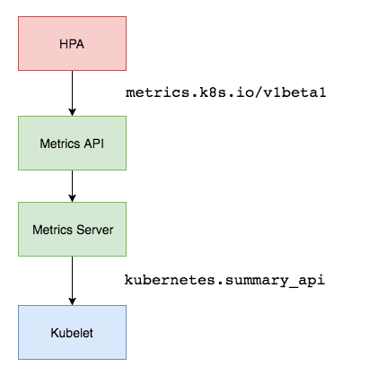

配置：
- kube-controller-manager
  ```
  --horizontal-pod-autoscaler-use-rest-clients="true"
  --master="http://192.168.56.101:8080"
  ```

- kube-apiserver
  ```
  --runtime-config=api/all=true
  --enable-aggregator-routing=true

  --requestheader-client-ca-file="/etc/kubernetes/ssl/ca.pem"
  --requestheader-allowed-names="[aggregator]"
  --requestheader-extra-headers-prefix="[X-Remote-Extra-]"
  --requestheader-group-headers="[X-Remote-Group]"
  --requestheader-username-headers="[X-Remote-User]"

  --proxy-client-cert-file="/etc/kubernetes/ssl/client.pem"
  --proxy-client-key-file="/etc/kubernetes/ssl/client-key.pem"
  ```

- deployment
  ```yaml
  apiVersion: extensions/v1beta1
  kind: Deployment
  metadata:
    name: metrics-server
    namespace: kube-system
    labels:
      k8s-app: metrics-server
  spec:
    selector:
      matchLabels:
        k8s-app: metrics-server
    template:
      metadata:
        name: metrics-server
        labels:
          k8s-app: metrics-server
      spec:
        serviceAccountName: metrics-server
        volumes:
        - name: ca-ssl
          hostPath:
            path: /etc/kubernetes/ssl
        containers:
        - name: metrics-server
          image: 192.168.56.1:5000/metrics-server-amd64:v0.3.0
          imagePullPolicy: Always
          volumeMounts:
          - name: ca-ssl
            mountPath: /etc/kubernetes/ssl
          command:
          - /metrics-server
          - --deprecated-kubelet-completely-insecure=true
          - --kubelet-preferred-address-types=InternalIP
          - --kubelet-port=10255
          - --requestheader-client-ca-file=/etc/kubernetes/ssl/ca.pem
  ```


代码流程:

metrics-server pod启动后，定期搜集数据并存储

```go
[pkg/manager/manager.go]
RunUntil
  -> rm.source.Collect(ctx)
  -> rm.sink.Receive(data)

[pkg/sources/manager.go]
Collect
  -> srcProv.GetMetricSources()
  -> scrapeWithMetrics
     -> MetricSource.Collect

[sources/summary/summary.go]
GetMetricSources
  -> nodeLister.List
  -> getNodeInfo(node)
     -> addrResolver.NodeAddress(node)
  -> NewSummaryMetricsSource

Collect
  -> src.kubeletClient.GetSummary
  -> src.decodeNodeStats
     -> decodeCPU
        decodeMemory
  -> src.decodePodStats
     -> decodeCPU
        decodeMemory
```

```go
[pkg/storage/nodemetrics/reststorage.go]

List
  -> getNodeMetrics
     -> getNodeMetrics(name)
        -> prov.GetNodeMetrics(names...)

[pkg/storage/podmetrics/reststorage.go]
List
  -> podLister.Pods(namespace).List(labelSelector)
Get
  -> podLister.Pods(namespace).Get(name)

getPodMetrics
  -> prov.GetContainerMetrics

[pkg/provider/sink/sinkprov.go]
type MetricsProvider interface {
        PodMetricsProvider
        NodeMetricsProvider
}

type PodMetricsProvider interface {
        GetContainerMetrics(pods ...apitypes.NamespacedName) ([]TimeInfo, [][]metrics.ContainerMetrics, error)
}

type NodeMetricsProvider interface {
        GetNodeMetrics(nodes ...string) ([]TimeInfo, []corev1.ResourceList, error)
}


GetNodeMetrics
  -> corev1.ResourceName(corev1.ResourceCPU)
     corev1.ResourceName(corev1.ResourceMemory)
     
GetContainerMetrics
  -> corev1.ResourceName(corev1.ResourceCPU)
     corev1.ResourceName(corev1.ResourceMemory)
     
Receive
  -> newNodes
  -> newPods
```


## 14.3 Custom Metrics API


# 15 kubernetes federation

https://kubernetes.io/docs/concepts/cluster-administration/federation/


# 16 微服务

# 17. Etcd

etcd是CoreOS团队于 2013 年 6 月发起的一个管理配置信息和服务发现(Service Discovery)的开源项目，基于golang实现，目标是构建一个高可用的分布式键值数据库，用户可以在多个节点上启动多个etcd实例，并添加它们为一个集群，同一个集群中的实例将会保持彼此信息的一致性。
