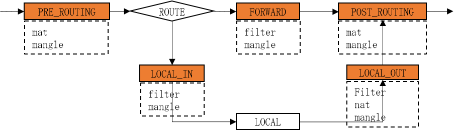
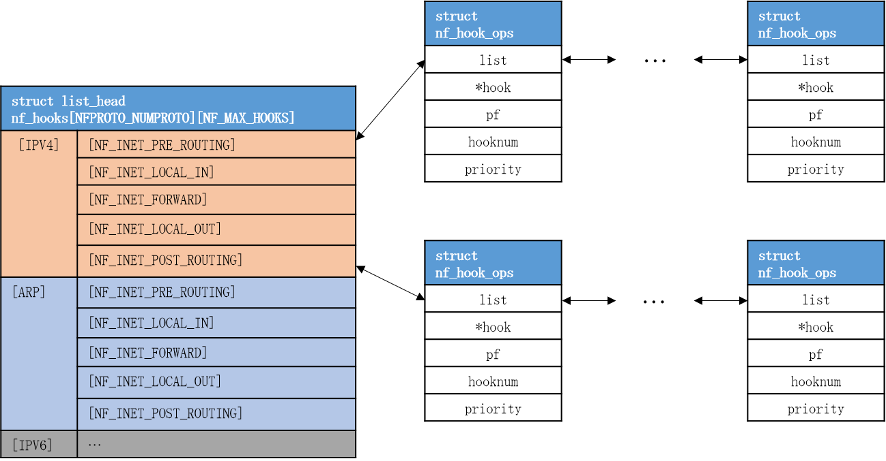
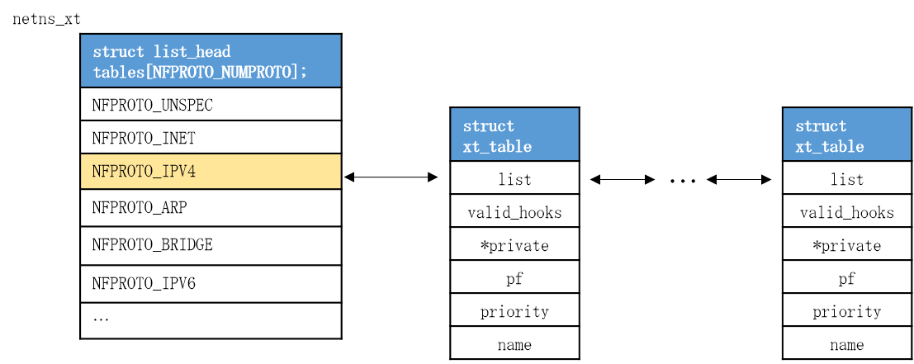
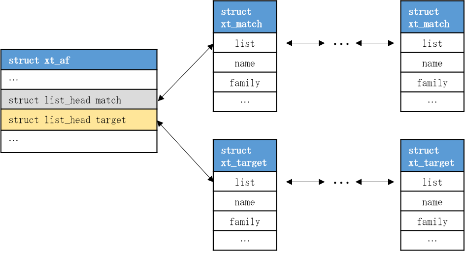
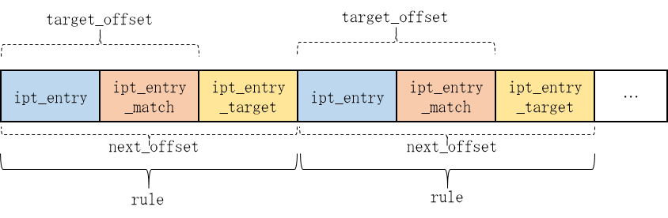
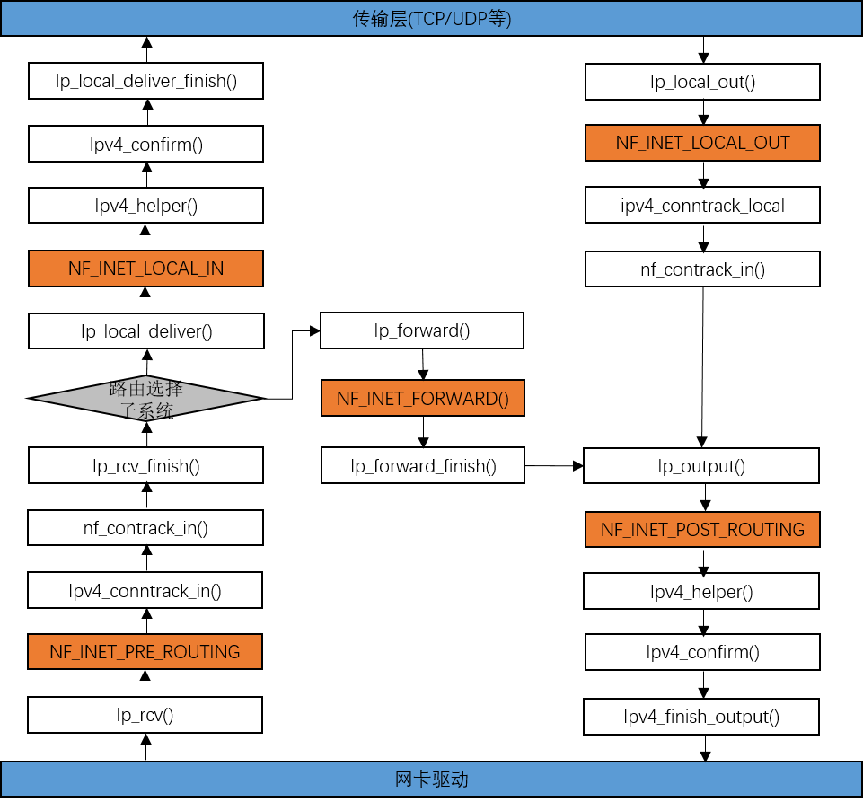
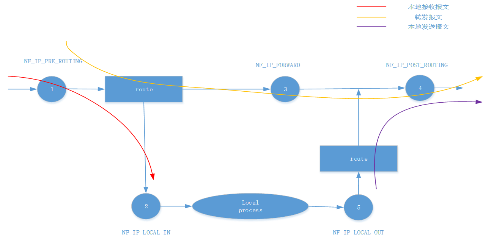

##1. iptables

###1.1 介绍

netfilter是由Rusty Russell提出的内核防火墙框架，可实现安全策略应用中的许多功能，如数据包过滤、数据包处理、地址伪装、透明代理、网络地址转换(Network Address Translation，NAT)、强制访问控制(Mandatory Access Control，MAC)和基于状态的过滤、包速率限制等。

iptables 在用户层通过 Netfilter的接口来对存放在内核内存中的 Netfilter的配置表进行修改。这个内存中的配置表由表`tables`、链`chains`、规则`rules`组成。Netfilter在内核中位置如下图所示：


### 1.2 命令格式

命令格式：


- **`table`**
  - `[-t table]`：该规则所操作的哪个表，可以使用filter、nat，mangle，raw，security，默认为filter。
- **`command`**
  - `-A`：新增一条规则，到该规则链列表的最后一行
  - `-C` ：检查规则是否存在
  - `-I`：插入一条规则，原本该位置上的规则会往后顺序移动，没有指定编号则为1
  - `-D`：从规则链中删除一条规则，要么输入完整的规则，或者指定规则编号加以删除
  - `-I` ：插入一条规则
  - `-R`：替换某条规则，规则替换不会改变顺序，而且必须指定编号。
  - `-P`：设置某条规则链的默认动作
  - `-nL`：`-L`、`-n`，查看当前运行的防火墙规则列表
  - `-S [chain]`: 查看当前运行的防火墙规则列表
  - `-F [chain]`: 清空所有链。
  - `–Z`: 把所有链的包及字节的计数器清空。它可以和 -L配合使用，在清空前察看计数器。
  - `-N`: 根据给出的名称建立一个新的用户定义链。这必须保证没有同名的链存在。
- **`chain`**
  - `chain名`：指定规则表的哪个链，如INPUT、OUPUT、FORWARD、PREROUTING等。
  - `[规则编号]`：插入、删除、替换规则时用，`--line-numbers`显示号码
- **`match`**
  - `[-i|o 网卡名称]`：i是指定数据包从哪块网卡进入，o是指定数据包从哪块网卡输出
  - `[-p 协议类型]`：可以指定规则应用的协议，包含tcp、udp和icmp等
  - `[-s 源IP地址]`：源主机的IP地址或子网地址
  - `[-d 目标IP地址]`：目标主机的IP地址或子网地址
  - `[--sport 源端口号]`：数据包的IP的源端口号
  - `[--dport目标端口号]`：数据包的IP的目标端口号
  - `[-m match]`：extend matches，通过match扩展模块提供更多的匹配 选项，对应net/netfilter/xt_xxx.ko模块。如：
    - -m state --state ESTABLISHED,RELATED  : 对状态为ESTABLISHED,RELATED的连接放行
    - -m tcp --dport 22
    - -m multiport --dports 80,8080
    - -m icmp --icmp-type 8
    - -m conntrack --ctstate RELATED,ESTABLISHED
- **`target`**
  - `<-j target>`：处理数据包的动作，包括ACCEPT、DROP、REJECT等，或target扩展模块。
  - `<-g chain>`：跳转到chain继续处理


###1.3 tables

- **filter表**
  主要用于对数据包进行过滤，根据具体的规则决定是否放行该数据包（如DROP、ACCEPT、REJECT、LOG）。filter 表对应的内核模块为iptable_filter，包含三个规则链：
  - `INPUT`链：INPUT针对那些目的地是本地的包
  - `FORWARD`链：FORWARD过滤所有不是本地产生的并且目的地不是本地(即本机只是负责转发)的包
  - `OUTPUT`链：OUTPUT是用来过滤所有本地生成的包

- **nat表**
  主要用于修改数据包的IP地址、端口号等信息（网络地址转换，如SNAT、DNAT、MASQUERADE、EDIRECT）。属于一个流的包(因为包的大小限制导致数据可能会被分成多个数据包)只会经过这个表一次。如果第一个包被允许做NAT或Masqueraded，那么余下的包都会自动地被做相同的操作，也就是说，余下的包不会再通过这个表。表对应的内核模块为 iptable_nat，包含三个链：
  - `PREROUTING`链：作用是在包刚刚到达防火墙时改变它的目的地址
  - `OUTPUT`链：改变本地产生的包的目的地址
  - `POSTROUTING`链：在包就要离开防火墙之前改变其源地址

- **mangle表**
  主要用于修改数据包的TOS（Type Of Service，服务类型）、TTL（Time To Live，生存周期）以及为数据包设置Mark标记，以实现Qos(Quality Of Service，服务质量)调整以及策略路由等应用，由于需要相应的路由设备支持，因此应用并不广泛。包含五个规则链 -- PREROUTING，POSTROUTING，INPUT，OUTPUT，FORWARD。

- **raw表**
  是自1.2.9以后版本的iptables新增的表，主要用于`决定数据包是否被状态跟踪机制处理`。在匹配数据包时，raw表的规则要优先于其他表。包含两条规则链 -OUTPUT、PREROUTING。

- **security表**
  用于MAC网络规则。


###1.4 chains

在处理各种数据包时，根据防火墙规则的不同介入时机，iptables供涉及5种默认规则链，分别对应内核的五个hook

  - `INPUT`链：当接收到防火墙本机地址的数据包（入站）时，应用此链中的规则。
  - `OUTPUT`链：当防火墙本机向外发送数据包（出站）时，应用此链中的规则。
  - `FORWARD`链：当接收到通过防火墙发送给其他地址的数据包(转发)时，应用此链中的规则。
  - `PREROUTING`链：在对数据包作路由选择之前，应用此链中的规则，如DNAT。
  - `POSTROUTING`链：在对数据包作路由选择之后，应用此链中的规则，如SNAT。


表和链对应关系如下：



```
  ---->PROUTING ----> [ROUTE] ----> FORWARD ----> POSTROUTING ---->
          mangle       |            mangle          ^ mangle
           nat         |            filter          |  nat
                       |                            |
                       |                            |
                       v                            |
                     INPUT                        OUTPUT
                       | mangle                     ^ mangle
                       | filter                     |  nat
                       v ----------->local--------->| filter
```


### 1.5 rules

rules由`match`和`target`构成:
```
rule-specification = [matches...] [target]
match = -m matchname [per-match-options]
target = -j targetname [per-target-options]
```


####1.5.1 MATCH EXTENSIONS

iptables除了一些内置的匹配选项(-p, -s, -d ，-i， -o...)外，还通过match扩展模块提供更多的匹配选项，match扩展模块对应内核net/netfilter/xt_xxx.ko模块：

- `-m tcp`  : 
  当 –protocol tcp 被指定,且其他匹配的扩展未被指定时,这些扩展被装载。它提供以下选项：
  - --source-port \[!] [port[:port]]
    源端口或端口范围指定。这可以是服务名或端口号。使用格式端口：端口也可以指定包含的（端口）范围。如果首端口号被忽略，默认是”0″，如果末端口号被忽略，默认是”65535″，如果第二个端口号大于第一个，那么它们会被交换。可以使用 --sport的别名。
  - --destionation-port \[!][port:[port]]
    目标端口或端口范围指定。可以使用 --dport别名来代替。
  - --tcp-flags [!] mask comp
    匹配指定的TCP标记。第一个参数是我们要检查的标记，一个用逗号分开的列表。第二个参数是用逗号分开的标记表,是必须被设置的。标记如下：SYN ACK FIN RST URG PSH ALL NONE。因此这条命令：iptables -A FORWARD -p tcp --m tcp --tcp-flags SYN, ACK, FIN, RST SYN  只匹配那些SYN标记被设置而ACK、FIN和RST标记没有设置的包(flags & mask == comp)。
  - [!] --syn
    只匹配那些设置了SYN位而清除了ACK和FIN位的TCP包。这些包用于TCP连接初始化时发出请求；例如，大量的这种包进入一个接口发生堵塞时会阻止进入的TCP连接，而出去的TCP连接不会受到影响。这等于 –tcp-flags SYN, RST, ACK SYN。如果”–syn”前面有”!”标记，表示相反的意思。
  - --tcp-option [!] number
    匹配设置了TCP选项的。

- `-m udp`  : 
  当protocol udp 被指定,且其他匹配的扩展未指定时,这些扩展被装载,它提供以下选项：
  - --source-port \[!][port:[port]]
    源端口或端口范围指定。详见 TCP扩展--source-port选项说明。
  - --destination-port \[!][port:[port]]
    目标端口或端口范围指定。详见 TCP扩展--destination-port选项说明。

- `-m icmp`  : 
  当protocol icmp被指定,且其他匹配的扩展未被指定时,该扩展被装载。提供以下选项：
  - --icmp-type \[!] typename
    允许指定ICMP类型，可以是一个数值型的ICMP类型，或者是某个由命令iptables -p icmp -h所显示的ICMP类型名。

- `-m state`
  此模块与连接跟踪(CT)结合使用时，允许跟踪包的连接状态。
  - --state state
    state是一个逗号分割的匹配连接状态列表。可能的状态是:
    - INVALID表示包是未知连接，
    - ESTABLISHED表示是双向传送的连接，
    - NEW表示包为新的连接，否则是非双向传送的，
    - RELATED表示包由新连接开始，但和一个已存在的连接在一起，如FTP数据传送，或一个  ICMP错误。

  示例：限制仅xxx网段可以访问FTP服务。
  ```markdown
  # iptables -A INPUT -p tcp -m state --state ESTABLISHED,RELATED -j ACCEPT
  # iptables -A INPUT -p tcp -s xxxx/24 --dport 21 -m state --state NEW -j ACCEPT
  # iptables -A INPUT -p tcp --dport 21 -j DROP
  ```

- `-m conntrace`
  跟踪连接，是`-m state`加强版。选项如下:
  - --ctstate {INVALID|ESTABLISHED|NEW|RELATED|UNTRACKED|SNAT|DNAT}[,...] 
    匹配数据包的状态，前四种和state相同，SNAT/DNAT用于匹配连接是否被SNAT/DNAT处理。

  - --ctproto proto              匹配协议，如"tcp"

  - --ctorigsrc address[/mask]

  - --ctorigdst address[/mask]

  - --ctreplsrc address[/mask]

  - --ctrepldst address[/mask]    Original/Reply source/destination address

  - --ctorigsrcport port

  - --ctorigdstport port

  - --ctreplsrcport port

  - --ctrepldstport port          TCP/UDP/SCTP orig./reply source/destination port

  - --ctstatus {NONE|EXPECTED|SEEN_REPLY|ASSURED|CONFIRMED}[,...]       Status(es) to match

  - --ctexpire time[:time]     Match remaining lifetime in seconds against value or range of values (inclusive)

  - --ctdir {ORIGINAL|REPLY}   Flow direction of packet

  示例：限制仅xxx网段可以访问FTP服务。
  ```markdown
  # iptables -A INPUT -p tcp -m conntrace --state ESTABLISHED,RELATED -j ACCEPT
  # iptables -A INPUT -m conntrace --ctproto tcp --ctorigsrc xxxx/24 \
                                   --ctorigdstport 21 --ctstate NEW -j ACCEPT
  # iptables -A INPUT -p tcp --dport 21 -j DROP
  ```

- `-m mac` : 
  匹配物理地址。
  - –mac-source [!] MAC
    必须是XX:XX:XX:XX:XX这样的格式。注意它只对来自以太设备并进入PREROUTING、FORWORD和INPUT链的包有效。

- `-m multiport`:
  这个模块匹配一组源端口或目标端口,最多可以指定15个端口。只能和-p tcp 或者 -p udp 连着使用。
  - --source-port port[,port:port,port...]  : 如果源端口是其中一个给定端口则匹配
  - --destination-port port[,port:port,port...]    : 如果目标端口是其中一个给定端口则匹配
  - --port port[,port:port,port]                 :  若源端口和目的端口相等并与某个给定端口相等,则匹配。

- `-m mark`  ：用于匹配`-j MARK`中设置的值，称为nfmark。有效范围仅限于一个数据包。

  - --mark value [/mask]

  示例：

  ```markdown
  # iptables -A FORWARD -p all -m mark --mark 80 -j DROP
  ```

- `-m connmark`: 

  connmark匹配必须和"-j CONNMARK"组合使用，可以针对连接设置mark 值。称为ctmark。connmark可以识别nfmark和ctmark，而mark只能识别nfmark。

- `-m connlimit` :

  基于/proc/net/nf_conntrack文件中的数据，限制IP或某个网段对目标机所能建立的最大连接数。

- `-m limit` : 
  这个模块匹配标志用一个标记桶过滤器一一定速度进行匹配,它和LOG目标结合使用来给出有限的登陆数.当达到这个极限值时,使用这个扩展包的规则将进行匹配.(除非使用了”!”标记)
  - --limit rate
    最大平均匹配速率：可赋的值有’/second’, ‘/minute’, ‘/hour’, or ‘/day’这样的单位，默认是3/hour。
  - --limit-burst number

  示例：允许每分钟<= 10的icmp数据包，如果大于10，限制为6/m。
  ```markdown
  # iptables -A INPUT -p icmp --icmp-type 8 -m limit --limit 6/m \
                                                     --limit-burst 10 -j ACCEPT
  # iptables -A INPUT -p icmp --icmp-type 8 -j DROP
  ```

- `hashlimit`  : 和limit类似，功能更强大。

- `-m connbytes`  :限制每个连接中所能传输的数据量。

- `-m quota  ` ： 限制数据传输量。

- `-m time`：设置规则生效时间。

- `-m tos`：匹配IP包首部的8位tos字段。rfc2474已经将TOS改为DSCP(Differentiated Service)。

- `-m iprange`  ：匹配IP地址范围。

- `-m ttl`   ：匹配TTL。

- `-m owner` ：匹配数据包是由哪位owner产生。只能用于OUTPUT/POSTROUTE链，有些包（如ICMP ping应答）可能没有所有者，因此永远不会匹配。

- `-m pkttype` ：匹配数据包的传输方式：Univsdy，Broadcase，Multicast。

- `-m addrtype`  : 匹配地址类型：src-type，dst-type，limit-iface-in，limit-iface-out

- `-m length`：匹配MTU值。

-  `-m recent` : 设定某段时间内对数据包的处理。

-  `-m string`  ：匹配数据包内容

     示例：使用bm(Boyer-Moore)算法匹配"system32"字符串.(bm/kmp两种字符串匹配算法)


```markdown
# iptables -A FORWARD -i eth0 -o eth1 -p tcp -d xxxx --dport 80 \
                                      -m string --algo bm --string "system32" \
                                      -j DROP
```

- `-m statistic`  ：以某种方式(random, nth)丢弃部分数据包，常用于负载均衡。

- `-m u32` :多功能匹配模块，允许检查数据包内各包头的任意数据。

  示例：匹配IP协议
  ```markdown
  # iptables -A INPUT -m u32 --u32 '6&0xFF=6' -j DROP
  ```

- `-m physdev` : 用于透明式防火墙中(工作于2层，又称桥接式防火墙，在网桥上加入防火墙功能后，就称为透明式防火墙)。"-i/-o"参数无法使用。

  示例：   Client1 <-----------eth1>[**Bridge**]\<eth0------------>Client2

  - 2层和3层是同一条FORWARD链，因此以下规则同时作用于2层和3层，Client2 ping不通Client1。
  ```markdown
  # iptables -t filter -A FORWARD -p icmp -j DROP
  ```
  - 工作在2层的netfilter识别不了以太网接口，因此以下规则不起作用。Client2 仍然可以ping通Client1。
  ```markdown
  # iptables -t filter -A FORWARD -i eth0 -o eth1 -p icmp -j DROP
  ```
  - 在2层识别以太网接口需使用physdev模，以下规则丢弃eth0接口icmp包。
  ```markdown
  # iptables -t filter -A FORWARD -m physdev --physdev-in eth0 -p icmp -j DROP
  ```

- `-m set` : 用于匹配ipset创建的集合。

  - [!] --match-set setname flag[,flag]...
    其中，flag为逗号分隔的src/dst列表，例如：
    `# iptables -A FORWARD -m set --match-set test src,dst`
    将会匹配ipset集合(如果集合类型为ip,port)中源地址/目的端口的报文。  如果指定集的集合类型是单维（例如ip），那么该命令将匹配在指定集中可以找到源地址的数据包。

    以下规则匹配源地址包含在集合myset中的数据包并丢弃。
    ```shell
    # ipset create myset hash:ip       
    # ipset add myset 1.1.1.1       
    # ipset add myset 2.2.2.2       
    # iptables -A INPUT -m set --set myset src -j DROP 
    ```

    以下规则伪装所有来自10.0.0.0/24的数据包，而不处理其他在routed_nets集合中的网络的包：
    ```shell
    # ipset create routed_nets hash:net       
    # ipset add routed_nets 10.30.30.0/24             
    # iptables -t nat -A POSTROUTING -s 10.0.0.0/24 \
                      -m set ! --set routed_nets dst \
                      -j MASQUERADE
    ```

  - [[!] --packets-eq value | --packets-lt value | --packets-gt value ]
    如果数据包与集合中的一个元素匹配，则只有当元素的数据包计数器与给定值匹配时才匹配。

- `-m ipvs`: 用于 匹配ipvs连接


####1.5.2 TARGET EXTENSIONS

和MATCH类似，target同样分为内置和扩展模块。target扩展模块对应内核net/netfilter/nft_xxx.ko模块：

- `-j ACCEPT`： 允许数据包通过

- `-j DROP`：     直接丢弃数据包，不给任何回应信息。

- `-j REJECT`：
  拒绝数据包通过，必要时会给数据发送端一个响应的信息。此目标只适用于INPUT、FORWARD和OUTPUT链。以下选项控制响应包的特性：
  - --reject-with type    根据类型返回reply包type可以是  icmp-net-unreachable、icmp-host-unreachable、icmp-port-nreachable、icmp-proto-unreachable、 icmp-net-prohibited 或者 icmp-host-prohibited，该类型会返回相应的ICMP错误信息（默认是port-unreachable）。选项 echo-reply也是允许的；它只能用于指定ICMP ping包的规则中，生成ping的回应。最后，选项tcp-reset可以用于在INPUT链中,或自INPUT链调用的规则，只匹配TCP协议：将回应一个TCP RST包。

- `-j SNAT`：
  源地址转换。在进入路由层面的route之前，重新改写源地址，目标地址不变，并在本机建立NAT表项，当数据返回时，根据NAT表将目的地址数据改写为数据发送出去时候的源地址，并发送给主机。解决内网用户用同一个公网地址上网的问题。该目标**只适用于nat表的POSTROUTING链**。包含如下选项：
  - --to-source \[\<ipaddr>[-\<ipaddr>]]\[:port[-port]]可以指定一个单一的新的IP地址，一个IP地址范围，也可以附加一个端口范围（只能在指定-p tcp 或者-p udp的规则里）。如果未指定端口范围，源端口中512以下的（端口）会被安置为其他的512以下的端口；512到1024之间的端口会被安置为1024以下的，其他端口会被安置为1024或以上。如果可能，端口不会被修改。
  - \[--random]\[--random-fully][--persistent]

- `-j MASQUERADE`: 
  SNAT的一种特殊形式，**只用于nat表的POSTROUTING链**。适用于像adsl这种每次获取的公网IP都不是固定的(如果是静态IP地址，使用SNAT)。相当于给包发出时所经过接口的IP地址设置一个映像，当接口关闭，连接会终止。这是因为当下一次拨号时公网IP未必是相同的接口地址（以后所有建立的连接都将关闭）。选项如下：
  - --to-ports [-port>]指定使用的源端口范围，覆盖默认的SNAT源地址选择。这个选项只适用于指定了-p tcp或者-p udp的规则。

  - --random 随机源端口

    示例：

    ```markdown
    一对多NAT：
    # iptables -t nat -A POSTROUTING -o eth0 -s 192.168.0.0/24 \
                                             -j SNAT --to 10.0.1.200
    每次获取的公网IP不固定，用发送数据的网卡上的IP来替换源IP：
    # iptables -t nat -A POSTROUTING -o eth0 -s 192.168.0.0/24 \
                                             -j MASQUERADE
    多对多NAT，必须保证公网IP连续：
    # iptables -t nat -A POSTROUTING -o eth0 -s 192.168.0.0/24 \
                                             -j SNAT --to 10.0.1.200-10.0.1.205
    ```

- `-j DNAT`:
  目标地址转换。和SNAT相反，IP包经过route之后、出本地的网络栈之前，重新修改目标地址，源地址不变，在本机建立NAT表项，当数据返回时，根据NAT表将源地址修改为数据发送过来时的目标地址，并发给远程主机。可以隐藏后端服务器的真实地址。
  - --to-destination \[\<ipaddr>\[-\<ipaddr>]][:port[-port]]        Address to map destination to.
  - \[--random] [--persistent]

- `-j REDIRECT`：
  是DNAT的一种特殊形式，适用于nat表的PREROUTING和OUTPUT链，将网络包转发到本地host上（不管IP头部指定的目标地址是啥），方便在本机做端口转发。一般用于代理服务器。

  - --to-ports \<port>[-\<port>]
    指定使用的目的端口或端口范围：不指定的话，目标端口不会被修改。只能用于指定了-p tcp 或 -p udp的规则。
  - [--random]

- `-j MARK`
  用来设置包mark值。适用于mangle表(注：MARK和LOG一样，匹配并标志数据包后，继续匹配下一条规则而不是返回)。
  - --set-xmark value[/mask]  Clear bits in mask and XOR value into nfmark
  - --set-mark value[/mask]   Clear bits in mask and OR value into nfmark
  - --and-mark bits                  Binary AND the nfmark with bits
  - --or-mark bits                     Binary OR the nfmark with bits
  - --xor-mask bits                   Binary XOR the nfmark with bits

  示例: 

  将tcp:80数据包的mark值设置为80(0x50/0xffffffff),然后可以通过`-m mark`匹配该值。
  ```markdown
  # iptables  -t mangle -A PREROUTING  -p tcp --dport 80 -j MARK --set-mark 80
  ```

- `-j CONNMARK`  :和`-j MARK`类似，用于设置连接的mark值，和MARK的区别在于mark的有效范围。MARK有效范围仅局限于单个数据包，CONNMARK则为一个完整的连接。

- `-j RETURN`: 用于自定义链，让符合规则的数据包提前返回其原来的链

  示例：创建/修改/删除自定义chain,丢弃icmp包

  ``` markdown
  # iptables -N ICMPCHAIN           --创建
  # iptables -E ICMPCHAIN xxxx      --重命名
  # iptables -X ICMPCHAIN           --删除
  # iptables -A INPUT -p icmp -j ICMPCHAIN
  # iptables -A ICMPCHAIN -p icmp -j DROP

  # iptables -I ICMPCHAIN 1 -p all -j RETURN
  ```

- `-j NETMAP` :映射网段

  示例：

  ```markdown
  # iptables -t NAT -A PREROUTING  -i eth0 -d 10.0.0.0/24 \
                                           -j NETMAP --to 192.168.1.0/24
  # iptables -t NAT -A POSTROUTING -i eth0 -d 192.168.1.0/24 \
                                           -j NETMAP --to 10.0.0.0/24
  ```

- `-j TOS`
  用来设置IP包的首部八位tos。只能用于mangle表。用于修改经过mangle的数据包。

  - --set-tos value[/mask]
    可以使用一个数值型的TOS 值，或者用iptables -j TOS -h 来查看有效TOS名列表。
  - --set-tos symbol

- `-j TTL` : 修改数据包的TTL值。

- `-j DSCP` : 修改dscp值

  示例：根据DSCP值分类，用于QOS。

  ```markdown
  # iptabkes -t mangle -A FORWARD -p tcp --sport 80 -j DSCP --set-dscp 1
  ```

- `-j QUEUE`： 将符合条件的包发送到用户空间去处理。例如将邮件包送到用户空间，过滤垃圾邮件等。

- `-j LOG`：
  在/var/log/messages文件中记录匹配的数据包信息。然后`将数据包传递给下一条规则`。
  - --log-level level记录级别（参考syslog.conf(5)）。
  - --log-prefix prefix在纪录信息前加上特定的前缀：最多14个字母长，用来和记录中其他信息区别。
  - --log-tcp-sequence记录TCP序列号。如果记录能被用户读取那么这将存在安全隐患。
  - --log-tcp-options记录来自TCP包头部的选项。
  - --log-ip-options记录来自IP包头部的选项。
  - --log-uidLog UID owning the local socket.
  - --log-macdecodeDecode MAC addresses and protocol.

  示例：记录icmp数据包
  ```markdown
  # iptables -A INPUT -p icmp -j LOG --log-level alert
  ```
  配置/etc/rsyslog.conf
  ```markdown
  kern.=alert		/var/log/netfilter
  ```

- `-j ULOG`:将log发送到用户空间处理，如ulogd

- `-j SET`： 添加/删除ipset集合中的ENTRY

  - --add-set setname flag[,flag...]
  - --del-set setname flag[,flag...]


## 2. netfilter框架

### 2.1 基于netfilter的常见框架

- iptables ： iptables防火墙，netfilter前端，能够添加/修改/删除netfilter规则，显示统计信息等。
- ipset ：iptables的扩展,它允许创建匹配整个地址sets（地址集合） 的规则。而不像普通的iptables链是线性的存储和过滤,ip集合存储在带索引的数据结构中,这种结构即时集合比较大也可以进行高效的查找.在
- IPVS(IP Virtual Server) ：一种传输层负载均衡解决方案。


### 2.2 内核iptables实现

- 用于IPV4的iptables - net/ipv4/netfilter/ip_tables.c
- 用于IPV6的ip6tables - net/ipv6/netfilter/ip6_tables.c
- 用于ARP的arptables  - net/ipv4/netfilter/arp_tables.c
- 用于bridge的ebtables - net/bridge/netfilter/etables.c

### 2.3 HOOK(IPv4)

#### 2.3.1 hook的定义

 Netfilter的通用框架不依赖于具体的协议，而是为每种网络协议定义一套HOOK函数，然后通过将一系列调用入口嵌入到内核网络协议栈的报文处理的路径上,完成对数据包的过滤,修改,跟踪等功能。

内核网络协议栈中有5个地方设置了netfilter hook点，对应iptables中的5个chain。hook点名称定义如下：

include/uapi/linux/netfilter.h

```c
enum nf_inet_hooks {
	NF_INET_PRE_ROUTING,
	NF_INET_LOCAL_IN,
	NF_INET_FORWARD,
	NF_INET_LOCAL_OUT,
	NF_INET_POST_ROUTING,
	NF_INET_NUMHOOKS
};
```

ipv4协议栈中主要的hook点如下：

- net/ipv4/ip_input.c : ip_rcv() 

  ```c
  	return NF_HOOK(NFPROTO_IPV4, NF_INET_PRE_ROUTING,
               		net, NULL, skb, dev, NULL,
               		ip_rcv_finish);
  ```

- net/ipv4/ip_input.c : ip_local_deliver()

  ```c
  	return NF_HOOK(NFPROTO_IPV4, NF_INET_LOCAL_IN,
  				net, NULL, skb, skb->dev, NULL,
  				ip_local_deliver_finish);
  ```

- net/ipv4/ip_output.c : __ip_local_out()

  ```c
        return nf_hook(NFPROTO_IPV4, NF_INET_LOCAL_OUT,
                       net, sk, skb, NULL, skb_dst(skb)->dev,
                       dst_output);
  ```

- net/ipv4/ip_forward.c : ip_forward()

  ```c
          return NF_HOOK(NFPROTO_IPV4, NF_INET_FORWARD,
                         net, NULL, skb, skb->dev, rt->dst.dev,
                         ip_forward_finish);
  ```

- net/ipv4/ip_output.c : ip_output()

  ```c
  	return NF_HOOK_COND(NFPROTO_IPV4, NF_INET_POST_ROUTING, sk, skb,
  			    NULL, dev,
  			    ip_finish_output,
  			    !(IPCB(skb)->flags & IPSKB_REROUTED));
  ```

NF_HOOK()宏定义在 include/linux/netfilter.h中：

```c
static inline int
NF_HOOK(uint8_t pf, unsigned int hook, struct net *net, struct sock *sk, struct sk_buff *skb,

        struct net_device *in, struct net_device *out,
        int (*okfn)(struct net *, struct sock *, struct sk_buff *))
{
        int ret = nf_hook(pf, hook, net, sk, skb, in, out, okfn);
        if (ret == 1)
                ret = okfn(net, sk, skb);
        return ret;
}
```

NF_HOOK()宏主要参数如下：

```
- pf	：协议族，对于ipv4来说为NFPROTO_IPV4。
- hook	：HOOK点名称。
- skb	：表示要处理的数据包skb。
- in	：输入设备(net_device对象)
- out	：输出设备，有些情况下，输出设备为NULL。
- okfn	：指向HOOK回调执行完后调用的方法。

```

#### 2.3.2 hook处理函数

在IPv4 协议栈中传输的数据包经过NF_HOOK()时，会进入 net/netfilter/core.c 中的 nf_hook_slow() 函数，该函数根据nf_hooks\[NFPROTO_NUMPROTO][NF_MAX_HOOKS]数组中对应的nf_hook_ops对数据包进行处理 。nf_hook_ops定义如下：

include/linux/netfilter.h

```c
struct nf_hook_ops {
	struct list_head list;

	/* User fills in from here down. */
	nf_hookfn	*hook;
	struct module	*owner;
	void		*priv;
	u_int8_t	pf;
	unsigned int	hooknum;
	/* Hooks are ordered in ascending priority. */
	int		priority;
	
	/* Reserved for use in the future RHEL versions. Set to zero. */
	unsigned long	__rht_reserved1;
	unsigned long	__rht_reserved2;
	unsigned long	__rht_reserved3;
	unsigned long	__rht_reserved4;
	unsigned long	__rht_reserved5;
};
```

iptables中的5个表的实现分别对应内核中的以下模块: net/ipv4/netfilter/iptable_{filter,mangle,nat,raw,security}.ko

当表对应的模块被加载时，除了调用ipt_register_table()注册表外，还会调用nf_register_hooks注册表中的hook，hook按照协议族分类，保存在全局数组nf_hooks中。



NAT表中的hook：

```c
static const struct nf_hook_ops nf_nat_ipv4_ops[] = {
        /* Before packet filtering, change destination */
        {
                .hook           = iptable_nat_ipv4_in,
                .pf             = NFPROTO_IPV4,
                .hooknum        = NF_INET_PRE_ROUTING,
                .priority       = NF_IP_PRI_NAT_DST,
        },
        /* After packet filtering, change source */
        {
                .hook           = iptable_nat_ipv4_out,
                .pf             = NFPROTO_IPV4,
                .hooknum        = NF_INET_POST_ROUTING,
                .priority       = NF_IP_PRI_NAT_SRC,
        },
        /* Before packet filtering, change destination */
        {
                .hook           = iptable_nat_ipv4_local_fn,
                .pf             = NFPROTO_IPV4,
                .hooknum        = NF_INET_LOCAL_OUT,
                .priority       = NF_IP_PRI_NAT_DST,
        },
        /* After packet filtering, change source */
        {
                .hook           = iptable_nat_ipv4_fn,
                .pf             = NFPROTO_IPV4,
                .hooknum        = NF_INET_LOCAL_IN,
                .priority       = NF_IP_PRI_NAT_SRC,
        },
};
```

filter表的hook

```c
filter_ops = xt_hook_ops_alloc(&packet_filter, iptable_filter_hook);
```

mangle表的hook

```c
mangle_ops = xt_hook_ops_alloc(&packet_mangler, iptable_mangle_hook);
```

raw表的hook

```c
rawtable_ops = xt_hook_ops_alloc(&packet_raw, iptable_raw_hook);
```

secure表的hook

```c
sectbl_ops = xt_hook_ops_alloc(&security_table, iptable_security_hook);
```

注：commit：b9e69e12(4.5-rc5)中为xt_hook_link()

各个表的hook处理函数最终都要调用ipt_do_table()函数。每个表包含一组规则的集合，ipt_do_table()函数就是按照表中规则依次处理数据包。

#### 2.3.3 hook返回值

NF_HOOK()返回值必须为如下定义值：

```c
/* Responses from hook functions. */
#define NF_DROP 0			- 丢弃数据包,所有该数据包的资源都会被释放。
#define NF_ACCEPT 1			- 继续在内核网络协议中处理数据包。
#define NF_STOLEN 2			- 数据包交给hook方法继续处理。
#define NF_QUEUE 3			- 将数据包排入队列，交给用户空间处理。
#define NF_REPEAT 4			- 再次调用HOOK函数。
#define NF_STOP 5			- 数据包停止被被hook点的后续函数处理。
#define NF_MAX_VERDICT NF_STOP
```

### 2.4 表

#### 2.4.1 表的表示

内核中，表使用xt_table来表示.

include/linux/netfilter/x_tables.c

```c
/* Furniture shopping... */
struct xt_table {
	struct list_head list;

	/* What hooks you will enter on */
	unsigned int valid_hooks;

	/* Man behind the curtain... */
	struct xt_table_info *private;

	/* Set this to THIS_MODULE if you are a module, otherwise NULL */
	struct module *me;

	u_int8_t af;		/* address/protocol family */
	int priority;		/* hook order */

	/* A unique name... */
	const char name[XT_TABLE_MAXNAMELEN];
};
```


其中，xt_table_info是实际用来描述表的结构：

```c
/* The table itself */
struct xt_table_info {
	/* Size per table */
	unsigned int size;
	/* Number of entries: FIXME. --RR */
	unsigned int number;
	/* Initial number of entries. Needed for module usage count */
	unsigned int initial_entries;

	/* Entry points and underflows */
	unsigned int hook_entry[NF_INET_NUMHOOKS];
	unsigned int underflow[NF_INET_NUMHOOKS];

	/*
	 * Number of user chains. Since tables cannot have loops, at most
	 * @stacksize jumps (number of user chains) can possibly be made.
	 */
	unsigned int stacksize;
	unsigned int __percpu *stackptr;
	void ***jumpstack;

	unsigned char entries[0] __aligned(8);
};
```

#### 2.4.2 表的注册

netfilter中共包含filter，nat，mangle，raw，secure5个表，表的实现分别对应内核ipv4中的net/ipv4/netfilter/iptable_{filter,}.ko模块

```c
static const struct xt_table packet_filter = {
        .name           = "filter",
        .valid_hooks    = FILTER_VALID_HOOKS,
        .me             = THIS_MODULE,
        .af             = NFPROTO_IPV4,
        .priority       = NF_IP_PRI_FILTER,
        .table_init     = iptable_filter_table_init,
};

static const struct xt_table nf_nat_ipv4_table = {
        .name           = "nat",
        .valid_hooks    = (1 << NF_INET_PRE_ROUTING) |
                          (1 << NF_INET_POST_ROUTING) |
                          (1 << NF_INET_LOCAL_OUT) |
                          (1 << NF_INET_LOCAL_IN),
        .me             = THIS_MODULE,
        .af             = NFPROTO_IPV4,
        .table_init     = iptable_nat_table_init,
};

static const struct xt_table packet_mangler = {
        .name           = "mangle",
        .valid_hooks    = MANGLE_VALID_HOOKS,
        .me             = THIS_MODULE,
        .af             = NFPROTO_IPV4,
        .priority       = NF_IP_PRI_MANGLE,
        .table_init     = iptable_mangle_table_init,
};
```

表对应的模块加载/卸载时，调用ipt_register_table/ipt_unregister_table函数完成表的注册。




###2.5 规则

####2.5.1 规则的下发

用户空间iptables命令通过getsockopt/setsockopt 获取/下发规则：

```c
static struct nf_sockopt_ops ipt_sockopts = {
	.pf		= PF_INET,
	.set_optmin	= IPT_BASE_CTL,
	.set_optmax	= IPT_SO_SET_MAX+1,
	.set		= do_ipt_set_ctl,
#ifdef CONFIG_COMPAT
	.compat_set	= compat_do_ipt_set_ctl,
#endif
	.get_optmin	= IPT_BASE_CTL,
	.get_optmax	= IPT_SO_GET_MAX+1,
	.get		= do_ipt_get_ctl,
#ifdef CONFIG_COMPAT
	.compat_get	= compat_do_ipt_get_ctl,
#endif
	.owner		= THIS_MODULE,
};
```

#### 2.5.2 规则的表示


规则下发后，保存在内核的内存中，使用ipt_entry结构表示，包含用于标准匹配用的IP头部分、0个或多个 match和一个target。由于match数不定，所以一条规则实际的占用空间是可变的。
表中规则的存放格式如下：

```c
struct ipt_entry {
	struct ipt_ip ip;

	/* Mark with fields that we care about. */
	unsigned int nfcache;
	
	/* Size of ipt_entry + matches */
	__u16 target_offset;
	/* Size of ipt_entry + matches + target */
	__u16 next_offset;
	
	/* Back pointer */
	unsigned int comefrom;
	
	/* Packet and byte counters. */
	struct xt_counters counters;
	
	/* The matches (if any), then the target. */
	unsigned char elems[0];
};
```


xt_entry_match 主要保存规则中扩展匹配内容（tos、ttl、time 等），数据结构,定义如下：

```c
struct xt_entry_match {
	union {
		struct {
			__u16 match_size;

			/* Used by userspace */
			char name[XT_EXTENSION_MAXNAMELEN];
			__u8 revision;
		} user;
		struct {
			__u16 match_size;

			/* Used inside the kernel */
			struct xt_match *match;
		} kernel;

		/* Total length */
		__u16 match_size;
	} u;

	unsigned char data[0];
};
```

其核心是ipt_match结构，该结构体中包含了对数据包做匹配的函数。

```c
struct xt_match {
	struct list_head list;

	const char name[XT_EXTENSION_MAXNAMELEN];
	u_int8_t revision;

	/* Return true or false: return FALSE and set *hotdrop = 1 to
           force immediate packet drop. */
	/* Arguments changed since 2.6.9, as this must now handle
	   non-linear skb, using skb_header_pointer and
	   skb_ip_make_writable. */
	bool (*match)(const struct sk_buff *skb,
		      struct xt_action_param *);

	/* Called when user tries to insert an entry of this type. */
	int (*checkentry)(const struct xt_mtchk_param *);

	/* Called when entry of this type deleted. */
	void (*destroy)(const struct xt_mtdtor_param *);
#ifdef CONFIG_COMPAT
	/* Called when userspace align differs from kernel space one */
	void (*compat_from_user)(void *dst, const void *src);
	int (*compat_to_user)(void __user *dst, const void *src);
#endif
	/* Set this to THIS_MODULE if you are a module, otherwise NULL */
	struct module *me;

	const char *table;
	unsigned int matchsize;
#ifdef CONFIG_COMPAT
	unsigned int compatsize;
#endif
	unsigned int hooks;
	unsigned short proto;

	unsigned short family;
};
```

当扩展一个match模块时，只需要定义好一个xt_match结构，当模块加载时调用xt_register_match()将该xt_match注册到match链表中。

xt_entry_target 结构与xt_entry_match结构类似，用于保存规则的动作，如-j MARK，SNAT, NETMAP等。定义如下：

```c
struct xt_entry_target {
	union {
		struct {
			__u16 target_size;

			/* Used by userspace */
			char name[XT_EXTENSION_MAXNAMELEN];
			__u8 revision;
		} user;
		struct {
			__u16 target_size;

			/* Used inside the kernel */
			struct xt_target *target;
		} kernel;

		/* Total length */
		__u16 target_size;
	} u;

	unsigned char data[0];
};
```

其核心是xt_target结构，包含了对数据包做修改的函数。

```c
/* Registration hooks for targets. */
struct xt_target {
	struct list_head list;

	const char name[XT_EXTENSION_MAXNAMELEN];
	u_int8_t revision;

	/* Returns verdict. Argument order changed since 2.6.9, as this
	   must now handle non-linear skbs, using skb_copy_bits and
	   skb_ip_make_writable. */
	unsigned int (*target)(struct sk_buff *skb,
			       const struct xt_action_param *);

	/* Called when user tries to insert an entry of this type:
           hook_mask is a bitmask of hooks from which it can be
           called. */
	/* Should return 0 on success or an error code otherwise (-Exxxx). */
	int (*checkentry)(const struct xt_tgchk_param *);

	/* Called when entry of this type deleted. */
	void (*destroy)(const struct xt_tgdtor_param *);
#ifdef CONFIG_COMPAT
	/* Called when userspace align differs from kernel space one */
	void (*compat_from_user)(void *dst, const void *src);
	int (*compat_to_user)(void __user *dst, const void *src);
#endif
	/* Set this to THIS_MODULE if you are a module, otherwise NULL */
	struct module *me;

	const char *table;
	unsigned int targetsize;
#ifdef CONFIG_COMPAT
	unsigned int compatsize;
#endif
	unsigned int hooks;
	unsigned short proto;

	unsigned short family;

	RH_KABI_RESERVE(1)
	RH_KABI_RESERVE(2)
	RH_KABI_RESERVE(3)
	RH_KABI_RESERVE(4)
};
```

当扩展一个target模块时，只需要定义好一个xt_target结构，当模块加载时调用xt_register_target()将该xt_target注册到target链表中。



####2.5.3 规则的存储

内核中规则是顺序存储的，一条规则主要包括三个部分：ipt_entry、xt_entry_match、xt_entry_target。
ipt_entry结构主要保存标准匹配的内容，xt_entry_match 结构主要保存扩展匹配的内容，xt_entry_target 结构主要保存规则的动作。

在ipt_entry 中还保存有与遍历规则相关的变量target_offset 与next_offset，通过target_offset 可以找到规则中动作部分ipt_entry_target 的位置，通过next_offset可以找到下一条规则的位置。规则的存储如下 所示：



setsockopt最后把用户配置的规则加在xt_table_info的hook_entry中.


netfilter 核心部分提供了一个分析、处置 packet 的架构，具体的分析、处置的任务被交给其它的 module 来完成.
各个相应模块加载时，使用xt_register_targets/xt_register_matches注册

#### 2.5.4 规则的遍历

函数ipt_do_table()实现了规则的遍历，该函数根据传入的参数table和hook找到相应的规则起点，即第一个ipt_entry的位置，主要通过函数get_entry()实现。

```c
private = table->private;
table_base = private->entries;
e = get_entry(table_base, private->hook_entry[hook]);
```

标准匹配是通过函数ip_packet_match()实现的，该函数主要通过(proto,sip,dip,iniface，outiface)对数据包信息进行匹配。

扩展匹配则通过宏xt_ematch_foreach实现，该宏的定义为：

```c
/* can only be xt_entry_match, so no use of typeof here */
#define xt_ematch_foreach(pos, entry) \
	for ((pos) = (struct xt_entry_match *)entry->elems; \
	     (pos) < (struct xt_entry_match *)((char *)(entry) + \
	             (entry)->target_offset); \
	     (pos) = (struct xt_entry_match *)((char *)(pos) + \
	             (pos)->u.match_size))
```

该宏遍历所有xt_entry_match，并依次调用各个xt_entry_match所指向的xt_match中match()函数处理数据包。

对数据包进行了匹配后，通过ipt_get_target()函数获取规则动作xt_entry_target的位置，执行xt_entry_target所指向的xt_target中target()中的动作：

```c
t = ipt_get_target(e);
```


## 3. conntrack

### 3.1 复杂通讯协议处理

netfilter 中所有通讯协议都被分为“简单通讯协议”和“复杂通讯协议”两种。

- `简单通讯协议`：

  客户端和服务端间的端口固定，通讯只使用一条连接。如http，https，ssh，telnet，smtp，pop3，IMAP等

  - 通过防火墙处理：

    ```markdown
    # iptables -p FORWARD DROP
    # iptables -A FORWARD -i eth0 -o eth1 -p tcp -d $WEB --dport 80 -j ACCEPT
    # iptables -A FORWARD -i eth1 -o eth0 -p tcp -d $WEB --sport 80 -j ACCEPT
    ```

  - 通过NAT处理：

    无需特殊处理，一对多，多对多，一对一环境都可正常使用。


- `复杂通讯协议`：

  客户端和服务端间的端口不完全固定(例如，使用固定端口协商，然后使用动态端口传输数据等)，通讯需要使用多个连接。如ftp，pptp，h.323，SIP等。

  - [ ] 通过防火墙处理：

        复杂通讯协议需要使用nf_conntrack模块跟踪连接状态，但是nf_conntrack模块并非具有判断所以连接状态的功能，单纯使用nf_conntrack模块无法将动态端口归为“RELATED”状态进行处理。为此，Netfilter 为各种不同的复杂动态协议编写不同的模块来跟踪协议状态。对应内核nf_conntrack_xxx.ko模块：

        nf_conntrack_ftp.ko : FTP协议

        nf_conntrack_h323.ko: 视频服务协议

        nf_conntrack_pptp.ko：点对点协议

        nf_conntrack_proto_gre.ko：gre协议

        示例：允许ftp协议通过服务端的防火墙

        ```markdown
        # iptables -p FORWARD DROP
        # iptables -A FORWARD -i eth0 -o eth1 -p tcp --syn -d 192.168.56.101 \
                                              --dport 21 -m state --state NEW -j ACCEPT
        # iptables -A FORWARD -i eth0 -o eth1 -p all -m state \
                                              --state ESTABLISHED,RELATED -j ACCEPT
        # iptables -A FORWARD -i eth1 -o eth0 -p all -j ACCEPT
        ```

  - [ ] 通过NAT处理

        和通过防火墙处理流程类似，复杂协议NAT对应内核nf_nat_xxx.ko模块。模块主要监控指定端口相关的数据，并NAT相应的IP。

### 3.2  最大连接跟踪数：

以下2种方法修改最大连接跟踪数

  `modprobe nf_conntrack hashsize=23768`

  `nf_conntrack.hashsize=32768`

### 3.3 禁用连接跟踪

filter表和NAT表都会用到nf_conntrack模块的连接跟踪功能。nf_conntrack模块默认跟踪所有连接，可以通过使用raw表禁用某连接跟踪。另外需要注意的是，raw表所定义的连接会跳过NAT表及nf_contrack模块的处理。

```markdown
# iptables -t raw -A PROROUTING -i eth1 -o eth2 -p tcp --dport 25 -j NOTRACK
# iptables -t raw -A PROROUTING -i eth2 -o eth1 -p tcp --sport 25 -j NOTRACK
```

### 3.4 ConnTrack介绍

前文介绍的的匹配方式中，除了可以根据L3和L4报文头来匹配数据流外，为了实现状态防火墙和NAT功能，还需要跟踪数据包的连接状态。

### 3.5 ConnTrack hook的初始化

ipv4协议连接跟踪的hook定义如下：

```c
static struct nf_hook_ops ipv4_conntrack_ops[] __read_mostly = {
	{
		.hook		= ipv4_conntrack_in,
		.owner		= THIS_MODULE,
		.pf		= NFPROTO_IPV4,
		.hooknum	= NF_INET_PRE_ROUTING,
		.priority	= NF_IP_PRI_CONNTRACK,
	},
	{
		.hook		= ipv4_conntrack_local,
		.owner		= THIS_MODULE,
		.pf		= NFPROTO_IPV4,
		.hooknum	= NF_INET_LOCAL_OUT,
		.priority	= NF_IP_PRI_CONNTRACK,
	},
	{
		.hook		= ipv4_helper,
		.owner		= THIS_MODULE,
		.pf		= NFPROTO_IPV4,
		.hooknum	= NF_INET_POST_ROUTING,
		.priority	= NF_IP_PRI_CONNTRACK_HELPER,
	},
	{
		.hook		= ipv4_confirm,
		.owner		= THIS_MODULE,
		.pf		= NFPROTO_IPV4,
		.hooknum	= NF_INET_POST_ROUTING,
		.priority	= NF_IP_PRI_CONNTRACK_CONFIRM,
	},
	{
		.hook		= ipv4_helper,
		.owner		= THIS_MODULE,
		.pf		= NFPROTO_IPV4,
		.hooknum	= NF_INET_LOCAL_IN,
		.priority	= NF_IP_PRI_CONNTRACK_HELPER,
	},
	{
		.hook		= ipv4_confirm,
		.owner		= THIS_MODULE,
		.pf		= NFPROTO_IPV4,
		.hooknum	= NF_INET_LOCAL_IN,
		.priority	= NF_IP_PRI_CONNTRACK_CONFIRM,
	},
};
```

hook的注册是在方法nf_conntrack_l3proto_ipv4_init()中通过调用nf_register_hooks()来完成的。

```c
static int __init nf_conntrack_l3proto_ipv4_init(void)
{  	...
  	ret = nf_register_hooks(ipv4_conntrack_ops,
				ARRAY_SIZE(ipv4_conntrack_ops));
	if (ret < 0) {
		pr_err("nf_conntrack_ipv4: can't register hooks.\n");
		goto cleanup_pernet;
	}
  	...
}
```

### 3.6 ConnTrack hook的处理函数

连接跟踪的主要工作可总结为以下两个部分：
1. 在入口处，收到一个数据包，计算hash值，根据数据包的hash值查找连接跟踪表，如果没找到连接跟踪信息，就为其创建一个新的连接跟踪项，如果找到则返回该连接跟踪项。参考上一章节，该处主要的hook处理函数为ipv4\_conntrack_in()和ipv4_conntrack_local()，这两个函数都会调用nf_conntrack_in()方法。
2. 在出口处，把新建的跟踪记录加到跟踪记录表。该处的hook处理函数为ipv4_helper()和ipv4 _confirm()。

各hook点的连接跟踪详细处理流程如下图：



上述流程主要对应以三条下数据流:



### 3.7 ConnTrack的表示

netfilter中的nf_conntrack.ko实现了数据包的连接跟踪功能。nf_conntrack模块为每个经过网络协议栈的数据包生成一个连接记录项，此后，所有属于此连接的数据包都被分配给该记录项并记录连接的状态。

内核中使用nf_conn来表示连接记录项，nf_conn是连接跟踪的核心数据结构，其结构如下：
include/net/netfilter/nf_conntrack.h

```c
struct nf_conn {
	struct nf_conntrack ct_general;

	spinlock_t	lock;
	u16		cpu;

	struct nf_conntrack_tuple_hash tuplehash[IP_CT_DIR_MAX];

	unsigned long status;

	/* If we were expected by an expectation, this will be it */
	struct nf_conn *master;

	/* Timer function; drops refcnt when it goes off. */
	struct timer_list timeout;

#if defined(CONFIG_NF_CONNTRACK_MARK)
	u_int32_t mark;
#endif

#ifdef CONFIG_NF_CONNTRACK_SECMARK
	u_int32_t secmark;
#endif

	/* Extensions */
	struct nf_ct_ext *ext;
	possible_net_t ct_net;

	/* Storage reserved for other modules, must be the last member */
	union nf_conntrack_proto proto;
};
```

主要参数说明如下：

```
- ct_general  是一个nf_conntrack结构，包含一个计数器use，用于对本连接记录引用计数。
- tuplehash   定义了两个tuple的hash表项tuplehash[IP_CT_DIR_ORIGINAL]和
              tuplehash[IP_CT_DIR_REPLY]，利用两个不同方向的tuple定位一个连接，同时也可以方便地
              对ORIGINAL以及REPLY两个方向进行追溯
- status      与枚举类型ip_conntrack_status进行位运算来表示连接的状态。
- *master     期望连接的主连接，由init_conntrack()方法在期望数据包到达(调用nf_ct_find_expection
              找到期望连接)时设置，
- timeout     定时器，用于处理超时连接项。
- *ext        用于扩展Conntrack功能，如ConnTrack的辅助模块等
```

其中，tuplehash中的nf_conntrack_tuple结构用来表示的特定方向上的数据流，dst是一个union结构，包含各种协议对象，如TCP，UDP，ICMP等。

```c
/* This contains the information to distinguish a connection. */
struct nf_conntrack_tuple {
	struct nf_conntrack_man src;

	/* These are the parts of the tuple which are fixed. */
	struct {
		union nf_inet_addr u3;
		union {
			/* Add other protocols here. */
			__be16 all;

			struct {
				__be16 port;
			} tcp;
			struct {
				__be16 port;
			} udp;
			struct {
				u_int8_t type, code;
			} icmp;
			struct {
				__be16 port;
			} dccp;
			struct {
				__be16 port;
			} sctp;
			struct {
				__be16 key;
			} gre;
		} u;

		/* The protocol. */
		u_int8_t protonum;

		/* The direction (for tuplehash) */
		u_int8_t dir;
	} dst;
};
```

连接跟踪中并不是直接的存储一个tuple,而是将其做hash，存储其hash值，实现如下：

```c
static u32 hash_conntrack_raw(const struct nf_conntrack_tuple *tuple)
{
	unsigned int n;
	n = (sizeof(tuple->src) + sizeof(tuple->dst.u3)) / sizeof(u32);
	return jhash2((u32 *)tuple, n, nf_conntrack_hash_rnd ^
		      (((__force __u16)tuple->dst.u.all << 16) |
		      tuple->dst.protonum));
}
```

Netfilter在获知连接相互关联后，就可以基于数据包的连接状态对数据包进行过滤等。

连接跟踪将网络协议栈的三，四层协议抽象为两个数据结构，其中三层协议的抽象为nf_conntrack_l3proto。四层协议的抽象为nf_conntrack_l4proto,并通过nf_ct_l3proto_register和nf_ct_l4proto_register对协议进行注册。连接跟踪在进行hook操作时，会根据sk_buff提供的协议信息找到对应的结构。

### 3.8 连接跟踪表

连接跟踪表是记录所有连接记录的hash表，其由全局变量nf_conntrack_hash所指向。连接跟踪表实际是一个以散列值排列的双向链表数组，链表中的元素即为连接记录所包含的ip_conntrack_tuple_hash结构。 

### 3.9 期望连接

期望连接是针对复杂协议，如FTP，SIP(Session Initiation Protocol)，h.323等。相对与http，ssh等协议，这些协议客户端和服务端间的端口不完全固定，例如使用固定端口协商，然后使用动态端口传输数据等，连接分为控制连接和数据连接。对于这些型的协议，连接跟踪认为这两次连接应该属于一个跟踪连接。当控制连接建立起来后，它的数据连接就是控制连接的期望连接，而数据连接就是控制连接的master。期望连接可用如下的数据结构表示：

```c
struct nf_conntrack_expect {
	/* Conntrack expectation list member */
	struct hlist_node lnode;

	/* Hash member */
	struct hlist_node hnode;

	/* We expect this tuple, with the following mask */
	struct nf_conntrack_tuple tuple;
	struct nf_conntrack_tuple_mask mask;

	/* Function to call after setup and insertion */
	void (*expectfn)(struct nf_conn *new,
			 struct nf_conntrack_expect *this);

	/* Helper to assign to new connection */
	struct nf_conntrack_helper *helper;

	/* The conntrack of the master connection */
	struct nf_conn *master;

	/* Timer function; deletes the expectation. */
	struct timer_list timeout;

	/* Usage count. */
	atomic_t use;

	/* Flags */
	unsigned int flags;

	/* Expectation class */
	unsigned int class;

#ifdef CONFIG_NF_NAT_NEEDED
	union nf_inet_addr saved_addr;
	/* This is the original per-proto part, used to map the
	 * expected connection the way the recipient expects. */
	union nf_conntrack_man_proto saved_proto;
	/* Direction relative to the master connection. */
	enum ip_conntrack_dir dir;
#endif

	struct rcu_head rcu;
};
```

nf_conntrack_expect对象被创建后，主连接上定义的规则也适用于相关联的连接。

### 3.10 ConnTrack的辅助模块

连接跟踪的辅助模块用于扩展连接跟踪的功能。应用层的协议通过辅助模块可以做一些与自己协议相关的工作。辅助模块使用nf_conntrack_helper结构表示。
include/net/netfilter/nf_contrack_helper.h

```c
struct nf_conntrack_helper {
	struct hlist_node hnode;	/* Internal use. */

	char name[NF_CT_HELPER_NAME_LEN]; /* name of the module */
	struct module *me;		/* pointer to self */
	const struct nf_conntrack_expect_policy *expect_policy;

	/* length of internal data, ie. sizeof(struct nf_ct_*_master) */
	size_t data_len;

	/* Tuple of things we will help (compared against server response) */
	struct nf_conntrack_tuple tuple;

	/* Function to call when data passes; return verdict, or -1 to
           invalidate. */
	int (*help)(struct sk_buff *skb,
		    unsigned int protoff,
		    struct nf_conn *ct,
		    enum ip_conntrack_info conntrackinfo);

	void (*destroy)(struct nf_conn *ct);

	int (*from_nlattr)(struct nlattr *attr, struct nf_conn *ct);
	int (*to_nlattr)(struct sk_buff *skb, const struct nf_conn *ct);
	unsigned int expect_class_max;

	unsigned int flags;
	unsigned int queue_num;		/* For user-space helpers. */
};
```

连接跟踪的nf_conn结构通过ext成员存储辅助模块nf_conntrack_helper信息，其定义如下：

```c
/* Extensions: optional stuff which isn't permanently in struct. */
struct nf_ct_ext {
	struct rcu_head rcu;
	u16 offset[NF_CT_EXT_NUM];
	u16 len;
	char data[0];
};
```

如果某个协议(如ftp等)需要连接跟踪辅助模块来完成一些工作的话，那么必须初始化一个ip_conntrack_helper对象，然后通过nf_conntrack_helper_register将初始化后的辅助模块注册到全局hash链表nf_ct_helper_hash中。

参考ConnTrack hook的初始化章节，hook点 NF_INET_LOCAL_IN 和 NF_INET_POST_ROUTING的处理函数为ipv4_helper()，其首先根据传来的sk_buff结构查找连接跟踪记录，如果该包所属连接有辅助模块helper，则调用相应辅助模块的函数 help()处理数据包。

### 3.11 连接的状态

ConnTrack中描述的连接状态有4中，分别是ESTABLISHED，NEW，RELATED，INVALID，定义如下：

```c
enum ip_conntrack_info {
	/* Part of an established connection (either direction). */
	IP_CT_ESTABLISHED,

	/* Like NEW, but related to an existing connection, or ICMP error
	   (in either direction). */
	IP_CT_RELATED,

	/* Started a new connection to track (only
           IP_CT_DIR_ORIGINAL); may be a retransmission. */
	IP_CT_NEW,

	/* >= this indicates reply direction */
	IP_CT_IS_REPLY,

	IP_CT_ESTABLISHED_REPLY = IP_CT_ESTABLISHED + IP_CT_IS_REPLY,
	IP_CT_RELATED_REPLY = IP_CT_RELATED + IP_CT_IS_REPLY,
	/* No NEW in reply direction. */

	/* Number of distinct IP_CT types. */
	IP_CT_NUMBER,

	/* only for userspace compatibility */
#ifndef __KERNEL__
	IP_CT_NEW_REPLY = IP_CT_NUMBER,
#endif
};
```

 需要注意的是，conntrack中连接的状态和连接标准的TCP/IP模型中连接的状态是完全不相干的定义。

- ESTABLISHED

  表示这个数据包对应的连接在两个方向都有数据包通过,并且这是初始方向数据包(无论是 TCP、 UDP、ICMP 数据包,只要在该连接的两个方向上已有数据包通过,就会将该连接设置为 IP_CT_ESTABLISHED 状态。不会根据协议中的标志位进行判断,例如 TCP 的 SYN 等)。但它表示不了这是第几个数据包,也说明不了这个 CT是否是子连接。

- NEW

  NEW状态与协议无关，其所i值的是每一条连接中的第一个数据包，表示这个数据包对应的连接还没有 REPLY 方向数据包,当前数据包是初始方向数据包。该连接不是子连接,但无法判断是第几个数据包(不一定是第一个)

- RELATED

  表示这个数据包对应的连接还没有 REPLY 方向数据包,当前数据包是初始方向数据包。并且这个连接关联一个已有的连接,是该已有连接的子连接,(即 status 标志中已经设置了 IPS_EXPECTED 标志,该标志在init_conntrack()函数中设置)。但无法判断是第几个数据包。

- INVALID

  状态不明的数据包，不属于上述任何一种状态。INVALID状态的数据包都被认为是“恶意”的数据包，都应该被丢弃。

### 3.12 FTP连接跟踪

假设ftpclient端的ip为：193.168.18.133,ftp服务器端的ip地址为193.168.18.135

Client端通过命令“ftp 193.168.18.135”与服务器建立连接，这时服务器的连接跟踪建立如下的跟踪：
```
ORIGINAL:193.168.18.133.1059->193.168.18.135.21
REPLY:193.168.18.135.21->193.168.18.133.1059
```
一次简单的连接跟踪建立起来。当用户在client端输入dir命令后，client向server端发送一个PORT的ftp命令，服务器端的连接跟踪机制接收到这个连接后，调用ftp协议相关的help函数，将初始化一个期望连接，并与主连接相关联，期望连接的相关tuple为：
`193.168.133.XXXX->193.168.18.135.20`

XXXX表示端口任意，可以用一个mask完成，当客户端发起一个数据连接时：
`193.168.133.1059->1933.168.18.135.20`

Server端发现此连接为期望连接，不会在重新初始化一个新的跟踪。

### 3.13 ipv4连接跟踪

#### 3.13.1 ipv4连接跟踪的初始化

IPv4连接跟踪对应内核中nf_conntrack_ipv4模块，该模块加载时通过nf_ct_l3proto_pernet_register()注册了自己的 3 层协议 IPv4 协议，并通过nf_ct_l4proto_pernet_register()注册了和 IPv4 相关的几个 4 层 TCP、UDP、ICMP等协议，代码实现如下：

```c
static int ipv4_net_init(struct net *net)
{
        int ret = 0;

        ret = nf_ct_l4proto_pernet_register(net, builtin_l4proto4,
                                            ARRAY_SIZE(builtin_l4proto4));
        if (ret < 0)
                return ret;
        ret = nf_ct_l3proto_pernet_register(net, &nf_conntrack_l3proto_ipv4);
        if (ret < 0) {
                pr_err("nf_conntrack_ipv4: pernet registration failed\n");
                nf_ct_l4proto_pernet_unregister(net, builtin_l4proto4,
                                                ARRAY_SIZE(builtin_l4proto4));
        }
        return ret;
}
```

L3层ipv4连接跟踪对应数据结构定义如下：

```c
struct nf_conntrack_l3proto nf_conntrack_l3proto_ipv4 __read_mostly = {
        .l3proto         = PF_INET,
        .name            = "ipv4",
        .pkt_to_tuple    = ipv4_pkt_to_tuple,
        .invert_tuple    = ipv4_invert_tuple,
        .print_tuple     = ipv4_print_tuple,
        .get_l4proto     = ipv4_get_l4proto,
#if IS_ENABLED(CONFIG_NF_CT_NETLINK)
        .tuple_to_nlattr = ipv4_tuple_to_nlattr,
        .nlattr_tuple_size = ipv4_nlattr_tuple_size,
        .nlattr_to_tuple = ipv4_nlattr_to_tuple,
        .nla_policy      = ipv4_nla_policy,
#endif
        .net_ns_get      = ipv4_hooks_register,
        .net_ns_put      = ipv4_hooks_unregister,
        .me              = THIS_MODULE,
};

```
L4层tcp/udp/icmp...对应的数据结构定义如下：

```c
static struct nf_conntrack_l4proto *builtin_l4proto4[] = {
        &nf_conntrack_l4proto_tcp4,
        &nf_conntrack_l4proto_udp4,
        &nf_conntrack_l4proto_icmp,
#ifdef CONFIG_NF_CT_PROTO_DCCP
        &nf_conntrack_l4proto_dccp4,
#endif
#ifdef CONFIG_NF_CT_PROTO_SCTP
        &nf_conntrack_l4proto_sctp4,
#endif
#ifdef CONFIG_NF_CT_PROTO_UDPLITE
        &nf_conntrack_l4proto_udplite4,
#endif
};

```

#### 3.13.2 ipv4 hook定义

IPv4定义了如下hook:

```c
/* Connection tracking may drop packets, but never alters them, so
   make it the first hook. */
static struct nf_hook_ops ipv4_conntrack_ops[] __read_mostly = {
        {
                .hook           = ipv4_conntrack_in,
                .pf             = NFPROTO_IPV4,
                .hooknum        = NF_INET_PRE_ROUTING,
                .priority       = NF_IP_PRI_CONNTRACK,
        },
        {
                .hook           = ipv4_conntrack_local,
                .pf             = NFPROTO_IPV4,
                .hooknum        = NF_INET_LOCAL_OUT,
                .priority       = NF_IP_PRI_CONNTRACK,
        },
        {
                .hook           = ipv4_helper,
                .pf             = NFPROTO_IPV4,
                .hooknum        = NF_INET_POST_ROUTING,
                .priority       = NF_IP_PRI_CONNTRACK_HELPER,
        },
        {
                .hook           = ipv4_confirm,
                .pf             = NFPROTO_IPV4,
                .hooknum        = NF_INET_POST_ROUTING,
                .priority       = NF_IP_PRI_CONNTRACK_CONFIRM,
        },
        {
                .hook           = ipv4_helper,
                .pf             = NFPROTO_IPV4,
                .hooknum        = NF_INET_LOCAL_IN,
                .priority       = NF_IP_PRI_CONNTRACK_HELPER,
        },
        {
                .hook           = ipv4_confirm,
                .pf             = NFPROTO_IPV4,
                .hooknum        = NF_INET_LOCAL_IN,
                .priority       = NF_IP_PRI_CONNTRACK_CONFIRM,
        },
};
```


数据包经过 ipv4 注册的hook时，调用 nf_conntrack_in()函数建立连接表项，连接表项中的 tuple 由 ipv4 注册的 3/4 层协议处理函数构建。


- ipv4_conntrack_in() 挂载在 NF_IP_PRE_ROUTING hook上。该函数主要功能是创建连接，即创建 struct nf_conn 结构，同时填充 struct nf_conn 中的一些必要的信息，例如连接状态、引用计数、helper 结构等。


- ipv4\_confirm() 挂载在 NF_IP_POST_ROUTING 和 NF_IP_LOCAL_IN hook上。该函数主要功能是确认一个链接。对于一个新链接,在 ipv4\_conntrack_in()函数中只是创建了 struct nf_conn 结构,但并没有将该结构挂载到链接跟踪的 Hash 表中,因为此时还不能确定该链接是否会被 NF_IP_FORWARD 点上的钩子函数过滤掉,所以将挂载到 Hash 表的工作放到了 ipv4_confirm()函数中。同时,子链接的 helper 功能也是在该函数中实现的。


- ipv4\_conntrack_local() 挂载在 NF_IP_LOCAL_OUT hook上。该函数功能与 ipv4_conntrack_in()函数基本相同,但其用来处理本机主动向外发起的链接。

#### 3.13.3 ipv4 连接跟踪处理流程

如上图所示，ipv4连链接跟踪主要由三个函数来完成,即 ipv4\_conntrack_in(),ipv4\_confirm()与 ipv4\_conntrack_local()。其中 ipv4\_conntrack_in()与 ipv4\_conntrack_local()都是通过调用函数 nf_conntrack_in()来实现的。nf_conntrack_in()函数主要完成创建链接、添加链接的扩展结构(例如 helper, acct 结构)、设置链接状态等。ipv4_confirm()函数主要负责确认链接(即将链接挂入到正式的链接表中)、执行 helper 函数、启动链接超时
定时器等。另外还有一个定时器函数 death_by_timeout(),，该函数负责链接到期时删除该链接。
